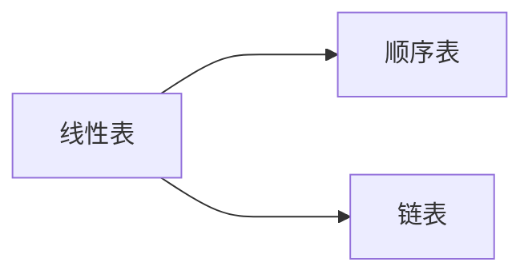

# 线性表

线性表是一种最简单的线性结构，线性结构的特点是数据元素之间为一种线性关系，数据元素“一个接一个的排列”，即除第一个和最后一个元素外，每个元素只有一个前驱元素和一个后继元素。在一个线性表中数据元素的**类型必须是相同**的。

线性表有两种存储方法：**顺序存储**和**链式存储**，分别被成为**顺序表**和**链表**，它的基本操作主要是插入、删除、查找等。

# 顺序表

顺序表：顺序存储结构的线性表称为顺序表，在内存中用**地址连续**的一块存储空间按顺序存放表中的各元素。典型代表即**一般数组**

由于顺序表的存储特点是用**物理上相邻**实现逻辑上的相邻，顺序表要求用连续的存储单元顺序存储线性表中各元素，因此，对顺序插入、删除时需要通过移动数据元素来实现，影响了运行效率。简单概括即**读取速度快，插入及删除的速度慢**。

典型代表即是数组，访问可以直接使用 **List[size]** 访问，顺序表的读取速度极快，但是**插入及删除的速度慢**。

# 链表

链表：针对顺序表 插入及删除的速度慢 的改进，链表应运而生。链式存储结构不需要用地址连续的存储单元实现，而是通过**一组存储单元**来存储线性表中的元素。为了建立元素间的线性关系，对每个数据元素 a ，除了存放数据之外，还需要存储放其前驱或后继所在的存储单元地址。存放数据的部分被称为**数据域**，存放其后继地址部分被称为**指针域**。通常把**一个数据域及若干个指针域**组合成结构体，称为**结点**，链表的元素即结点。

链表的形式有**单链表、循环链表、双向链表**等。

