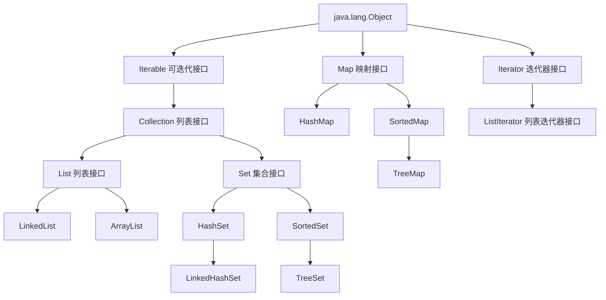

列表类的继承关系



# Collection\<E> 接口的常用方法

Set\<E> 和 List\<E> 都继承自 Collection\<E> 接口，故而以下方法对集合 Set\<E> 和列表 List\<E> 通用

- int size();                                                               返回容器中元素的个数
- boolean isEmpty();                                              判断容器是否为空
- boolean contains(Object o);                              判断容器是否包含 obj
- **Iterator**\<E> iterator();                                         返回容器的迭代器
- Object[] toArray();                                               将容器转化为数组，**返回的数组**包含容器的所有元素
- boolean add(E e);                                                添加元素e，成功返回true，失败返回false  
- boolean remove(Object o);                               删除元素o，成功返回true，失败返回false 
- boolean addAll(Collection<? extends E> c);   添加 c 的所有元素到当前容器中，集合并运算
- boolean removeAll(Collection<?> c);               在当前容器中删除包含在 c 中的元素，集合差运算
- void clear();                                                          删除容器中所有元素
- boolean equals(Object o);                                 比较两对象是否相等
- int hashCode();                                                    返回容器的哈希码值


# List\<E> 接口的常用方法

- E get(int index);                                                                              返回指定位置的元素                   
- E set(int index, E element);                                                          修改指定位置的元素
- boolean add(E element);                                                             在列表的最后添加元素 element
- void add(int index, E element);                                                   在指定位置插入元素 element
- boolean addAll(int index, Collection<? extends E> c);             在 index 位置有序插入 c 中的所有元素
- E remove(int index);                                                                       删除指定位置的元素
- int indexOf(Object o);                                                                    返回 元素o **首次**出现的位置，没有返回 -1
- int lastIndexOf(Object o);                                                              返回元素o **最后**出现的位置
- **ListIterator**\<E> listIterator(int index);                                       返回从 index 位置开始的列表迭代器


## ArrayList\<E> 

ArrayList是一个基于数组（**顺序表**）的动态数组，它可以自动增长但不能自动缩小，但可以使用`trimToSize()`方法将数组的容量减小到数组列表的大小。它可以随机访问元素，但在插入和删除元素时效率较低。

构造方法

- public ArrayList()                                                            创建初始容量为 10的空数组列表
- public ArrayList(int initialCapacity)                             创建初始容量为 initialCapacity 的空数组列表
- public ArrayList(Collection<? extends E> c)               创建包含容器 c 所有元素的数组列表，元素次序与 c 同


### ArrayList\<E> 类的常用方法

- public void trimToSize()                                                           将ArrayList的容量减小到列表的当前大小
- public void forEach(Consumer<? super E> action)             对 action 对象执行遍历操作


## LinkedList\<E>

LinkedList是一个基于**链表**的数据结构，它可以高效地插入和删除元素，但在随机访问元素时效率较低。因此，如果需要频繁地插入和删除元素，建议使用LinkedList；如果需要频繁地随机访问元素，建议使用ArrayList。

构造方法

- public LinkedList() { }                                                       创建空链表
- public LinkedList(Collection<? extends E> c)               创建包含容器 c 中所有元素的链表


### LinkedList<E> 类的常用方法

- public void addFirst(E e)                            将元素 e 插入列表开头
- public void addLast(E e)                            将元素 e添加到列表的末尾
- public E getFirst()                                        返回列表中的第一个元素
- public E getLast()                                        返回列表中的最后一个元素
- public E removeFirst()                                删除并返回列表中的第一个元素
- public E removeLast()                                 删除并返回列表中的最后一个元素


# Iterator\<E> 接口的常用方法

- boolean hasNext();                             判断是否还有后继元素，有返回 **true**，没有返回 **false**
- E next();                                                 返回后继元素
- default void remove()                         删除迭代器当前指向的元素，即 删除由最近一次 next() 或 previous() 方法调用返回的元素

```java
Iterator it = c.Iterator();
while(it.hasNext()) {
    Object o = it.next();
    ...
}
```


## ListIterator\<E> 接口的常用方法

- boolean hasPrevious();                       判断是否有前驱元素
- E previous();                                          返回前驱元素
- int nextIndex();                                     返回基于 next() 调用的元素序号
- int previousIndex();                             返回基于 previous() 调用的元素序号
- void set(E e);                                         用元素 e 替换列表当前的元素
- void add(E e);                         将 e 插入列表中，next()方法返回的元素之前，previous() 方法返回的元素之后，若是空列表，直接插入


# Set\<E>

Set\<E>是一个**不含重复元素**的集合接口，它继承自 Collection\<E> 接口，并**没有声明其他方法**。它的方法都是从 Collection\<E> 继承来的

实现 Set\<E> 的两个主要类是 **哈希集合类 HashSet\<E>** 及 **树集合类 TreeSet\<E>** 。


## HashSet\<E>

​	哈希集合对所包含元素的访问并不是像线性表一样使用下标，而是**根据哈希码来存取集合中的元素**。为此先介绍一下哈希码的概念。哈希集合是在元素的存储位置和元素的值 k 之间建立一个特定的对应关系 f ，使每个元素与一个唯一的存储位置相对应。因而在查找时，只要根据元素的值k，计算 f(k) 的值即可，如果此元素在集合中，则必定在存储位置f(k)上，因此不需要与集合中的其他元素进行比较便可直接取得所查的元素，称这个对应关系 f 为哈希(Hash)函数，由该函数计算出的数值称为哈希码或散列索引，而按这种关系建立的表称为哈希表，也称散列表。

​	HashSet\<E>集合类是基于哈希表的Set\<E>接口实现的。HashSet\<E>根据哈希码来确定元素在集合中的存储位置(即内存地址)，因此**可以根据哈希码快速地找到集合中的元素**。HashSet\<E>集合不保证选代顺序，但**允许元素值为 null**。在比较两个加入哈希集合HashSet\<E>中的元素是否相同时，会先比较哈希码方法 hashCode()的返回值是否相同。若相同则再使用equals()方法比较其存储位置(即内存地址)，若两者都相同则视为相同的元素。之所以在比较了哈希码之后，还要通过 equals()方法进行比较,是因为对不同元素计算出的哈希码可能相同。因此，对于哈希集合来说，**若重写了元素对应类的 equals()方法或 hashCode()方法中的某一个，则必须重写另一个，以保证其判断的一致性**。


- 根据哈希集合的特性可知，哈希集合不能修改元素，只能先删除，再添加。


### 构造方法

- public HashSet()                                                                    创建初始容量16，默认上座率是0.75的空哈希集合
- public HashSet(int initialCapacity)                                     创建初始容量 initialCapacity，默认上座率是0.75的空哈希集合
- public HashSet(int initialCapacity, float loadFactor)       创建初始容量 initialCapacity，上座率是 loadFactor 的空哈希集合
- public HashSet(Collection<? extends E> c)                       创建包含容器 c 中的所有元素，默认上座率是0.75的空哈希集合


### 常用方法

- public boolean add(E e)                                            添加成功返回 true ，添加失败或已有该元素返回 false
- public boolean remove(Object o)
- public void clear()                                                       删除集合中所有元素，集合为空
- public boolean contains(Object o)                          如果集合中包含元素 o，返回 true
- public int size()                                                           返回容器中包含元素的个数，即返回集合的容量
- public Iterator<E> iterator()


## TreeSet\<E>

​	树集合类 TreeSet\<E>不仅实现了 Set< E>接口，还实现了java.util.SortedSet 接口。TreeSet\<E>的工作原理与 HashSet< E>相似，但TreeSet\<E>增加了一个额外步骤，以保证**集合中的元素总是处于有序状态**。因此，**当排序很重要时，就选择 TreeSet\<E>，否则应选用HashSet\<E>**。TreeSet< E>类的大多数方法继承自其父类或祖先类。

### 构造方法

- public TreeSet()                                                         创建新的空树集合，其元素按自然顺序进行排序
- public TreeSet(Collection<? extends E> c)            创建包含容器 c 元素的新 TreeSet 对象，并按其元素的自然顺序进行排序


### 常用方法

- public E first()                                        返回集合中第一个（最低）元素
- public E last()                                         返回集合中最后一个（最高）元素
- public E lower(E e)                                返回严格小于给定元素 e 的最大元素，如果不存在这样的元素，返回 null
- public E higher(E e)                              返回大于给定元素 e 的最小元素，如果不存在这样的元素，返回 null
- public E floor(E e)                                 返回严格小于或等于给定元素 e 的最大元素，如果不存在这样的元素，返回 null
- public E ceiling(E e)                              返回大于或等于给定元素 e 的最小元素，如果不存在这样的元素，返回 null
- public SortedSet\<E> subSet(E fromElement, E toElement)            返回一个新的集合，新的集合元素是 fromElement 到 toElement（不包含） 之间的元素
- public SortedSet\<E> headSet(E toElement)                         返回一个新的集合，新的集合元素是 toElement（不包含） 之前的元素
- public SortedSet\<E> tailSet(E fromElement)                        返回一个新的集合，新的集合元素是 fromElement 及其之后的元素


# Map<k, v>

- Map<k, v> 的实现类有 HashMap<k, v> , TreeMap<k, v>

Map<k, v> 中的元素都是成对出现的，它提供了键(key) 到 值(value) 的映射。Map<k, v> 中键可以是任意类型，且唯一。


## Map<k, v> 接口常用方法

- int size();
- boolean isEmpty();
- boolean containsKey(Object key);                                 判断是否包含指定的键 key
- boolean containsValue(Object value);                          判断是否包含指定的值 value
- V get(Object key);                                                             返回键 key 所映射的值，没有返回**null**
- V put(K key, V value);                                                       以 key 为键，向集合中添加 value ，key 必须唯一，否则新值取代旧值
- default V putIfAbsent(K key, V value)                            如果已存在不添加
- void putAll(Map<? extends K, ? extends V> m);          将映射 m 中的所有映射关系复制到调用该方法的映射中
- V remove(Object key);                                                    将键为 key 的条目从映射中删除
- void clear();
- Set<K> keySet();                                                               返回该映射中所有键对象形成的 Set 集合
- Collection<V> values();                                                   返回该映射中所有值对象形成的 Collection 集合
- Set<Map.Entry<K, V>> entrySet();                                 返回映射中 **"键-值"** 集合
- default V replace(K key, V value)
- default boolean replace(K key, V oldValue, V newValue)


## HashMap<k, v> 映射常用构造方法

HashMap<k, v> 通过哈希码对其内部的映射关系进行快速查找，因此对于添加和删除映射关系效率较高，并且允许null值和null键，但必须保证键的一致性。

HashMap 遍历修改数据请使用 **Iterator**

- public HashMap()                                                  构造一个具有默认初始容量（16），默认上座率是0.75的空 HashMap 对象
- public HashMap(int initialCapacity)                   构造一个具有默认初始容量initialCapacity，默认上座率是0.75的空 HashMap 对象
- public HashMap(int initialCapacity, float loadFactor)
- public HashMap(Map<? extends K, ? extends V> m)      创建一个映射关系与指定 Map 相同的新 HashMap 对象，具有默认上座率（0.75）和足以容纳指定 Map 中映射关系的初始容量


## TreeMap 类的构造方法

- public TreeMap()                                     使用键的自然顺序创建一个新的空树映射
- public TreeMap(Map<? extends K, ? extends V> m)                创建一个与给定映射具有相同映射关系的新树映射，该映射会根据其自然顺序进行排序


## TreeMap<k, v> 类的常用方法

如果希望 Map<k, v> 中的元素也存在一定额度顺序，应该使用 TreeMap

- public int size() { return size; }
- public boolean containsKey(Object key)
- ...参考Map<k, v>
- public K firstKey()                                        返回映射中第一个（最低）键
- public K lastKey()                                        返回映射中最后一个（最高）键
- public SortedMap<K,V> subMap(K fromKey, K toKey)
- public SortedMap<K,V> headMap(K toKey)                     返回键值小于 toKey 的那部分映射
- public SortedMap<K,V> tailMap(K fromKey)                   返回键值大于或等于 fromKey 的那部分映射
- public K lowerKey(K key)                            返回小于给定键 key 的最大键，如果不存在这样的键，返回 null
- public K floorKey(K key)                             返回小于或等于给定键 key 的最大键，如果不存在这样的键，返回 null
- public K ceilingKey(K key)                          返回大于或等于给定键 key 的最小键，如果不存在这样的键，返回 null
- public K higherKey(K key)                          返回严格大于给定键 key 的最小键，如果不存在这样的键，返回 null
