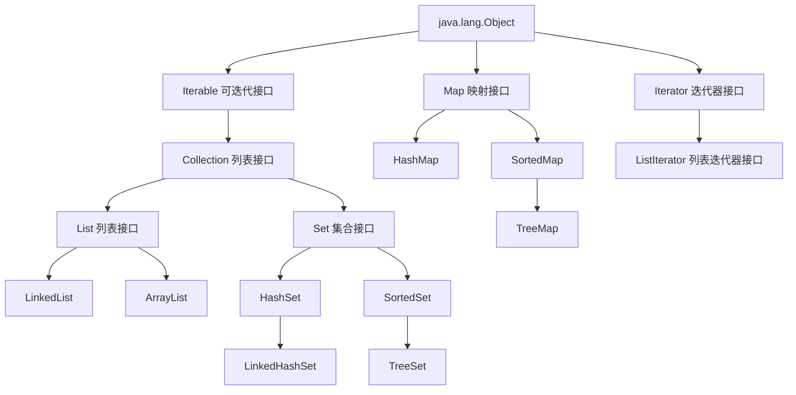

列表类的继承关系



# Collection\<E> 接口的常用方法

Set\<E> 和 List\<E> 都继承自 Collection\<E> 接口，故而以下方法对集合 Set\<E> 和列表 List\<E> 通用

- int size();                                                               返回容器中元素的个数
- boolean isEmpty();                                              判断容器是否为空
- boolean contains(Object o);                              判断容器是否包含 obj
- **Iterator**\<E> iterator();                                         返回容器的迭代器
- Object[] toArray();                                               将容器转化为数组，**返回的数组**包含容器的所有元素
- boolean add(E e);                                                添加元素e，成功返回true，失败返回false  
- boolean remove(Object o);                               删除元素o，成功返回true，失败返回false 
- boolean addAll(Collection<? extends E> c);   添加 c 的所有元素到当前容器中，集合并运算
- boolean removeAll(Collection<?> c);               在当前容器中删除包含在 c 中的元素，集合差运算
- void clear();                                                          删除容器中所有元素
- boolean equals(Object o);                                 比较两对象是否相等
- int hashCode();                                                    返回容器的哈希码值


# List\<E> 接口的常用方法

- E get(int index);                                                                              返回指定位置的元素                   
- E set(int index, E element);                                                          修改指定位置的元素
- void add(int index, E element);                                                   在指定位置插入元素 element
- boolean addAll(int index, Collection<? extends E> c);             在 index 位置有序插入 c 中的所有元素
- E remove(int index);                                                                       删除指定位置的元素
- int indexOf(Object o);                                                                    返回 元素o **首次**出现的位置，没有返回 -1
- int lastIndexOf(Object o);                                                              返回元素o **最后**出现的位置
- **ListIterator**\<E> listIterator(int index);                                       返回从 index 位置开始的列表迭代器


# ArrayList\<E> 

ArrayList是一个基于数组（**顺序表**）的动态数组，它可以自动增长但不能自动缩小，但可以使用`trimToSize()`方法将数组的容量减小到数组列表的大小。它可以随机访问元素，但在插入和删除元素时效率较低。

构造方法

- public ArrayList()                                                            创建初始容量为 10的空数组列表
- public ArrayList(int initialCapacity)                             创建初始容量为 initialCapacity 的空数组列表
- public ArrayList(Collection<? extends E> c)               创建包含容器 c 所有元素的数组列表，元素次序与 c 同


## ArrayList\<E> 类的常用方法

- public void trimToSize()                                                           将ArrayList的容量减小到列表的当前大小
- public void forEach(Consumer<? super E> action)             对 action 对象执行遍历操作


# LinkedList\<E>

LinkedList是一个基于**链表**的数据结构，它可以高效地插入和删除元素，但在随机访问元素时效率较低。因此，如果需要频繁地插入和删除元素，建议使用LinkedList；如果需要频繁地随机访问元素，建议使用ArrayList。

构造方法

- public LinkedList() { }                                                       创建空链表
- public LinkedList(Collection<? extends E> c)               创建包含容器 c 中所有元素的链表


## LinkedList<E> 类的常用方法

- public void addFirst(E e)                            将元素 e 插入列表开头
- public void addLast(E e)                            将元素 e添加到列表的末尾
- public E getFirst()                                        返回列表中的第一个元素
- public E getLast()                                        返回列表中的最后一个元素
- public E removeFirst()                                删除并返回列表中的第一个元素
- public E removeLast()                                 删除并返回列表中的最后一个元素


# Iterator\<E> 接口的常用方法

- boolean hasNext();                             判断是否还有后继元素，有返回 **true**，没有返回 **false**
- E next();                                                 返回后继元素
- default void remove()                         删除迭代器当前指向的元素，即删除由最近一次 next() 或 previous() 方法调用返回的元素

```java
Iterator it = c.Iterator();
while(it.hasNext()) {
    Object o = it.next();
    ...
}
```


# ListIterator\<E> 接口的常用方法

- boolean hasPrevious();                       判断是否有前驱元素
- E previous();                                          返回前驱元素
- int nextIndex();                                     返回基于 next() 调用的元素序号
- int previousIndex();                             返回基于 previous() 调用的元素序号
- void set(E e);                                         用元素 e 替换列表当前的元素
- void add(E e);                         将 e 插入列表中，next()方法返回的元素之前，previous() 方法返回的元素之后，若是空列表，直接插入


