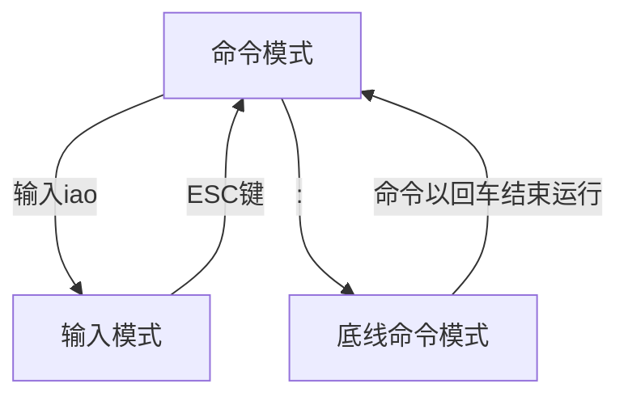

# vi / vim

## `Vim / Vi` 工作模式

`vim` 是 `vi` 的升级款

```shell
vim --version                     # 检查下载了没

sudo dnf install vim -y           # 下载 vim
```

各个模式间的切换，注意：输入模式不能直接跳到底线命令行格式



**命令**模式：命令模式下，所敲的按键编辑器都理解为命令，以命令驱动执行不同的功能。

**输入**模式：编辑模式、插入模式。

**底线命令**模式：以 `:` 开始，通常用于文件的保存、退出。


## 命令模式

### 进入输入模式

| 命令 | 释义                               |
| ---- | ---------------------------------- |
| i    | 在当前光标位置，进入输入模式       |
| I    | 在当前光标位置 之后 ，进入输入模式 |
| a    | 在当前行 开头，进入输入模式        |
| A    | 在当前行 结尾，进入输入模式        |
| o    | 在当前光标 下一行，进入输入模式    |
| O    | 在当前光标 上一行，进入输入模式    |
| esc  | 输入模式回到命令模式               |


### 命令行模式快捷键

| 命令     | 释义                                |
| -------- | ----------------------------------- |
| /        | 进入搜索模式，如/str：搜索str字符串 |
| n        | 向下继续搜索                        |
| N        | 向上继续搜索                        |
| u        | 撤销上次命令，类似 `Ctrl + Z`       |
| ctrl + r | 恢复撤销的命令，类似 `Ctrl + Y`     |
| yy       | 复制当前行                          |
| nyy      | n是数字，复制当前行和下面的n行      |
| p        | 粘贴复制内容                        |
| PgUp     | 向上翻页                            |
| PgDn     | 向下翻页                            |
| 0        | 移动到当前行开头                    |
| $        | 移动到当前行结尾                    |
| gg       | 跳至首行                            |
| G        | 跳至尾行                            |
| dd       | 删除当前行                          |
| ndd      | 从当前行开始删除 n 行               |
| D \| d$  | 从当前位置开始删除至行尾            |
| d0       | 从当前位置开始删除至行开头          |
| dG       | 从当前行开始，向下全部删除          |
| dgg      | 从当前行开始，向上全部删除          |


## 底线命令模式

| 命令       | 释义                 |
| ---------- | -------------------- |
| :w         | 保存                 |
| :q         | 退出                 |
| :q!        | 强制退出（放弃更改） |
| :wq        | 保存退出             |
| :set nu    | 显示行号             |
| :set paste | 设置粘贴模式         |
