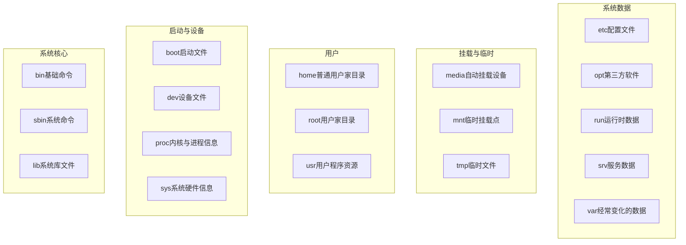

# Vmware

[Vmware官网下载](https://www.vmware.com/products/desktop-hypervisor/workstation-and-fusion "Vmware下载")

# CentOS

[CentOS官网下载](https://www.centos.org/download/ "CentOS下载")

# Linux `/` 目录结构

```mermaid
graph TB
	subgraph 系统数据
        etc[etc配置文件]
        opt[opt第三方软件]
        run[run运行时数据]
        srv[srv服务数据]
        var[var经常变化的数据]
   	end
   	
   	subgraph 挂载与临时
        media[media自动挂载设备]
        mnt[mnt临时挂载点]
        tmp[tmp临时文件]
    end
    
    subgraph 用户
        home[home普通用户家目录]
        root[root用户家目录]
        usr[usr用户程序资源]
    end
    
    subgraph 启动与设备
        boot[boot启动文件]
        dev[dev设备文件]
        proc[proc内核与进程信息]
        sys[sys系统硬件信息]
    end
   	
   	subgraph 系统核心
        bin[bin基础命令]
        sbin[sbin系统命令]
        lib[lib系统库文件]
    end

```

