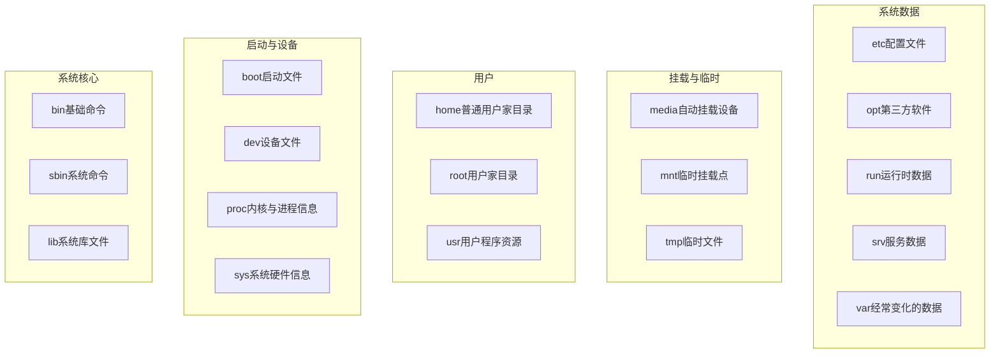

# Vmware

[Vmware官网下载](https://www.vmware.com/products/desktop-hypervisor/workstation-and-fusion "Vmware下载")

1. 搜索 **VMware Workstation**
2. 选择最新版本的 **VMware Workstation Pro for Windows**
3. 同意 Terms and Conditions
4. 填写基本信息后下载


# Xshell

[Xshell个人版下载](https://www.xshell.com/zh/free-for-home-school/ "Xshell个人版" )

[Xshell下载](https://www.xshell.com/zh/all-downloads/ "Xshell下载")


# CentOS

[CentOS官网下载](https://www.centos.org/download/ "CentOS下载") 下载 `x86_64` `iso` 镜像


# 连接网络

```shell
# 查看 ip
ip addr

# 直接查看 ens33 名的 ip
ip addr show ens33

# 查看路由
ip route

# ip 地址在 ens33 中，如 inet 192.168.11.128
# 如果没有则大概率是虚拟机的网络适配器（网卡）有问题了
```

> `ens33` 一般是动态 `ip`，它会带有 `dynamic` 等说明
>
> 如果虚拟机需要用 `xshell` 连接，需要配置`静态 ip`，具体 `ai` 查怎么配置就行，不同的操作系统版本配置方式可能不太一样。注意：生产环境不要乱配`静态 ip`

---

- 问题解决：虚拟机的 `ip` 地址不一定能用，也可能是 `windows` 的问题

    ```shell
    ens33: <NO-CARRIER,BROADCAST,MULTICAST,UP>
    ```

    `ens33` 报了这个，不显示 `ip` 地址，原因是 `VMware` 的 **NAT 服务**（`VMware NAT Service`）在 `Windows` 中没有正常运行，需要手动重启

    ```shell
    # 以 管理员身份 打开 Windows CMD（命令提示符）
    net stop "VMware NAT Service"
    net stop "VMware DHCP Service"
    net start "VMware DHCP Service"
    net start "VMware NAT Service"
    
    # 重启完再执行 ip addr 应该就可以看到 ens33 的 ip 地址了
    ```

    同时，可以将 `Windows` 的 `VMware NAT Service`、`VMware DHCP Service` 服务把手动设置为自动(延迟启动)；（手动的情况下，Windows 无法自动启动服务，不会自动为虚拟机分配 IP 地址（DHCP 功能））

    1. `Win + R` → 输入 `services.msc` → 回车
    2. 找到 `VMware NAT Service`、`VMware DHCP Service`
    3. 右键 → **属性**
    4. **启动类型** 改为 **"自动"**（或"自动（延迟启动）"更稳定）
    5. 点击 **应用** → **确定**


# Linux `/` 目录结构



