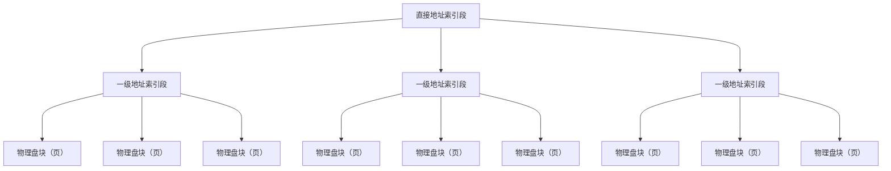

这一章涉及操作系统。一般我们写代码，代码都是加载到内存中执行的，这里涉及到操作系统，所以提一嘴。

数据库存储涉及到操作系统的**存储管理**，如**段页式存储（段号+页号+页内地址）**，存储空间划分为同样大小的页（块），页是存储空间的基本单位，大小约为`16KB`（也有 `2KB、4KB、8KB`的）。

`CPU` 只会读取内存中的数据而不会读取硬盘的数据，数据库需要从硬盘中加载对应的页到内存中，才能被访问。即需要加载对应的存储页/物理盘块到内存中，也就是磁盘的IO操作。

# 索引的概念

索引是一种帮助 MySQL 快速查找数据的**数据结构**。索引本身也是数据，索引太多，占用磁盘空间

> 一旦给字段 `col` 建立了索引，就相当于在硬盘上为字段 `col` 维护了一个索引的数据结构
>
> 可以粗略理解为索引就像是二叉树的根节点，查找数据时使用二分法，时间复杂度会从 `O(n)` 优化到 $O(log_2 n)$
>
> 但**数据库索引的性能**不能简单只用算法里的时间复杂度来描述，因为数据库最重要的成本之一是 **磁盘IO**

适合建立索引的位置：`WHERE`、`JOIN`、`ORDER BY`、`GROUP BY`

---

索引的优点

1. 提高数据检索效率，**降低数据库的 IO 成本**
2. 通过唯一所以保证数据库每一行**数据的唯一性**

索引的缺点：

1. 创建和维护索引需要耗费时间
2. 索引需要**占磁盘空间**：除了表数据之外，每一个索引都要占一定的磁盘空间
3. 虽然所以会提高查询速度，但是会 **降低更新表的速度**；对表中的数据进行增加、修改、删除，索引也要动态地维护。（没有索引的话，增加数据直接往表后插就行）


## 1.1`B+Tree`

**B+树是一种多路平衡查找树**，主要用于数据库和文件系统的索引结构。

    # 真实的 B+Tree
                         ┌───────────┐
                         │ 30 │ 60   │
                         └───────────┘
                         /      |      \
                        /       |       \
       ┌────────────────┐ ┌────────────────┐ ┌────────────────┐
       │ 10 │ 20        │ │ 30 │ 40 │ 50   │ │ 60 │ 70 │ 80   │
       └────────────────┘ └────────────────┘ └────────────────┘
                ↓                 ↓                  ↓
              ─────────────────────────────────────────

说说普通二叉树，就是两个叉；B树呢，就是多个叉，多个叉本质上可以降低树的高度，高度即 磁盘IO 次数，降低高度有助于降低 磁盘IO 次数；B+树是B树的改进。

| 对比项                   | B树                  | B+树                         |
| ------------------------ | -------------------- | ---------------------------- |
| **非叶子节点是否存数据** | ✅ 存数据             | ❌ 通常只存索引键             |
| **叶子节点是否存数据**   | ✅ 存数据             | ✅ 存全部数据                 |
| **数据存储位置**         | 所有节点都可能有数据 | **所有数据都集中在叶子节点** |
| **非叶子节点作用**       | 索引 + 数据          | **主要负责导航**             |
| **叶子节点之间**         | 通常没有链表连接     | **通常通过双向链表连接**     |
| **单值查询**             | 可能更快             | 查询通常要走到叶子节点       |
| **范围查询**             | 较麻烦               | **非常高效**                 |
| **查询路径长度**         | 不一定相同           | **基本相同，性能稳定**       |
| **树高**                 | 相对可能更高         | **通常更矮**（只存索引键）   |
| **数据库使用**           | 较少                 | **MySQL InnoDB 常用**        |

- B树的所有节点都存储 索引+数据，所以同样大小的存储页存储的索引信息更少
- B+树查询效率更稳定，查询效率更高


## 1.2索引结构的推演

数据的存储在操作系统中是**段页式存储**的，比如一页有 `16KB`，一页中有很多条数据记录，每加载一页到内存中都是一次磁盘IO，**磁盘IO操作远比逻辑查询更耗时**，所以降低磁盘IO操作次数才是根本

只要数据在内存中，二分法查询数据的速度是极快的，可能是纳秒级别；而磁盘IO的速度是微妙级（参考`400us`）的，所以真正耗时的操作在于磁盘IO加载物理盘块

在**数据库索引**中可能存放的是**分段**的计算机**地址索引段的地址值**；如 `D0:D8:D32`

> 操作系统也有索引文件结构
>
> - 索引结点 -> 物理块 -> 逻辑块
>     - 直接地址索引
>     - 一级地址索引
>     - 二级地址索引



所以索引的数据结构并不是简单的二叉树。具象化的一点的话，应该是 **分块 + 二分法**

分块：即数据库索引中可能存放各级地址段的值，如 `D0:D8:D32`。先从 `D0~D7` 中找到 `D0`，`D0.next`  = `D8~D15`，然后从 `D8~D15` 中找到 `D8`，`D8.next`  = `D32~D39`，然后从 `D32~D39` 中找到 `D32`，`D32`指向物理盘块，这样就找到了对应的存储页面，将其加载到内存中，用二分法就能找到对应的数据记录。

- 块中可能存放各级地址索引段的**具体地址(`D1`)**，在地址索引表中根据二分法查询这个具体地址，直到找到物理盘块
- 分块（地址索引地址）越少，加载的磁盘存储页就越少，磁盘IO也越少。
- 开发中的 `B+Tree` 一般也**不会超过4层**。比如一个地址索引里面有1000个索引结点，3层就有 $1000^3 = 10亿$ 个索引节点，指向了10亿个物理盘块，基本够用
    - 层数：实际上每个节点可能不能填满，所以需要**2~4层B+树**
    - 磁盘IO次数：根节点常驻内存中，一般**磁盘IO次数为1~3次**

---

假设有1亿条数据，一个物理盘块放 10000 条数据，则共有 10000 个物理盘块存储

1. 普通查询：加载一个物理盘块，然后用二分法在块中查找，也就是遍历，最大有 **10000** 次磁盘IO
2. 二叉树查询：加载一个物理盘块，然后用二分法在块中查询下一个物理盘块的地址，大约是 **$log_2 10000 ≈ 14$** 次磁盘IO
3. B+树：磁盘IO次数为 **1~3** 次


## 1.3常见的索引概念

1. **聚簇索引**：聚簇索引的叶子节点存储的是完整的行数据，**索引即数据，数据即索引**。在 `InnoDB` 中，通常 **主键索引 = 聚簇索引**
2. **二级索引**：二级索引访问需要两次索引查找，第一次找到主键值，第二次根据**主键值**找到行数据
3. **联合索引**：**多个字段**共同建立一个索引，属于非聚簇索引的一类

```
                    MySQL InnoDB 索引
                           │
              ┌────────────┴────────────┐
              │                         │
        按存储结构分类              按字段数量分类
              │                         │
       ┌──────┴──────┐           ┌──────┴──────┐
       ↓             ↓           ↓             ↓
   聚簇索引       二级索引      单列索引      联合索引（多个字段构成）
       │             │
       │             ├── username
       │             ├── age
       │             └── (username, age)
       │
       └── PRIMARY KEY
```


### 聚簇索引

```sql
CREATE TABLE user (
    id BIGINT PRIMARY KEY,      # 主键索引、聚簇索引
    username VARCHAR(50),
    age INT
);
```

聚簇索引结构类似于顺序的基础数字数组 `[1, 2, 3, 4, 6, 7, 8, 9]`

- **查找**：二分法查找，速度很快
- **更新**：插入 5，6789就要往后挪；但是插入 10 直接往后插，就比较快；所以开发中一般使用自增 ID 作为主键，插入较快
- **删除**：删除6，789就得往前挪，但是开发中一般很少物理删除记录，一般是设置 `is_deleted = 1` 来解决，物理删除记录操作一般由数据管理员执行

优点：

- **数据访问更快**，因为聚簇索引将索引和数据保存在同一个B+树中，因此从聚簇索引中获取数据比非聚簇索引更快
- 聚簇索引对于**主键**的排序查找和范围查找速度非常快
- 按照聚簇索引排列顺序，查询显示一定范围数据的时候，由于**数据都是紧密相连**，数据库不用从多个数据块中提取数据，所以节省了大量的IO操作

缺点：

- 插入速度严重依赖于插入顺序，按照主键的顺序插入是最快的方式。否则将会出现页分裂，严重影响性能。对于 `InnoDB` 表，我们一般都会定义一个**自增的 `ID` 列为主键**
- **更新主键的代价很高**，因为将会导致被更新的行移动。因此，对于 `InnoDB` 表，我们一般定义主键为不可更新

限制：

- 由于数据物理存储排序方式只能有一种，所以**每个 `MySQL` 的表只能有一个聚簇索引**。一般情况下就是该表的**主键**
- 如果没有定义主键，`InnoDB` 会选择 **非空的唯一索引** 代替
- 为了充分利用聚簇索引的聚簇的特性，所以 `InnoDB` 表的==**主键列尽量选用有序的顺序id**==，而不建议用 无序的id，比如`UUID`、`MD5`、`HASH`、字符串列作为主键无法保证数据的顺序增长。


### 二级索引（辅助索引、非聚簇索引）

```sql
CREATE TABLE user (
    id BIGINT PRIMARY KEY,
    username VARCHAR(50),
    age INT,
    INDEX idx_username(username)
);
```

一个表中只能有一个聚簇索引，但**可以有多个二级索引**

> 二级索引查询过程（回表`Back to Table`）
>
> 1. 查询二级索引
> 2. 再根据主键，找到聚簇索引
> 3. 去聚簇索引查完整数据

聚簇索引**查询速度更快**，二级索引 **插入、删除、更新** 等操作速度更快


### 联合索引

```sql
CREATE TABLE user (
    id BIGINT PRIMARY KEY,
    username VARCHAR(50),
    age INT,
    INDEX idx_username_age(username, age)
);
```

联合索引就是**多个字段**共同建立一个索引，属于非聚簇索引


## 1.4存储引擎

存储引擎索引结构，不同的存储引擎索引结构并不一样

- `InnoDB` 的索引结构是 `B+Tree` 结构，`B+Tree` 通过降低树高来减少磁盘 `IO`，从而提高查询效率


### `InnoDB` 的 `B+Tree` 索引注意事项

1. 根页面位置万年不动
2. 一个页面最少存储两条记录，MySQL会自动给每个页加两天记录，也称**伪记录**或**虚拟记录**
