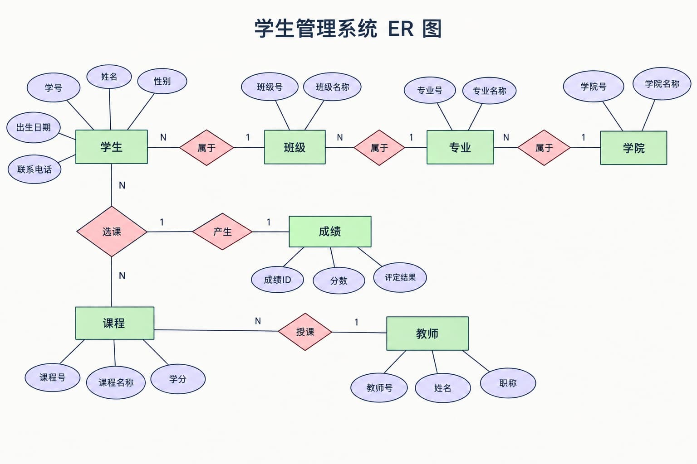
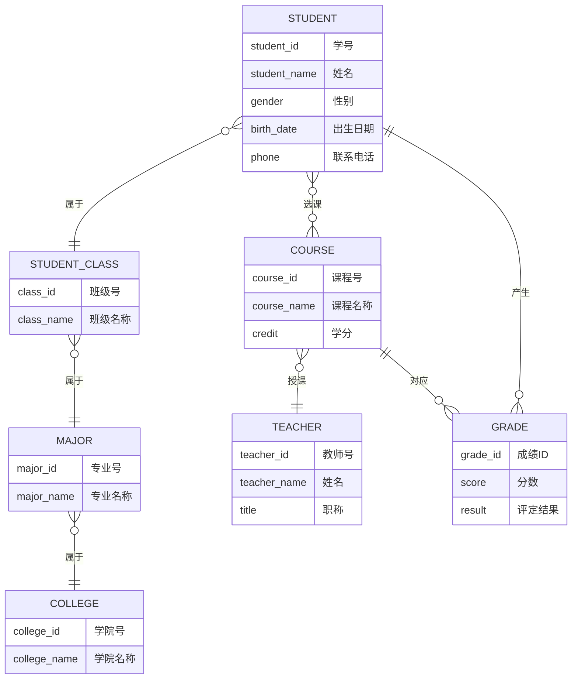
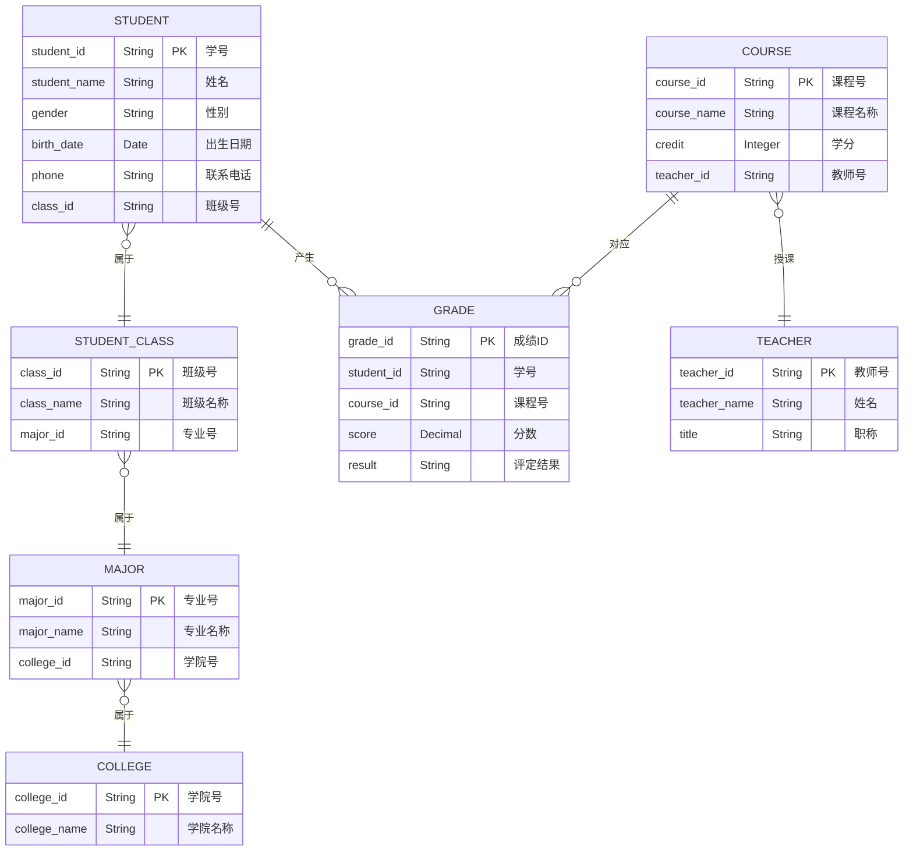

# 1. 范式

-   范式的优点：数据的标准化有助于消除数据库中的数据冗余，第三范式(`3NF`)通常被认为在性能、扩展性和数据完整性方面达到了最好的平衡。
-   范式的缺点：范式的使用，可能**降低查询的效率**。因为范式等级越高，设计出来的数据表就越多、越精细，数据的冗余度就越低，进行数据查询的时候就可能需要关联多张表，这不但代价昂贵，也可能使一些索引策略无效

**范式只是提出了设计的标准**，实际上设计数据表时，未必一定要符合这些标准。开发中，我们会出现为了性能和读取效率违反范式化的原则，通过增加少量的冗余或重复的数据来提高数据库的读性能，减少关联查询，`join` 表的次数，实现空间换取时间的目的。因此在实际的设十过程中要理论结合实际，灵活运用。


## 1.1 概念

-   **范式**：在关系型数据库中，关于数据表设计的基本原则、规则就称为范式。

    目前关系型数据库有六种常见的范式：第一范式（`1NF`）、第二范式（`2NF`）、第三范式（`3NF`）、巴斯-科德范式（`BCNF`）、第四范式（`4NF`）、第五范式（`5NF`）

| 范式   | 主要解决的问题   |
| ------ | ---------------- |
| `1NF`  | 属性不可再分     |
| `2NF`  | 部分依赖         |
| `3NF`  | 传递依赖         |
| `BCNF` | 决定因素不是超键 |
| `4NF`  | 多值依赖         |
| `5NF`  | 连接依赖         |

### 键和相关属性

```sql
CREATE TABLE user (
    id BIGINT NOT NULL PRIMARY KEY,
    username VARCHAR(50) NOT NULL,
    phone VARCHAR(20) NOT NULL UNIQUE,
    email VARCHAR(100) NOT NULL UNIQUE,
    dept_id BIGINT NOT NULL,
);
```

-   **超键**：能唯一标识元组（表中的一行数据）的属性集叫做超键。如 `id`、`phone`、`email` 都是超键，也可以组合 `{id, username}` 因为 `id` 足够标识了

    好像都是包含 `UNIQUE` 的，没有 `UNIQUE` 就是联合 `UNIQUE`

-   **候选键**：如果超键不包括多余的属性，那么这个超键就是候选键。如 `id`、`phone`、`email` 都是候选键

-   **主键**：用户可以从候选键中选择**一个**作为主键。虽然有3个 `UNIQUE`，依据表设计，一般我们选 `id`

    主键一定是候选键，但候选键不一定是主键。候选键可以有多个，但主键通常选择一个

-   **外键**：如果数据表 `R1` 中的某属性集不是 `R1` 的主键，而是另一个数据表 `R2` 的主键，那么这个属性集就是数据表 `R1` 的外键。如 `dept_id`（设计中 `dept_id` 是部门表的主键）

-   **主属性**：包含在任一**候选键**中的属性称为主属性。如 `id`、`phone`、`email` 

-   **非主属性**：与主属性相对，指的是不包含在任何一个候选键中的属性。如 `name`、`dept_id`


## 1.2 第一范式 `1NF`

**第一范式**：字段必须是不可再分的原子值；（列不可再分）

```
student
------------------------------------------------
id | name | user_info
------------------------------------------------
1  | 张三 | 18,1
```

`user_info` 里面放了年龄和性别，这就不符合第一范式。

>   一般我们会拆成两个字段
>
>   ```
>   student
>   ------------------------------------------------
>   id | name | age | gender
>   ------------------------------------------------
>   1  | 张三 | 18   | 1
>   ```


## 1.3 第二范式 `2NF`

**第二范式**：在满足 `1NF` 的基础上，**非主属性**必须完全依赖于**候选键**，不能只依赖**候选键**的一部分；（有的候选键是联合的）（这个概念主要在**联合主键**的情况下比较明显）

```
student_course 学生选课表
------------------------------------------------
student_id | course_id | student_name | course_name
------------------------------------------------
1          | 101       | 张三         | MySQL
1          | 102       | 张三         | Java
2          | 101       | 李四         | MySQL
```

假设主键是 `(student_id, course_id)`，也就是 `student_id + course_id` 共同确定一条记录。但是 `student_name` 只依赖于 `student_id` 而不是 `student_id + course_id`，所以出现了部分依赖，违反了第二范式

>   解决需要拆成三张表
>
>   ```
>   student 学生表
>   ----------------
>   student_id | name
>   ----------------
>   1          | 张三
>   2          | 李四
>   ```
>
>   ```
>   course 课程表
>   ------------------
>   course_id | name
>   ------------------
>   101       | MySQL
>   102       | Java
>   ```
>
>   ```
>   student_course 选课表
>   ----------------------------
>   student_id | course_id
>   ----------------------------
>   1          | 101
>   1          | 102
>   2          | 101
>   ```


## 1.4 第三范式 `3NF`

**第三范式**：在满足 `2NF` 的基础上，**非主属性**字段不能依赖于其他**非候选键字段**；（任何非主属性都不能传递依赖于**候选键**）

```
# 典型的不满足第三范式的情况
非主属性 → 非主属性
```

```
# 满足的情况
候选键 → 非主属性
```

```
student
------------------------------------------------
student_id | student_name | class_id | class_name
------------------------------------------------
1          | 张三         | 101       | Java班
2          | 李四         | 101       | Java班
3          | 王五         | 102       | MySQL班
```

主键是 `student_id`，存在 `class_id → class_name`，但 **`class_id` 不是候选键且 `class_name` 是非主属性**，产生了传递依赖 `student_id → class_id → class_name`，不符合第三范式

>   解决需要拆成两张表
>
>   ```
>   student
>   -------------------------------
>   student_id | student_name | class_id
>   -------------------------------
>   1          | 张三         | 101
>   2          | 李四         | 101
>   3          | 王五         | 102
>   ```
>
>   ```
>   class
>   -------------------------
>   class_id | class_name
>   -------------------------
>   101      | Java班
>   102      | MySQL班
>   ```

>记忆口诀：
>
>**`1NF`：列不可再分**
>
>**`2NF`：完全依赖主键**
>
>**`3NF`：非主属性不能依赖其他非候选键**（如果所有字段都是主属性，那么他至少满足 `3NF`）


## 1.5 其他范式（往下的不要再看，太乱）

>   不要深究其他范式，不知道哪个神仙定义出来的范式，绕成麻花。一般学到 `3NF` 就可以了，往深了学这东西也没啥用的，说到底只是个规范，对开发无益
>
>   我学了一小时的 `BCNF` 发现很多教材，因为不教 `3NF` 以上的范式，所以在 `2NF`、`3NF` 把“候选键”换成了“主键”以便于理解，以至于增加了很多学习 `BCNF` 的成本，既然教材都没打算让你学，就别往下学了
>
>   我这都还没学 `4NF`、`5NF` 呢！就踩了一堆坑，愿意踩坑就学吧！


## 1.6 巴斯范式 `BCNF`

`BCNF`：对关系中的每一个非平凡函数依赖 `X → Y`，`X` 必须是超键

---

| student | course | teacher |
| ------- | ------ | ------- |
| 张三    | MySQL  | 王老师  |
| 李四    | MySQL  | 王老师  |
| 王五    | Java   | 李老师  |
| 赵六    | Java   | 李老师  |

1.   假设存在：
     1.   一个学生的一门课程只能由一个老师教
     2.   一个老师只负责一门课程
2.   存在**函数依赖**：`(student, course) → teacher`、`teacher → course`
3.   确定**候选键**： `(student, course) → teacher`，`(student, course)` 可以确定一整行，是候选键；又因为 `teacher → course`，所以 `(student, teacher) → course`，因此 `(student, teacher)` 也可以确定一整行，也是候选键；那么候选键有两个 `(student, course)`、`(student, teacher)`
4.   确定**主属性**：候选键包含三个字段，因此 `student, course, teacher` 都是主属性。
5.   `teacher → course`，而 `course` 是主属性，所以满足 `3NF`
6.   判断 `BCNF`：`teacher → course`，老师不能确定学生，所以`teacher` 不能确定一整行，因此 `teacher` 不是超键，不满足 `BCNF`；

这张表的问题：

1.   最大的问题：数据冗余
2.   修改异常：如果王老师改成教 `Java` 了需要改很多行
3.   插入异常：李老师准备教一门新课程 `JavaScript`，但是目前还没有学生选择 `JavaScript`，那么就只能允许学生为 `NULL`
4.   删除异常：如果张三是王老师教 `MySQL` 的最后一个学生，如果张三毕业了，删除张三，王老师也会被一起删除

>   改动：拆成两个表 `student_teacher`、`teacher_course`
>
>   | student | teacher |
>   | ------- | ------- |
>   | 张三    | 王老师  |
>   | 李四    | 王老师  |
>   | 王五    | 李老师  |
>   | 赵六    | 李老师  |
>
>   | teacher | course |
>   | ------- | ------ |
>   | 王老师  | MySQL  |
>   | 李老师  | Java   |


## 1.7 第四范式 `4NF`

-   **多值依赖**：即属性之间的一对多关系，记为 `K →→ A`
-   **函数依赖**：事实上是单值依赖，记为 `K → A`，所以不能表达属性值之间的一对多关系
-   **平凡的多值依赖**：对于全集 `U = K + A`，一个 `K` 可以对应于多个 `A`，即 `K →→ A`。此时整个表就是**一组**一对多关系
-   **非平凡的多值依赖**：全集 `U = K + A + B`，一个 `K` 可以对对应多个 `A` 也可以对应于多个 `B`，`A` 与 `B` 互相独立，即 `K →→ A`，`K →→ B`。整个表有**多组**一对多关系，且有：`→` 部分是相同的属性集合，“多”部分是互相独立的属性集合。

第四范式：对于每一个**非平凡的**多值依赖 `X →→ Y`，`X` 必须是超键

---

| student | course | hobby |
| ------- | ------ | ----- |
| 张三    | MySQL  | 篮球  |
| 张三    | MySQL  | 游戏  |
| 张三    | Java   | 篮球  |
| 张三    | Java   | 游戏  |

学生可以学习多门课程，学生也会有多个兴趣；课程和兴趣其实没有关系，它们都是独立于学生的多个值；于是有 `student →→ course`、`student →→ hobby`

1.   确认依赖：`student →→ course`、`student →→ hobby`
2.   确认候选键：`student, course, hobby`，那么超键是 `{student, course, hobby}`
3.   该表三个字段都是主属性，满足 `3NF`；该表无函数依赖，满足 `BCNF`
4.   `student →→ course`、`student →→ hobby`，`{student}` 不是超键，所以该表不满足 `4NF`

这张表的问题：

1.   假设张三增加一门课程，他不可能要增加一个兴趣

>   解决：拆成两张表 `student_course`、`student_hobby`
>
>   | student | course |
>   | ------- | ------ |
>   | 张三    | MySQL  |
>   | 张三    | Java   |
>
>   | student | hobby |
>   | ------- | ----- |
>   | 张三    | 篮球  |
>   | 张三    | 游戏  |


## 1.8 第五范式 `5NF`

第五范式：`5NF` 要求关系中的每一个**非平凡连接依赖**，都必须由候选键所蕴含

-   连接依赖：设关系 `R` 的属性集为 `U`，如果 `R` 可以**无损分解**成若干子关系 `R1, R2, ..., Rn`（即这些子关系的自然连接恰好等于原关系 `R`），那么就称 `R` 满足一个**连接依赖**

    换句话说：**R 等于它这些投影的自然连接**

-   平凡连接依赖：连接依赖**被候选键逻辑蕴含**，不产生冗余，无需处理

-   非平凡连接依赖：不由候选键蕴含，会导致冗余，是 `5NF` 要消除的对象

---

| `supplier`(供应商) | `part`(零件) | `project`(项目) |
| ------------------ | ------------ | --------------- |
| S1                 | P1           | J1              |
| S1                 | P1           | J2              |
| S1                 | P2           | J1              |
| S2                 | P1           | J1              |

**原关系**：`R(供应商, 零件, 项目)`

**候选键**是 `{supplier, part, project}`（全属性）

假设业务规则规定：

-   一个供应商可以供应多种零件，`R1 = (供应商, 零件)`
-   一个供应商可以参与多个项目，`R2 = (供应商, 项目)`
-   一种零件可以用于多个项目，`R3 = (零件, 项目)`
-   供应商、零件、项目三者之间相互独立

>   **非平凡连接依赖**：`R1、R2、R3` 都是原关系 `R` 的子关系，但又能够通过 `JOIN` 无损地还原出原关系：`R1 ⋈ R2 ⋈ R3 = R`。因此，`R` 中存在一个非平凡连接依赖：`*(R1, R2, R3)`
>
>   **不由候选键所蕴含**：而这个连接依赖不是由原关系的候选键 `{supplier, part, project}` 所蕴含。因此，`R` 不满足 `5NF`
>
>   
>
>   简单理解：
>
>   表 `R` 本来需要 `{supplier, part, project}` 作为候选键，但业务规则又允许把 `R` 拆成 `R1、R2、R3`，并且三个表 `JOIN` 后可以无损恢复 `R`。这个额外的连接依赖不是由候选键决定的，所以违反 `5NF`。

>   解决：拆成三个表 `supplier_part`（供应商-零件）、`supplier_project`（供应商-零件）、`part_project`（零件-项目）
>
>   | supplier | part |
>   | -------- | ---- |
>   | S1       | P1   |
>   | S1       | P2   |
>   | S2       | P1   |
>
>   | supplier | project |
>   | -------- | ------- |
>   | S1       | J1      |
>   | S1       | J2      |
>   | S2       | J1      |
>
>   | part | project |
>   | ---- | ------- |
>   | P1   | J1      |
>   | P1   | J2      |
>   | P2   | J1      |

# 2. 反范式化

反范式化：反范式化是指在满足业务需求和性能要求的情况下，有意增加数据冗余，通过减少表之间的关联和 JOIN，降低查询复杂度、提高查询效率，但同时会增加数据维护成本和**数据不一致**的风险

-   优点：
    1.   减少表之间的 `JOIN`
    2.   简化 `SQL`
    3.   某些高频查询场景下可以提高查询效率
-   缺点：数据一致性维护变得困难

---

增加冗余字段的建议：

1.   这个冗余字段不需要经常进行修改
2.   这个冗余字段查询的时候不可或缺

---

```
student
-------------------------------
student_id | student_name | class_id
-------------------------------
1          | 张三         | 101
2          | 李四         | 101
3          | 王五         | 102
```

```
class
-------------------------
class_id | class_name
-------------------------
101      | Java班
102      | MySQL班
```

```sql
# 查询学生及其班级名称，需要进行 JOIN：
SELECT
    s.student_id,
    s.student_name,
    c.class_name
FROM student s
JOIN class c
ON s.class_id = c.class_id;
```

为了查询效率，我们可以把 `class_name` 冗余到 `student` 表中，将两张表合并为一张

```
student
------------------------------------------------
student_id | student_name | class_id | class_name
------------------------------------------------
1          | 张三         | 101       | Java班
2          | 李四         | 101       | Java班
3          | 王五         | 102       | MySQL班
```

”Java班“被重复存储了，所以是增加了冗余数据的

```sql
SELECT student_id, student_name, class_name FROM student;
```

---


# 3. `ER` 模型

`ER` 模型也叫作 **实体关系模型**`entity-relationship`

`ER` 模型三要素：实体、属性、关系

1.  实体（`Entity`）：现实世界中可以被区分、需要保存信息的对象；用**矩形**表示；如老师、学生、课程

    强实体：强实体是指不依赖于其他实体的实体

    弱实体：弱实体是指对另一个实体有很强的**依赖**关系的实体

2.  属性（`Attribute`）：描述实体的信息；用**椭圆**表示；如学生（学号、姓名、性别、年龄），（学号、姓名、性别、年龄）都是属性

3.  关系（`Relationship`）：实体和实体之间的关系；用**菱形**表示；如`学生 - 选修 - 课程`，学生和课程之间存在“选修”关系
    -   **一个对一个**：学生 - 身份信息
    -   **一个对多个**：班级 - 学生
    -   **多个对多个**：学生 - 课程


## 3.1 `ER` 图

该图包含实体和关系



然后根据 `ER` 模型转换成一张张 `sql` 数据表

```sql
CREATE TABLE student (
    student_id BIGINT UNSIGNED NOT NULL AUTO_INCREMENT COMMENT '学号',
    student_name VARCHAR(50) NOT NULL COMMENT '姓名',
    gender TINYINT UNSIGNED NOT NULL COMMENT '性别：0-女，1-男',
    birth_date DATE COMMENT '出生日期',
    phone VARCHAR(20) COMMENT '联系电话',
    class_id BIGINT UNSIGNED NOT NULL COMMENT '班级号',

    PRIMARY KEY (student_id),

    CONSTRAINT fk_student_class
        FOREIGN KEY (class_id)
        REFERENCES student_class (class_id)
) ENGINE=InnoDB
  DEFAULT CHARSET=utf8mb4
  COMMENT='学生表';
```


## 3.2 概念数据模型 `CDM`

概念数据模型(`Conceptual Data Model`)：简称概念模型，是面向现实世界、面向用户的一种高层次数据模型。概念数据模型必须换成逻辑数据模型，才能在 `DBMS` 中实现。主要面向 **业务用户**




## 3.3 逻辑数据模型 `LDM`

逻辑数据模型(`Logical Data Model`)：简称逻辑模型，是在概念数据模型的基础上，按照某种数据库管理系统的数据类型（如关系型、层次型、网状型、面向对象型等）对数据进行组织和结构化的模型。主要面向 **系统设计人员**


## 3.4 物理数据模型 `PDM`

物理数据模型(`Physical Data Model`)：简称物理模型，是逻辑数据模型在特定数据库管理系统和计算机存储设备上的具体实现，它描述数据在存储介质上的实际存储结构、存取方法、索引方式以及系统配置等，与具体的数据库产品和硬件环境密切相关。主要面向：**开发/`DBA`**




# 4. 数据库对象编写建议

## 4.1 关于库

1.   【强制】库的名称必须控制在32个字符以内，只能使用英文字母、数字和下划线，建议以英文字母开头。

2.   【强制】库名中英文**一律小写**，不同单词采用**下划线**分割。须见名知意。

3.   【强制】库的名称格式：业务系统名称_子系统名。

4.   【强制】库名禁止使用关键字（如 `type`、`order` 等）。

5.   【强制】创建数据库时必须**显式指定字符集**，并且字符集只能是 `utf8` 或 `utf8mb4`。

     创建数据库 `SQL` 范例：

     ```sql
     CREATE DATABASE crm_fund DEFAULT CHARACTER SET 'utf8';
     ```

6.   【建议】对于程序连接数据库账号，遵循**权限最小原则**。

     使用数据库账号只能在一个 `DB` 中使用，不准跨库。程序使用的账号原则上不准有 `drop` 权限。

7.   【建议】临时库以 `tmp_` 为前缀，并以日期为后缀；

     备份库以 `bak_` 为前缀，并以日期为后缀。


## 4.2 关于表、列

1. 【强制】表和列的名称必须控制在32个字符以内，表名只能使用英文字母、数字和下划线，建议以**英文字母**开头。

2. 【强制】**表名、列名一律小写**，不同单词采用下划线分割。须见名知意。

3. 【强制】表名要求有模块名强相关，同一模块的表名尽量使用**统一前缀**。比如：`crm_fund_item`

4. 【强制】创建表时必须**显式指定字符集**为 `utf8` 或 `utf8mb4`。

5. 【强制】表名、列名禁止使用关键字（如 `type`、`order` 等）。

6. 【强制】创建表时必须**显式指定表存储引擎**类型。如无特殊需求，一律为 `InnoDB`。

7. 【强制】建表必须有 `comment`。

8. 【强制】字段命名应尽可能使用表达实际含义的英文单词或**缩写**。如：公司 ID，不要使用 `corporation_id`，而使用 `corp_id` 即可。

9. 【强制】布尔值类型的字段命名为 `is_` 描述。如 `member` 表上表示是否为 `enabled` 的会员的字段命名为 `is_enabled`。

10. 【强制】禁止在数据库中存储图片、文件等大的二进制数据。

    通常文件很大，短时间内造成数据量快速增长，数据库进行数据库读取时，通常会进行大量的随机 IO 操作，文件很大时，IO 操作很耗时。通常存储于文件服务器，数据库只存储文件地址信息。

11. 【建议】建表时关于主键：**表必须有主键**

    （1）强制要求主键为 `id`，类型为 `int` 或 `bigint`，且为 `auto_increment`，建议使用 `unsigned` 无符号类型。

    （2）标识表里每一行主体的字段不要设为主键，建议设为其他字段如 `user_id`、`order_id` 等，并建立 `unique key` 索引。因为如果设为主键且主键值为随机插入，则会导致 `InnoDB` 内部页分裂和大量随机 `I/O`，性能下降。

12. 【建议】核心表（如用户表）必须有行数据的**创建时间字段**（`create_time`）和**最后更新时间字段**（`update_time`），便于查问题。

13. 【建议】表中所有字段**尽量都是 `NOT NULL` 属性**，并业务可以根据需要定义 `DEFAULT` 值。

    因为使用 `NULL` 值会存在每一行都会占用额外存储空间、数据迁移容易出错、聚合函数计算结果偏差等问题。

14. 【建议】所有存储相同数据的**列名和列类型必须一致**（一般作为关联列，如果查询时关联列类型不一致会自动进行数据类型隐式转换，会造成列上的索引失效，导致查询效率降低）。

15. 【建议】中间表（或临时表）用于保留中间结果集，名称以 `tmp_` 开头。

    备份表用于备份或抓取源表快照，名称以 `bak_` 开头。中间表和备份表定期清理。

16. 示范代码：

    ```sql
    CREATE TABLE user_info (
        `id` int unsigned NOT NULL AUTO_INCREMENT COMMENT '自增主键',
        `user_id` bigint(11) NOT NULL COMMENT '用户id',
        `username` varchar(45) NOT NULL COMMENT '真实姓名',
        `email` varchar(30) NOT NULL COMMENT '用户邮箱',
        `nickname` varchar(45) NOT NULL COMMENT '昵称',
        `birthday` date NOT NULL COMMENT '生日',
        `sex` tinyint(4) DEFAULT '0' COMMENT '性别',
        `short_introduce` varchar(150) DEFAULT NULL COMMENT '一句话介绍自己，最多50个汉字',
        `user_resume` varchar(300) NOT NULL COMMENT '用户提交的简历存放地址',
        `user_register_ip` int NOT NULL COMMENT '用户注册时的源ip',
        `user_review_status` tinyint NOT NULL COMMENT '用户资料审核状态，1为通过，2为审核中，3为未通过，4为还未提交审核',
        `create_time` timestamp NOT NULL DEFAULT CURRENT_TIMESTAMP COMMENT '创建时间',
        `update_time` timestamp NOT NULL DEFAULT CURRENT_TIMESTAMP ON UPDATE CURRENT_TIMESTAMP COMMENT '修改时间',
        PRIMARY KEY (`id`),
        UNIQUE KEY `uniq_user_id` (`user_id`),
        KEY `idx_username`(`username`),
        KEY `idx_create_time_status`(`create_time`,`user_review_status`)
    )	ENGINE=InnoDB
        DEFAULT CHARSET=utf8
        COMMENT='网站用户基本信息';
    ```


## 4.3 关于索引

1.  【强制】`InnoDB` 表必须主键为`id int/bigint auto_increment`，且主键值**禁止被更新**。

2.  【强制】`InnoDB` 和 `MyISAM` 存储引擎表，索引类型必须为 `BTREE`。

3.  【建议】主键的名称以 `pk_` 开头，唯一键以 `uni_` 或 `uk_` 开头，普通索引以 `idx_` 开头，一律使用小写格式，以字段的名称或缩写作为后缀。

4.  【建议】多单词组成的 `columnname`，取前几个单词首字母，加末单词组成 `column_name`。如: `sample` 表 `member_id` 上的索引：`idx_sample_mid`。

5.  【建议】单个表上的索引个数**不能超过6个**。

6.  【建议】在建立索引时，多考虑建立**联合索引**，并把区分度最高的字段放在最前面。

7.  【建议】在多表 `JOIN` 的`SQL`里，保证**被驱动表的连接列上有索引**，这样`JOIN` 执行效率最高。

8.  【建议】建表或加索引时，保证表里互相不存在**冗余索引**。

    比如：如果表里已经存在`key(a,b)`，则`key(a)`为冗余索引，需要删除。


## 4.4 `SQL` 编写

1.  【强制】程序端 `SELECT` 语句必须指定具体字段名称，禁止写成 `*`。

2.  【建议】程序端 `insert` 语句指定具体字段名称，不要写成`INSERT INTO t1 VALUES(...)`。

3.  【建议】除静态表或小表（100行以内），`DML` 语句必须有 `WHERE` 条件，且使用索引查找。

4.  【建议】`INSERT INTO...VALUES(XX),(XX),(XX)... `这里 `XX` 的值不要超过 5000 个。值过多虽然上线很快，但会引起主从同步延迟。

5.  【建议】`SELECT` 语句不要使用 `UNION`，推荐使用 `UNION ALL`，并且 `UNION` 子句个数限制在5个以内。

6.  【建议】线上环境，多表 `JOIN` 不要超过5个表。

7.  【建议】减少使用`ORDER BY`，和业务沟通能不排序就不排序，或将排序放到程序端去做。`ORDER BY`、`GROUP BY`、`DISTINCT` 这些语句较为耗费`CPU`，数据库的`CPU`资源是极其宝贵的。

8.  【建议】包含了`ORDER BY`、`GROUP BY`、`DISTINCT` 这些查询的语句，`WHERE` 条件过滤出来的结果集请保持在1000行以内，否则`SQL`会很慢。

9.  【建议】对单表的多次`alter`操作必须合并为一次

    对于超过 100W 行的大表进行`alter table`，必须经过 `DBA` 审核，并在业务低峰期执行，多个 `alter` 需整合在一起。

    因为`alter table`会产生表锁，期间阻塞对于该表的所有写入，对于业务可能会产生极大影响。

10.  【建议】批量操作数据时，需要控制事务处理间隔时间，进行必要的`sleep`。

11.  【建议】事务里包含`SQL`不超过5个。

     因为过长的事务会导致锁数据较久，`MySQL`内部缓存、连接消耗过多等问题。

12.  【建议】事务里更新语句尽量基于主键或 `UNIQUE KEY`，如 `UPDATE... WHERE id=XX`；

     否则会产生间隙锁，内部扩大锁定范围，导致系统性能下降，产生死锁。
