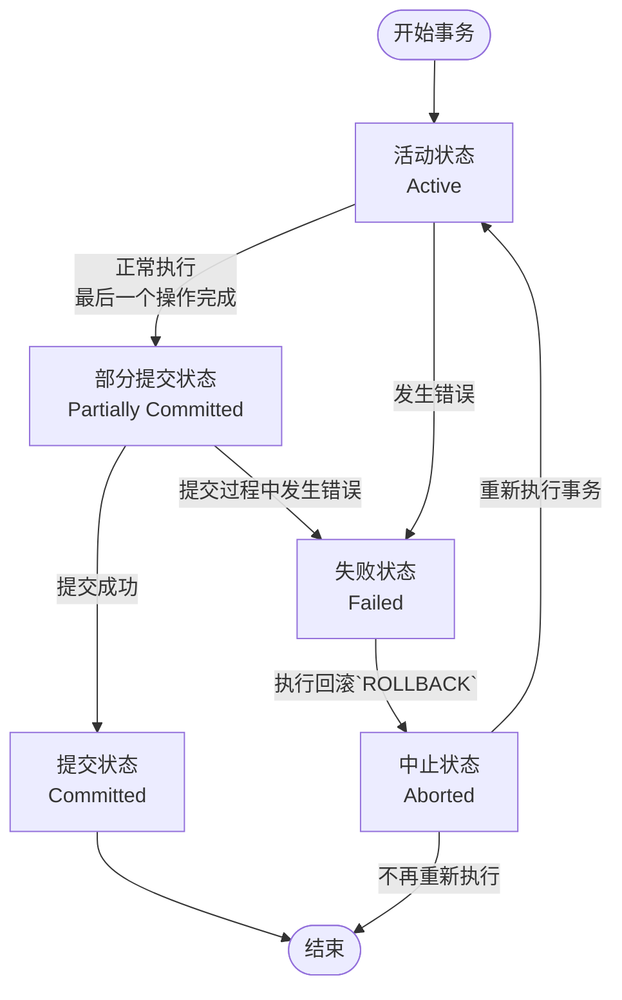

# `1`. 数据库事务概述

## `1.1` 存储引擎支持情况

```sql
# 查看 MySQL 提供的存储引擎，有支持，不支持和默认，默认一般是 InnoDB
SHOW ENGINES;
```

只有 `InnoDB` 是支持事务的，所以创建表一定要使用 `InnoDB` 才可以使用事务


## `1.2` 基本概念

事务（`Transaction`）：**是数据库管理系统中对一组数据库操作的**逻辑处理单元；简单来说，事务就是把多个数据库操作打包成一个整体，这些操作要么全部成功，要么全部失败

```sql
UPDATE account
SET balance = balance - 100
WHERE id = 1;

UPDATE account
SET balance = balance + 100
WHERE id = 2;
```

假如第一个操作成功，第二个操作失败，在把这段代码放进事务后，不管谁失败，两个都一起失败


## `1.3` 事务的 `ACID` 特性

| 特性 | 英文          | 中文   | 核心意思                                    |
| ---- | ------------- | ------ | ------------------------------------------- |
| `A`  | `Atomicity`   | 原子性 | 要么全部执行，要么全部不执行                |
| `C`  | `Consistency` | 一致性 | 事务执行前后，数据都必须符合规则            |
| `I`  | `Isolation`   | 隔离性 | 多个事务同时执行时，互不干扰                |
| `D`  | `Durability`  | 持久性 | `COMMIT` 后，即使数据库宕机，数据也永久保存 |


### `1.3.1` 原子性

原子性：是指事务是一个不可分割的工作单位，要么全部提交，要么全部失败回滚。

>   一个事务中的多个操作，是不可再分的整体。要么全部成功，要么全部失败，不能只成功一部分。


### `1.3.2` 一致性

一致性：指事务执行前后，数据从一个**合法性状态变**换到另外一个**合法性状态**。这种状态是语义上的而不是语法上的，跟具体的业务有关。

>   例如银行账户有一个业务规则：所有账户余额总和 = 10000
>
>   张三和李四各有 5000元，现在有个业务：张三转给李四 1000元
>
>   最后张三 4000元，李四6000元，总和仍然：4000 + 6000 = 10000。数据库没有违反业务规则


### `1.3.3` 隔离性

隔离性：事务的隔离性是指一个事务的执行**不能被其他事务干扰**，即一个事务内部的操作及使用的数据对并发的其他事务是隔离的，并发执行的各个事务之间不能互相干扰

>   假设现在有两个事务：
>
>   -   事务A：修改余额 1000 → 500
>   -   事务B：读取余额
>
>   如果 A 还没有提交，B 到底应该看到：1000
>
>   这就是**事务隔离性**要解决的问题


### `1.3.4` 持久性

持久性：事务提交以后，数据不能因为数据库突然宕机就消失

```sql
START TRANSACTION;

UPDATE account
SET balance = 900
WHERE id = 1;

COMMIT;
```

执行 `COMMIT;` 之后，服务器突然断电，数据库重新启动之后，`balance` 应该仍然是 900，而不是1000，这就是：**持久性（`Durability`）**

>   持久性是通过事务日志来保证的。日志包括了**重做日志**和**回滚日志**。当我们通过事务对数据进行修改的时候，首先会将数据库的变化信息记录到重做日志中，然后再对数据库中对应的行进行修改。这样做的好处是，即使数据库系统崩溃，数据库重启后也能找到没有更新到数据库系统中的重做日志，重新执行，从而使事务具有持久性。


## `1.3.4` 事务的状态

| 状态             | 英文                  | 含义                                             |
| ---------------- | --------------------- | ------------------------------------------------ |
| **活动状态**     | `Active`              | 事务正在执行                                     |
| **部分提交状态** | `Partially Committed` | 最后一个操作已经执行完，但事务还没有真正完成提交 |
| **提交状态**     | `Committed`           | 事务成功提交，修改已经正式生效                   |
| **失败状态**     | `Failed`              | 事务执行过程中发生错误，无法继续执行             |
| **中止状态**     | `Aborted`             | 事务已经回滚，数据库恢复到事务开始前的状态       |


### 活动状态 `active`

事务对应的数据库操作**正在执行**过程中时，我们就说该事务处在活动的状态


### 部分提交状态 `Partially Committed`

当事务中的最后一个操作执行完成，但由于操作都在**内存中执行**，所造成的影响并**没有刷新到磁盘**时，我们就说该事务处在部分提交的状态。


### 提交状态 `Committed`

事务成功完成，事务对数据库产生的修改正式生效


### 失败状态 `Failed`

事务执行过程中发生错误，就可能进入失败状态，此时事务已经**无法正常继续执行**

比如：

1.   `SQL` 执行错误
2.   违反约束
3.   数据库发生故障
4.   事务被系统终止


### 中止状态 `Aborted`

事务失败之后，需要进行 `ROLLBACK`，把事务已经执行的修改撤销掉。事务回滚完成后，就是中止状态


### 状态图




# `2`. 如何使用事务

使用事务有两种方式，分别是 **显示事务** 和 **隐式事务**

>   显示事务 = 你明确写 `START TRANSACTION` / `BEGIN` 开启事务
>   隐式事务 = `MySQL` 自动帮你开启事务，你不需要显式写 `START TRANSACTION`
>   自动提交 = 每条 `SQL` 执行完自动提交，是默认模式；`SELECT @@autocommit;`

```
                    MySQL 事务
                       │
          ┌────────────┴────────────┐
          │                         │
      自动提交模式               手动事务模式
   autocommit = 1             autocommit = 0
          │                         │
      每条语句自动提交          多条语句组成事务
                                    │
                          ┌─────────┴─────────┐
                          │                   │
                       显式事务             隐式事务
                  START TRANSACTION       SQL自动开启
```


## `2.1` 显示事务

使用 `START TRANSACTION` / `BEGIN` 关键字开启事务

```sql
START TRANSACTION;

UPDATE account
SET balance = balance - 100
WHERE id = 1;

UPDATE account
SET balance = balance + 100
WHERE id = 2;

COMMIT;
```

```sql
BEGIN;

UPDATE account
SET balance = balance - 100
WHERE id = 1;

UPDATE account
SET balance = balance + 100
WHERE id = 2;

COMMIT;
```

```sql
START TRANSACTION;

-- 一系列 SQL

ROLLBACK;
```


### `2.1.1` `START TRANSACTION`

与 `BEGIN` 关键字不一样，`START TRANSACTION` 后面可以跟两个修饰项

```sql
START TRANSACTION
	[READ WRITE | READ ONLY]
    [WITH CONSISTENT SNAPSHOT];
```

-   `READ WRITE`：**默认值**，当前事务允许进行**读写**操作
-   `READ ONLY`：当前事务是**只读**事务，适合一些只需要查询数据的场景，因为明确告诉 `MySQL`，这个事务不会修改数据
-   `WITH CONSISTENT SNAPSHOT`：一致性读，事务开始时立即建立一致性**快照**，后续普通 `SELECT` 的一致性读会基于事务的快照进行读取

| 写法                                          | 含义                         |
| --------------------------------------------- | ---------------------------- |
| `START TRANSACTION;`                          | 开启普通读写事务             |
| `START TRANSACTION READ WRITE;`               | 开启读写事务                 |
| `START TRANSACTION READ ONLY;`                | 开启只读事务                 |
| `START TRANSACTION WITH CONSISTENT SNAPSHOT;` | 开启事务并立即建立一致性快照 |


### `2.1.2` 保存点（`SAVEPOINT`）

语法：`ROLLBACK TO SAVEPOINT`，回滚到保存点，但不结束整个事务

```sql
START TRANSACTION;

UPDATE account
SET balance = balance - 100
WHERE id = 1;

SAVEPOINT sp1;            # sp1 是临时的变量，仅对当前事务生效

UPDATE account
SET balance = balance - 200
WHERE id = 1;

ROLLBACK TO sp1;           # 在事务提交之前，可以回到 一个保存点

COMMIT;
```


### `2.1.3` `ROLLBACK` 和 `ROLLBACK TO` 的区别

| 操作              | 效果         | 事务是否结束 |
| ----------------- | ------------ | ------------ |
| `ROLLBACK`        | 回滚整个事务 | **是**       |
| `ROLLBACK TO sp1` | 回滚到保存点 | 否           |
| `COMMIT`          | 提交整个事务 | 是           |


## `2.2` 隐式事务

```sql
# 关闭自动提交，只针对 DML 有效，DDL 无效
SET autocommit = 0;

# 关闭自动提交之后，在手动 COMMIT 前，这段代码都处于一个 事务中
UPDATE account SET balance = balance - 100 WHERE id = 1;
UPDATE account SET balance = balance + 100 WHERE id = 2;

COMMIT;

# 重新开启自动提交
SET autocommit = 1;
```


### `2.2.1` 隐式提交的情况

1.   开启新的事务会触发上一个事务隐式提交

     ```sql
     START TRANSACTION;
     
     UPDATE account
     SET balance = balance - 100
     WHERE id = 1;
     
     START TRANSACTION;      # 触发上一个事务隐式提交
     ```

2.   `SET autocommit = 1` 手动设置自动提交也会触发隐式提交

     ```sql
     SET autocommit = 0;
     
     UPDATE account
     SET balance = balance - 100
     WHERE id = 1;
     
     SET autocommit = 1;      # 触发事务隐式提交
     ```

3.   `DDL` 语句触发隐式提交

     ```sql
     CREATE TABLE
     ALTER TABLE
     DROP TABLE
     TRUNCATE TABLE
     CREATE INDEX
     DROP INDEX
     ```

     ```sql
     START TRANSACTION;
     
     UPDATE account
     SET balance = balance - 100
     WHERE id = 1;
     
     CREATE TABLE test (      # 触发事务隐式提交
         id INT
     );
     ```

4.   锁定表 `LOCK TABLES`、解锁表 `UNLOCK TABLES` 触发隐式提交

     ```sql
     START TRANSACTION;
     
     UPDATE account
     SET balance = balance - 100
     WHERE id = 1;
     
     LOCK TABLES account WRITE;       # 触发事务隐式提交
     ```

5.   `TRUNCATE TABLE` 清空表数据

     ```sql
     START TRANSACTION;
     
     TRUNCATE TABLE account;
     ```
     
6.   `LOAD DATA` 会隐式提交

7.   `MySQL` 部分 **复制/主从复制控制语句** 会导致隐式提交

     ```sql
     START REPLICA;
     STOP REPLICA;
     RESET REPLICA;
     CHANGE REPLICATION SOURCE TO ...;
     ```

8.   其他的一些语句，比如分析语句

     ```sql
     ANALYZE TABLE
     CHECK TABLE
     OPTIMIZE TABLE
     REPAIR TABLE
     FLUSH
     CACHE INDEX
     LOAD INDEX INTO CACHE
     RESET
     ```

     ```sql
     START TRANSACTION;
     
     UPDATE account
     SET balance = balance - 100
     WHERE id = 1;
     
     ANALYZE TABLE account;        # 触发事务隐式提交
     ```


## `2.3` 事务的特性

1.   当前事务自己修改的数据是可以看到的

     ```sql
     START TRANSACTION;
     
     UPDATE `order`
     SET order_name = 'bin'
     WHERE order_id = 1; 
     
     SELECT * FROM `order`;     # 这里可以看到 order_id = 1 的记录，名字被设置为 'bin'
     
     ROLLBACK;
     ```


# `3`. 事务隔离级别

>   事务隔离级别主要是为了解决“**并发事务**之间的数据可见性和相互影响”问题
>
>   如果只有**一个事务、没有其他事务同时操作数据**，隔离级别通常不会体现出它的核心区别
>
>   ```sql
>   事务 A                         事务 B
>      │                              │
>      │                              │
>      ├── 查询余额 1000               │
>      │                              │
>      │                              ├── 修改余额为 500
>      │                              │
>      │                              ├── COMMIT
>      │                              │
>      ├── 再次查询余额？               │
>      │                              │
>   ```
>
>   事务 A 第二次查询，到底应该看到 1000 还是 500？这就是**事务隔离级别**要解决的问题

| 隔离级别                                    | 脏写 | 脏读 | 不可重复读 | 幻读 |
| ------------------------------------------- | ---- | ---- | ---------- | ---- |
| `READ UNCOMMITTED`（读未提交）              | ✅    | ❌    | ❌          | ❌    |
| `READ COMMITTED`（读已提交）`Oracle` 默认值 | ✅    | ✅    | ❌          | ❌    |
| `REPEATABLE READ`（可重复读）`MySQL` 默认值 | ✅    | ✅    | ✅          | ❌*   |
| `SERIALIZABLE`（串行化）                    | ✅    | ✅    | ✅          | ✅    |

>   隔离级别越高，并发性越差
>
>   默认情况下：一般我们写代码估计都不会修改隔离级别，所以写代码的时候注意吧
>
>   `Oracle` 支持 `READ COMMITTED`、`SERIALIZABLE` 两种隔离级别，`MySQL` 则4种都支持
>
>   -   `MySQL` 需要注意幻读的问题
>   -   `Oracle` 需要注意不可重复读、幻读的问题


## `3.1` 隔离级别概述

| 问题           | 核心区别                                   | 主要原因                                  | 典型现象                        |
| -------------- | ------------------------------------------ | ----------------------------------------- | ------------------------------- |
| **脏写**       | 覆盖别人**未提交的修改**                   | 另一个事务已经修改数据，但还没有提交      | A 改成 800 未提交，B 又改成 500 |
| **脏读**       | 读到了**未提交的数据**                     | 另一个事务修改后还没提交                  | 读到的数据后来被 `ROLLBACK` 了  |
| **不可重复读** | 同一条数据，**两次读取结果不同**           | 另一个事务修改并提交了这条数据            | 第一次读 100，第二次读 200      |
| **幻读**       | 同一个查询范围，**两次查询的记录数量不同** | 另一个事务新增/删除了符合条件的记录并提交 | 第一次 10 条，第二次 11 条      |

1.   **脏写**：一个事务修改了另一个事务尚未提交的数据，并且覆盖了这个未提交的数据

     ```
     原来的值：1000
     
     事务 A：1000 → 800（未提交）
     事务 B：800  → 500（覆盖 A 的未提交修改）
     
     最后值为 500
     ```

2.   **脏读**：读取到了其他事务尚未提交的数据

     ```
     事务 A              事务 B
     事务A：修改数据
                        事务B：读取数据 ← A还没提交
     事务A：ROLLBACK
     ```

     B 刚才读取到的数据实际上不存在了，这就是脏读

3.   **不可重复读**：同一个事务中，两次读取同一条数据，结果不一样

     不可重复读针对已有**记录**的内容发生变化

     ```
     事务A：                      事务B：
     第一次查询：余额 = 1000
                      ↓
                                 事务B：
                                 修改余额 = 500
                                 COMMIT
                      ↓
     事务A：
     第二次查询：余额 = 500
     ```

     同一个事务中：第一次：1000，第二次：500，这就是不可重复读

4.   **幻读**：同一个查询范围，前后两次出现不同的记录集合；与**不可重复读**类似，幻读针对 **结果集** 中的记录发生变化（比如多一**行**记录）

     假设有两个事务，事务A和事务B

     ```sql
     # 事务 A
     SELECT * FROM user WHERE age >= 20;   # 得到3条记录
     
     # 事务 B
     INSERT INTO user(id, name, age) VALUES (4, '赵六', 21);
     COMMIT;
     
     # 事务 A 再执行相同查询
     SELECT * FROM user WHERE age >= 20;     # 突然多出来一条赵六，就好像“凭空出现了一条数据”
     ```


## `3.2` 设置事务的隔离级别

1.   查看事务的隔离级别

     ```sql
     SELECT @@transaction_isolation;
     
     # 或者
     SHOW VARIABLES LIKE 'transaction_isolation';
     ```

2.   设置事务的隔离级别

     ```sql
     SET [GLOBAL | SESSION] TRANSACTION ISOLATION LEVEL 隔离级别;
     
     # 或者
     SET [GLOBAL | SESSION] TRANSACTION_ISOLATION = '隔离级别';
     ```

     ```sql
     # 设置隔离级别为 不可重复读
     SET SESSION TRANSACTION ISOLATION LEVEL REPEATABLE READ;
     
     SET SESSION TRANSACTION_ISOLATION = 'REPEATABLE-READ';    # 隔离级别需要使用 - 连接
     ```

3.    只设置下一次事务

     ```sql
     SET TRANSACTION ISOLATION LEVEL READ COMMITTED;           # 就是没有 SESSION | GLOBAL
     
     # 开启事务，使用 READ COMMITTED 级别
     START TRANSACTION;
     
     SELECT * FROM account;
     
     COMMIT;
     
     # 此处恢复原来的隔离级别
     ```

     这个事务结束后，后续事务不会继续使用这个临时设置
