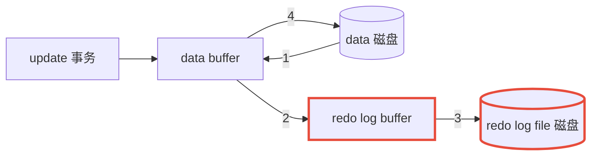
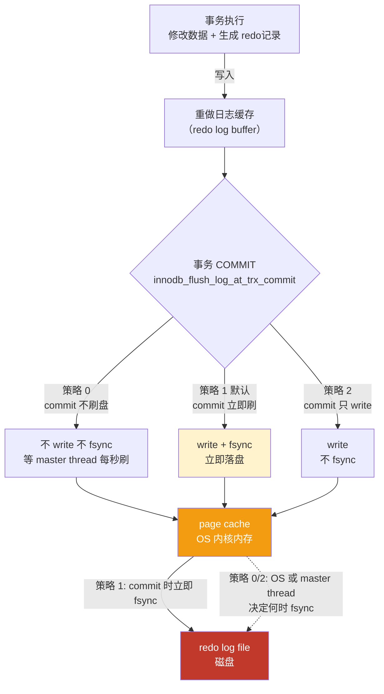
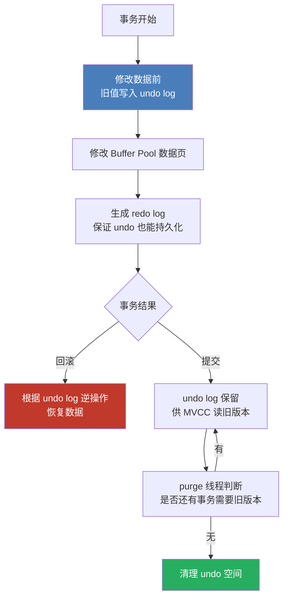

# `MySQL` 事务日志

事务有4种特性：原子性、一致性、隔离性和持久性。那么事务的四种特性到底是基于什么机制实现呢？

-   事务的隔离性由 **锁机制** 实现。
-   而事务的原子性、一致性和持久性由事务的 `redo` 日志和 `undo` 日志来保证。
    -   `REDO LOG` 称为 **重做日志** ，提供再写入操作，恢复提交事务修改的页操作，用来保证事务的持久性。
    -   `UNDO LOG` 称为 **回滚日志** ，回滚行记录到某个特定版本，用来保证事务的原子性、一致性。

有的 `DBA` 或许会认为 `UNDO` 是 `REDO` 的逆过程，其实不然。 `REDO` 和 `UNDO` 都可以视为是一种 **恢复操作**，但是：

-   `redo log` ：是存储引擎层( `innodb` )生成的日志，记录的是" **物理级别** "上的页修改操作，比如页号 `xxx` 、偏移量 `yyy` 写入了 `'zzz'` 数据。主要为了保证数据的可靠性；
-   `undo log` ：是存储引擎层( `innodb` )生成的日志，记录的是 **逻辑操作** 日志，比如对某一行数据进行了 `INSERT` 语句操作，那么 `undo log` 就记录一条与之相反的 `DELETE` 操作。主要用于 **事务的回滚**（`undo log` 记录的是每个修改操作的 **逆操作**）和 **一致性非锁定读**（`undo log` 回滚行记录到某种特定的版本--- `MVCC` ，即多版本并发控制）

| 日志        | 主要作用                           | 关键特性           |
| ----------- | ---------------------------------- | ------------------ |
| `Redo Log`  | 保证事务的**持久性**               | 崩溃恢复           |
| `Undo Log`  | 保证事务的**回滚**、实现 `MVCC`    | 保存旧版本         |
| `Binlog`    | 记录数据库的**逻辑**变更           | 主从复制、数据恢复 |
| `Relay Log` | 从库接收主库 `Binlog` 后保存的日志 | 主从复制           |


## `1`. `redo` 日志

注意一个非常重要的概念：**事务提交时，并不要求所有修改过的数据页都立即写入磁盘**，`InnoDB` 更倾向于，**先写日志，再写数据页**

`InnoDB` 存储引擎是以 **页为单位** 来管理存储空间的。在真正访问页面之前，需要把在 **磁盘上** 的页缓存到内存中的 `Buffer Pool` 之后才可以访问。所有的变更都必须 **先更新缓冲池** 中的数据，然后缓冲池中的 **脏页** 会以**一定的频率**被刷入磁盘（ **`checkPoint` 机制** ），通过缓冲池来优化 `CPU` 和磁盘之间的鸿沟，这样就可以保证整体的性能不会下降太快。

```
SQL
 ↓
Buffer Pool
 ↓
Redo Log
 ↓
COMMIT
 ↓
以后再把数据页刷入磁盘
```


### `1.1` 为什么需要 `redo` 日志

如果每次修改数据都直接写磁盘：

```
UPDATE
 ↓
修改 Buffer Pool
 ↓
写磁盘
 ↓
COMMIT
```

**磁盘 `I/O` 会非常频繁**。`InnoDB` 使用：

```
SQL
 ↓
修改 Buffer Pool 中的数据页
 ↓
写 Redo Log
 ↓
COMMIT
```

数据页可以稍后再刷入磁盘。因此可以把大量随机磁盘 `I/O` 转化成相对连续的日志写入。

>   这个机制也叫：
>
>   **`Write-Ahead Logging`（`WAL`，预写日志）**
>
>   核心思想：
>
>   **数据页真正写入磁盘之前，必须先保证对应的 `Redo Log` 已经持久化**


### `1.2` `redo` 的优点、特点

优点：

1.   `redo` 日志降低了刷盘频率

2.   `redo` 占用的空间非常小

     存储表空间`ID`、页号、偏移量以及需要更新的值，所需的存储空间是很小的，刷盘快

特点：

1.   `redo` 日志是顺序写入磁盘的

     在执行事务的过程中，每执行一条语句，就可能产生若干条 `redo` 日志，这些日志是按照 **产生的顺序写入磁盘的**，也就是使用顺序 `IO` ，效率比随机 `IO` 快。

2.   事务执行过程中，`redo log` 不断记录

     `redo log` 跟 `bin log` 的区别， `redo log` 是 **存储引擎层** 产生的，而 `bin log` 是 **数据库层** 产生的。假设一个事务，对表做10万行的记录插入，在这个过程中，一直不断的往 `redo log` 顺序记录，而 `bin log` 不会记录，直到这个事务提交，才会一次写入到 `bin log` 文件中。


### `1.3` redo log` 的组成

`Redo log` 可以简单分为以下两个部分：

1.   重做日志的缓冲（`redo log buffer`），保存在内存中，是易失的

     在服务器启动时就向操作系统申请了一大片称之为 `redo log buffer` 的连续内存空间，翻译成中文就是`redo`日志缓冲区。这片内存空间被划分成若干个连续的 `redo log block`。一个 `redo log block` 占用**512字节**大小。

     ```sql
     show variables like '%innodb_log_buffer_size%'
     ```

2.   重做日志文件（ `redo log file` ），保存在硬盘中，是持久的

     `MySQL 8.0` 的 `REDO` 日志文件位于 `MySQL` 数据目录（`datadir`）下的 `#innodb_redo` 目录


### `1.4` `redo` 整体流程



1.   第1步：先将原始数据从磁盘中读入内存中来，修改数据的内存拷贝
2.   第2步：生成一条重做日志并写入 `redo log buffer` ，记录的是数据被修改后的值
3.   第3步：当事务 `commit` 时，将 `redo log buffer` 中的内容刷新到 `redo log file` ，对 `redo log file` 采用追加写的方式
4.   第4步：定期将内存中修改的数据刷新到磁盘中

>   `Write-Ahead Log` (预先日志持久化)：在持久化一个数据页之前，先将内存中相应的日志页持久化


### `1.5` `redo log` 刷盘策略



注意， `redo log buffer` 刷盘到 `redo log file` 的过程并不是真正的刷到磁盘中去，只是刷入到 `文件系统缓存` （ `page cache` ）中去（这是现代操作系统为了提高文件写入效率做的一个优化），真正的写入会交给系统自己来决定（比如 `page cache` 足够大了）。那么对于 `InnoDB` 来说就存在一个问题，如果交给系统来同步，同样如果系统宕机，那么数据也丢失了（虽然整个系统宕机的概率还是比较小的）。

针对这种情况， `InnoDB` 给出 `innodb_flush_log_at_trx_commit` 参数，该参数控制 `commit` 提交事务时，如何将 `redo log buffer` 中的日志刷新到 `redo log file` 中。它支持三种策略：

```sql
# 查看 innodb_flush_log_at_trx_commit 的值，默认是 1
SHOW VARIABLES LIKE 'innodb_flush_log_at_trx_commit';
SELECT @@global.innodb_flush_log_at_trx_commit;

# 设置
SET GLOBAL innodb_flush_log_at_trx_commit = 2;
```

1.  设置为 `0` ：表示每次事务提交时**不进行刷盘操作**。（系统默认 `master thread` 每隔 `1s` 进行一次重做日志的同步）
2.  设置为 `1` ：表示每次事务**提交时都将进行同步**，刷盘操作（ **默认值** ）
3.  设置为 `2` ：表示每次事务提交时都只把 `redo log buffer` 内容**写入 `page cache`** ，不进行同步。由 `os` 自己决定什么时候同步到磁盘文件。

>   另外，`InnoDB` 存储引擎有一个后台线程，每隔1秒，就会把 `redo log buffer` 中的内容写到文件系统缓存(`page cache`)，然后调用刷盘操作。
>
>   也就是说，一个没有提交事务的 `redo log` 记录，也可能会刷盘。因为在事务执行过程 `redo log` 记录是会写入 `redo log buffer` 中，这些 `redo log` 记录会被后台线程刷盘。

| `innodb_flush_log_at_trx_commit` | 安全性 | 性能 | `commit` 时     | 适用场景                         | 说明                                                         |
| :------------------------------- | :----- | :--- | :-------------- | :------------------------------- | ------------------------------------------------------------ |
| **0**                            | 最低   | ⭐⭐⭐  | 不立即写/刷     | 日志、埋点等可容忍丢数据场景     | `commit` 不刷盘，`master thread` 每秒刷一次；`MySQL/OS` 宕机最多丢 1 秒数据 |
| **1**（默认）                    | 最高   | ⭐    | 写并刷          | 金融、订单等强一致场景           | 每次 `commit` 都 `write + fsync`，真正落盘；不丢数据，但 `IO` 开销最大 |
| **2**                            | 中等   | ⭐⭐   | `写入 OS Cache` | 高并发、可容忍 OS 崩溃丢数据场景 | 每次 `commit` 只 `write` 到 `page cache`，不 `fsync`；`MySQL `崩溃不丢，`OS` 崩溃可能丢 |

在性能要求较高的情况下，可以考虑把 `innodb_flush_log_at_trx_commit` 设置为2，以提升性能，因为 操作系统或服务器 级别的崩溃风险相对较小，可以牺牲一点安全性换取高性能。

此时 `ACID` 中的 `Durability`（持久性）会受到影响，因为数据库事务有一个非常重要的承诺 -> （`COMMIT` 成功，即使数据库突然崩溃，数据也应该能够恢复）


### `1.6` `MySQL` 崩溃 vs 操作系统崩溃

1.   `MySQL` 崩溃

     ```
     MySQL 崩溃
         ↓
     操作系统还活着
         ↓
     OS Cache 仍然存在
     ```

2.   操作系统崩溃

     ```
     服务器断电
         ↓
     OS Cache 消失
         ↓
     尚未刷盘的 Redo Log 可能丢失
     ```

因此 `innodb_flush_log_at_trx_commit = 2` 的风险主要体现在：**操作系统或服务器级别的崩溃。**而 `0` 连 `MySQL` 进程崩溃都可能丢失尚未写出的日志


### `1.7` `redo log buffer`

向 `log buffer` 中写入 `redo` 日志的过程是顺序的，也就是先往前边的 `block` 中写，当该 `block` 的空闲空间用完之后再往下一个 `block` 中写。

>   一个 `block` 大小是 `512KB`


### `1.8` `redo log file`

##### 相关参数配置

```sql
SHOW VARIABLES LIKE 'innodb_log_file%';

# 数据目录
SHOW VARIABLES LIKE '%datadir%';
```

1.   `innodb_log_files_in_group`：`redo log file` 文件个数，默认2，最大100
2.   `innodb_log_file_size`：单个 `redo log` 文件大小，默认值 `48M`，全部 `redo log` 最大值 `512G` (`innodb_log_files_in_group * innodb_log_file_size`)


##### `checkpoint`

在整个日志文件组中还有两个重要的属性，分别是 `write pos` 、 `checkpoint`

-   `write pos` 是当前记录的位置，一边写一边后移
-   `checkpoint` 是当前要擦除的位置，也是往后推移

每次刷盘 `redo log` 记录到日志文件组中， `write pos` 位置就会后移更新。每次 `MySQL` 加载日志文件组恢复数据时，会清空加载过的 `redo log` 记录，并把 `checkpoint` 后移更新。 `write pos` 和 `checkpoint` 之间的还空着的部分可以用来写入新的 `redo log` 记录。

如果 `write pos` 追上 `checkpoint`，表示**日志文件组**满了，这时候不能再写入新的 `redo log` 记录，`MysQL` 得停下来，清空一些记录，把 `checkpoint` 推进一下。


## `2`. `undo` 日志

`redo log` 是事务持久性的保证，`undo log` 是事务原子性的保证。在事务中更新数据的**前置操作**其实是要先写入一个 `undo log`

-   `Redo Log` 关注 怎么把修改重新做一遍？保证事务的 **持久性**
-   `Undo Log` 则是关注 怎么把修改撤销回来？主要用于事务 **回滚**


### `2.1` `undo log` 的两大作用

| 作用                  | 说明                                                         |
| :-------------------- | :----------------------------------------------------------- |
| 事务回滚              | 记录数据修改前的旧值，事务失败或 `ROLLBACK` 时，用 `undo` 记录把数据恢复回去 |
| `MVCC` 一致性非锁定读 | 为每个事务提供某个时间点的数据快照，实现 `READ COMMITTED` / `REPEATABLE READ` 下的无锁读 |

**`MVCC`**：（`Multi-Version Concurrency Control`，多版本并发控制）是 `MySQL InnoDB` 实现**高并发读写**的核心机制；同一条数据保留多个历史版本，让不同事务可以读取自己“应该看到”的版本，从而减少读写之间的互相阻塞


### `2.2` `undo log` 记录的是什么(`undo` 类型)

`undo log` 记录的是 **逻辑日志**，不是物理页修改，而是**逆操作**

在 `InnoDB` 存储引擎中， `undo log` 分为：

1.   `insert undo log`

     `insert undo log` 是指在 `insert` 操作中产生的 `undo log` 。因为 `insert` 操作的记录，只对事务本身可见，对其他事务不可见（这是事务隔离性的要求），故该 `undo log` 可以在事务提交后直接删除。不需要进行 `purge` 操作。

2.   `update undo log`

     `update undo log` 记录的是对 `delete` 和 `update` 操作产生的 `undo log` 。该 `undo log` 可能需要提供 `MVCC` 机制，因此不能在事务提交时就进行删除。提交时放入 `undo log` 链表，等待 `purge` 线程进行最后的删除。

| 原操作   | undo 中记录的逆操作               |
| :------- | :-------------------------------- |
| `INSERT` | 对应的 `DELETE`                   |
| `DELETE` | 对应的 `INSERT/UPDATE`            |
| `UPDATE` | 对应的反向 `UPDATE`（把旧值写回） |

>   例子：把 `id=1` 的 `name` 从 `'A'` 改成 `'B'`，undo 记录的是“把 `name` 改回 `'A'`”


### `2.3` `undo log` 的存储

| 参数                       | 作用                                            |
| -------------------------- | ----------------------------------------------- |
| `innodb_undo_directory`    | `undo` 表空间存放目录                           |
| `innodb_undo_tablespaces`  | `undo` 表空间数量（8.0 已废弃，最小 2）         |
| `innodb_max_undo_log_size` | 单个 `undo` 表空间最大大小，超过触发 `truncate` |
| `innodb_purge_threads`     | `purge` 线程数量，负责清理 `undo`               |
| `innodb_undo_log_truncate` | 是否开启 `undo` 表空间自动截断                  |

```sql
SHOW VARIABLES LIKE 'innodb_undo_directory';
```


### `2.4` `undo log` 的生命周期

```
① 事务开始
   ↓
② 修改数据前写入 undo log
   ↓
③ 事务提交 / 回滚
   ├── 回滚：立即使用 undo 恢复数据
   └── 提交：undo 不再用于回滚，但可能被 MVCC 读引用
   ↓
④ purge 线程清理
   └── 当没有事务再需要这些旧版本时，undo 空间被回收
```

>   **注意**：`undo log` 不是提交后立刻删除，因为可能还有长事务在读取旧版本。
>   长事务会导致 `undo` 空间膨胀，这是生产环境要避免长事务的原因之一。



>   一句话总结：**`undo log` 记录数据修改前的旧值，用于事务回滚和 `MVCC` 快照读；它本身也受 `redo log` 保护，提交后由 `purge` 线程在安全时清理。**
