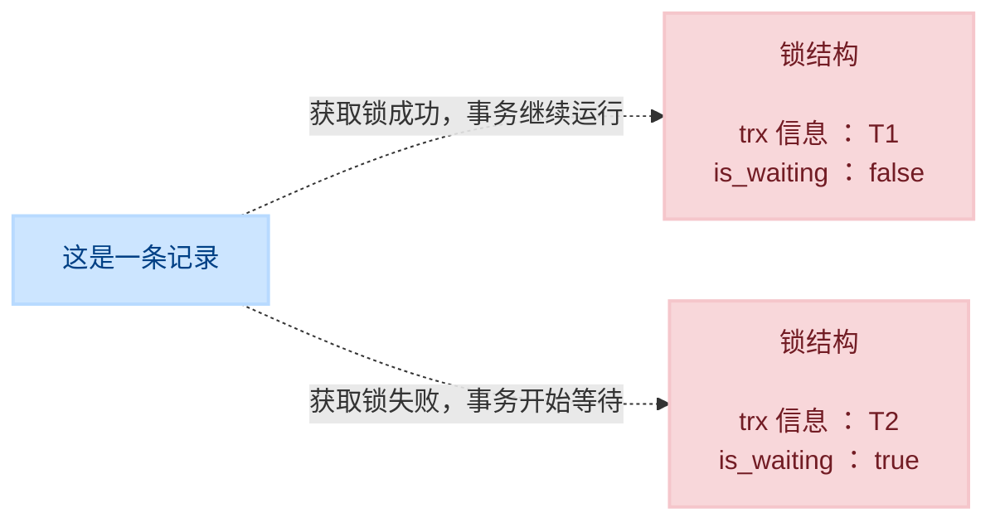
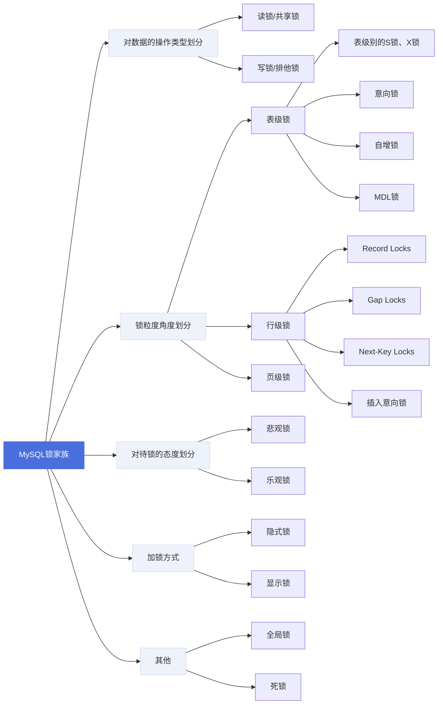
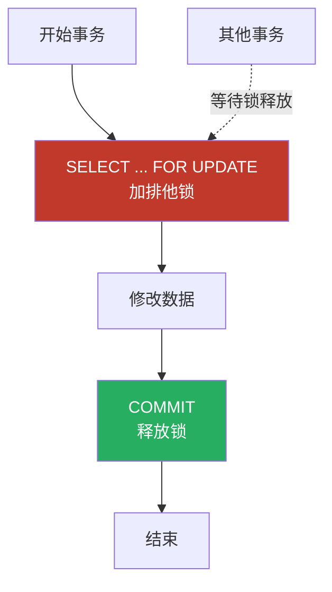
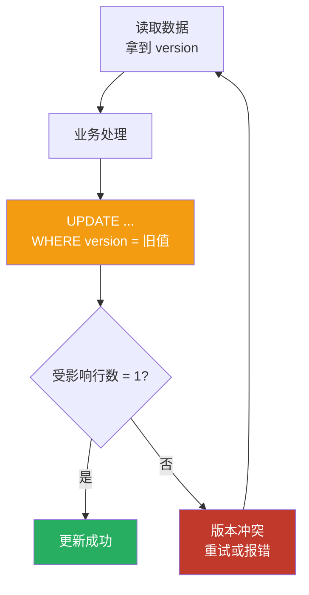
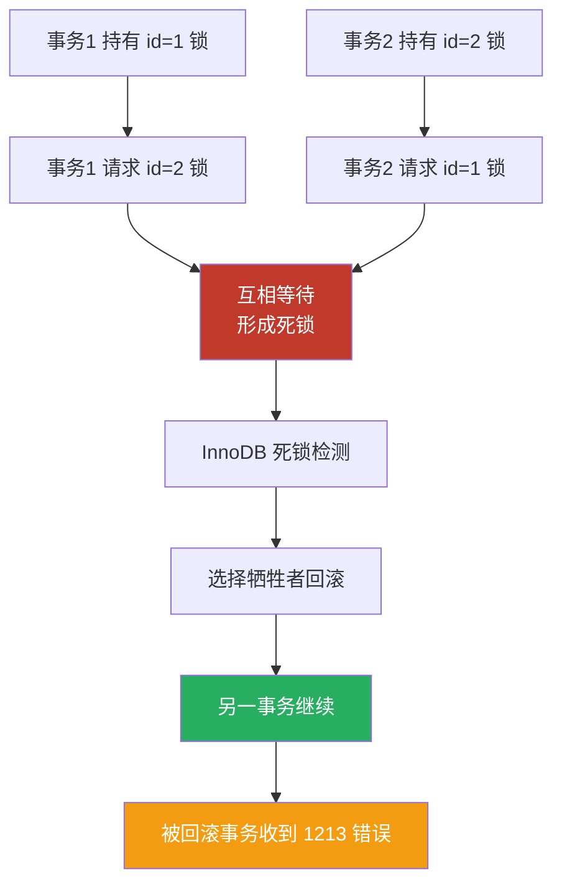
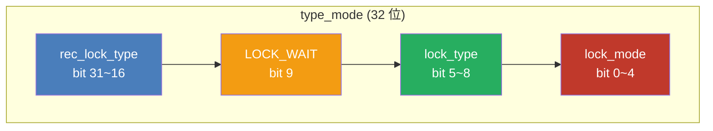

# `1`. 概述

**锁** 是计算机协调多个进程或线程 **并发访问某一资源** 的机制。在程序开发中会存在多线程同步的问题，当多个线程并发访问某个数据的时候，尤其是针对一些敏感的数据（比如订单、金额等），我们就需要保证这个数据在任何时刻 **最多只有一个线程** 在访问，保证数据的 **完整性** 和 **一致性**。在开发过程中加锁是为了保证数据的一致性，这个思想在数据库领域中同样很重要。

在数据库中，除传统的计算资源（如 `CPU`、`RAM`、`I/O` 等）的争用以外，数据也是一种供许多用户共享的资源。为保证数据的一致性，需要对 **并发操作进行控制**，因此产生了 **锁**。同时 **锁机制** 也为实现 `MySQL` 的各个隔离级别提供了保证。 **锁冲突** 也是影响数据库 **并发访问性能** 的一个重要因素。所以锁对数据库而言显得尤其重要，也更加复杂。


# `2`. `MySQL` 并发事务访问相同记录

## `2.1` 读-读情况

**读-读** 情况，即并发事务相继 **读取相同的记录** 。读取操作本身不会对记录有任何影响，并不会引起什么问题，所以允许这种情况的发生。


## `2.2` 写-写情况

**写-写** 情况，即并发事务相继对相同的记录做出改动

在这种情况下会发生 **脏写** 的问题，任何一种隔离级别都不允许这种问题的发生。所以在多个未提交事务相继对一条记录做改动时，需要让它们 **排队执行** ，这个排队的过程其实是通过 **锁** 来实现的。这个所谓的锁其实是一个 **内存中的结构**，在事务执行前本来是没有锁的，也就是说一开始是没有 **锁结构** 和记录进行关联的，如图所示：


当一个事务想对这条记录做改动时，首先会看看内存中有没有与这条记录关联的 **锁结构** ，当没有的时候就会在内存中生成一个 **锁结构** 与之关联。比如，事务 `T1` 要对这条记录做改动，就需要生成一个 **锁结构** 与之关联：


在 锁结构 里有很多信息，为了简化理解，只把两个比较重要的属性拿了出来：

-   **`trx` 信息** ：代表这个锁结构是哪个事务生成的
-   `is_waiting` ：代表当前事务是否在等待

当事务 `T1` 改动了这条记录后，就生成了一个 **锁结构** 与该记录关联，因为之前没有别的事务为这条记录加锁，所以 `is_waiting` 属性就是 `false` ，我们把这个场景就称之为 **获取锁成功**，或者 **加锁成功**，然后就可以继续执行操作了。

在事务 `T1` 提交之前，另一个事务 `T2` 也想对该记录做改动，那么先看看有没有 锁结构 与这条记录关联，发现有一个 锁结构 与之关联后，然后也生成了一个锁结构与这条记录关联，不过锁结构的 `is_waiting` 属性值为 `true` ，表示当前事务需要等待，我们把这个场景就称之为 获取锁失败 ，或者 加锁失败 ，图示：



在事务 `T1` 提交之后，就会把该事务生成的 **锁结构释放** 掉，然后看看还有没有别的事务在等待获取锁，发现了事务 `T2` 还在等待获取锁，所以把事务 `T2` 对应的锁结构的 `is_waiting` 属性设置为 `false` ，然后把该事务对应的线程唤醒，让它继续执行，此时事务 `T2` 就算获取到锁了。效果图就是这样：


小结：

-   不加锁

    意思就是不需要在内存中生成对应的 **锁结构**，可以直接执行操作。

-   获取锁成功，或者加锁成功

    意思就是在内存中生成了对应的 **锁结构**，而且锁结构的 `is_waiting` 属性为 `false` ，也就是事务可以继续执行操作。

-   获取锁失败，或者加锁失败，或者没有获取到锁

    意思就是在内存中生成了对应的 **锁结构**，不过锁结构的 `is_waiting` 属性为 `true` ，也就是事务需要等待，不可以继续执行操作。


## `2.3` 读-写或写-读情况

**读-写** 或 **写-读**，即一个事务进行读取操作，另一个进行改动操作。这种情况下可能发生**脏读、不可重复读、幻读**的问题。

各个数据库厂商对 `SQL` 标准 的支持都可能不一样。比如 `MySQL` 在 `REPEATABLE READ` 隔离级别上就已经解决了**幻读**问题。


## `2.4` 并发问题的解决方案

怎么解决**脏读、不可重复读、幻读**这些问题呢？其实有两种可选的解决方案：

1.  方案一：读操作利用多版本并发控制（ `MVCC` ，下章讲解），写操作进行**加锁**

2.  方案二：读、写操作都采用**加锁**的方式

    如果我们的一些业务场景不允许读取记录的旧版本，而是每次都必須去**读取记录的最新版本**。比如，在银行存款的事务中，你需要先把账户的余额读出来，然后将其加上本次存款的数额，最后再写到数据库中。在将账户余额读取出来后，就不想让别的事务再访问该余额，直到本次存款事务执行完成，其他事务才可以访问账户的余额。这样在读取记录的时候就需要对其进行 加锁 操作，这样也就意味着 读 操作和 写 操作也像 写-写 操作那样**排队**执行

    **脏读** 的产生是因为当前事务读取了另一个未提交事务写的一条记录，如果另一个事务在写记录的时候就给这条记录加锁，那么当前事务就无法继续读取该记录了，所以也就**不会有脏读问题**的产生了。

    **不可重复读** 的产生是因为当前事务先读取一条记录，另外一个事务对该记录做了改动之后并提交之后，当前事务再次读取时会获得不同的值，如果在当前事务读取记录时就给该记录加锁，那么另一个事务就无法修改该记录，自然也**不会发生不可重复读**了。

    **幻读** 问题的产生是因为当前事务读取了一个范围的记录，然后另外的事务向该范围内插入了新记录，当前事务再次读取该范围的记录时发现了新插入的新记录。**采用加锁的方式解决幻读问题就有一些麻烦**，因为当前事务在第一次读取记录时幻影记录并不存在，所以读取的时候加锁就有点尴尬（因为你并不知道给谁加锁）。

小结对比发现：

-   采用 `MVCC` 方式的话，**读-写**操作彼此并不冲突，**性能更高**。
-   采用**加锁**方式的话，**读-写**操作彼此需要**排队执行**，影响性能。

一般情况下我们当然愿意采用 `MVCC` 来解决 读-写 操作并发执行的问题，但是业务在某些特殊情况下，要求必须采用 加锁 的方式执行。下面就讲解下 `MySQL` 中不同类别的锁。


# `3`. 锁的不同角度的分类




## `3.1` 对数据的操作类型划分：读锁、写锁

对于数据库中并发事务的**读-读**情况并不会引起什么问题。对于**写-写**、**读-写**或**写-读** 这些情况可能会引起一些问题，需要使用 `MVCC` 或者**加锁**的方式来解决它们。在使用**加锁**的方式解决问题时，由于既要允许**读-读**情况不受影响，又要使**写-写、读-写或写-读**情况中的操作**相互阻塞**，所以 `MySQL` 实现一个由两种类型的锁组成的锁系统来解决。这两种类型的锁通常被称为**共享锁**（`Shared Lock`，`S Lock`）和**排他锁**（`Exclusive Lock`，`X Lock`），也叫**读锁**（`readlock`）和**写锁**（`write lock`）。

-   **读锁**：也称为 **共享锁** 、英文用 `S` 表示。针对同一份数据，多个事务的读操作可以同时进行而不会互相影响，**相互不阻塞的**。
-   **写锁**：也称为 **排他锁** 、英文用 `X` 表示。当前写操作没有完成前，它会阻断其他写锁和读锁。这样就能确保在给定的时间里，只有一个事务能执行写入，并防止其他用户读取正在写入的同一资源。

**需要注意的是对于 `InnoDB` 引擎来说，读锁和写锁可以加在表上，也可以加在行上。**

-   **举例（行级读写锁）**：

    如果一个事务 `T1` 已经获得了某个行 `r` 的**读锁**，那么此时另外的一个事务 `T2` 是可以去获得这个行 `r` 的读锁的，因为读取操作并没有改变行 `r` 的数据；

    但是，如果某个事务 `T3` 想获得行 `r` 的**写锁**，则它必须等待事务 `T1`、`T2` 释放掉行 `r` 上的读锁才行。

    |        | `S` 锁 | `X` 锁 |
    | :----- | :----- | :----- |
    | `S` 锁 | 兼容   | 不兼容 |
    | `X` 锁 | 不兼容 | 不兼容 |

    解释：

    1.   给表 `user` 的行加上 `S`锁之后，另一个事务仍可以获取 `user` 表该行的 `S` 锁，但是不能获取 `X` 锁
    2.   给表 `user` 的行加上 `X`锁之后，另一个事务不可以获取 `user` 表该行的 `S` 锁和 `X` 锁


### `3.1.1` 锁定读

在采用**加锁**方式解决**脏读**、**不可重复读**、**幻读**这些问题。`MySQL` 提供了两种特殊的 `SELECT` 语法来实现锁定读：

1.  对读取的记录加 `S` 锁（共享锁）

    ```sql
    # 必须在事务中使用
    SELECT ... LOCK IN SHARE MODE;
    #或
    SELECT ... FOR SHARE; #( 8.0 新增语法)
    ```

    ```sql
    # 举例（在事务中才会加锁）
    BEGIN;
    
    SELECT * FROM sys_user
    WHERE user_id = 1
    FOR SHARE;
    
    COMMIT;
    ```

    -   **作用**：读取记录并加上 `S` 锁。
    -   **特点**：允许其他事务继续读取这些记录（加 `S` 锁），但阻止其他事务修改这些记录或加 `X` 锁。
    -   **适用场景**：需要确保读取的数据在事务结束前不会被其他事务修改，但允许其他事务同时读取。

2.  对读取的记录加 `X` 锁（排他锁）

    ```sql
    # 必须在事务中使用
    SELECT ... FOR UPDATE;
    ```
    
    ```sql
    # 举例
    BEGIN;
    
    SELECT * FROM sys_user
    WHERE user_id = 1
    FOR UPDATE;
    
    COMMIT;
    ```
    
    -   **作用**：读取记录并加上 `X` 锁。
    -   **特点**：不仅阻止其他事务修改这些记录，也阻止其他事务加 `S` 锁或 `X` 锁来读取这些记录。其他事务只能等待当前事务提交或回滚。
    -   **适用场景**：读取数据后马上就要进行修改（如上面提到的银行存款场景），需要对数据进行独占保护。

#### 锁定读的重要特性

1.  **必须包含在事务中**：锁定读只有在事务中才有意义（通常配合 `START TRANSACTION` 或 `BEGIN` 使用）。

    如果不在事务中，锁会在语句执行后立即释放，因为不在事务中，`MySQL` 会**自动提交**（`autocommit` 默认开启），事务立刻结束，**锁立即释放**

    ```sql
    # 事务 A
    BEGIN;
    
    SELECT * FROM sys_user
    WHERE user_id = 1
    FOR SHARE;
    
    COMMIT;
    
    # 事务 B
    BEGIN;
    
    SELECT * FROM sys_user
    WHERE user_id = 1
    FOR SHARE;
    
    COMMIT;
    ```

2.  **读取最新数据**：锁定读会绕过 `MVCC`，直接读取最新版本的记录（当前读）。

3.  **锁的粒度取决于索引**：锁定读加的锁是行级锁，但它锁定的具体范围（记录锁、间隙锁、临键锁）取决于 `WHERE` 条件是否命中了索引。如果 `WHERE` 条件没有用到索引，`InnoDB` 可能会锁住整个表

    ```sql
    BEGIN;
    
    # 没有 WHERE 语句，锁住整个表
    SELECT * FROM sys_user FOR UPDATE;
    
    COMMIT;
    ```

4.  **必须使用索引**：为了防止全表扫描导致锁表，`WHERE` 条件应尽可能使用索引。

5.  **释放时机**：锁定读加的锁会一直持有，直到当前事务执行 `COMMIT` 或 `ROLLBACK` 时才会释放。

一句话总结

**锁定读是 `MySQL` 中用于读取最新数据并主动加锁的 `SELECT` 语句（`FOR UPDATE` 或 `LOCK IN SHARE MODE`），它的核心目的是在并发环境下保护数据，防止其他事务在本次事务结束前修改或读取这些记录，从而解决更新丢失、脏读等问题**


#### `MySQL 8.0` 新特性

在 `5.7` 及之前的版本中，`SELECT ... FOR SHARE | UPDATE;` 如果获取不到锁，会一直等待，直到 `innodb_lock_wait_timeout` 超时

```sql
-- 查看当前会话的等待超时时间，默认 50s
SHOW VARIABLES LIKE 'innodb_lock_wait_timeout';

-- 设置当前会话的等待超时时间（仅影响当前连接）
SET SESSION innodb_lock_wait_timeout = 10;

-- 设置全局等待超时时间（仅影响之后建立的新连接）
SET GLOBAL innodb_lock_wait_timeout = 30;
```

在 `MySQL 8.0` 中，锁定读新增了 `NOWAIT` 和 `SKIP LOCKED` 两个选项，用于解决特定业务场景下的锁等待与并发阻塞问题

-   **`NOWAIT`**：当请求的行已被锁定，**不等待，直接报错返回**。
-   **`SKIP LOCKED`**：当请求的行已被锁定，**不等待，直接跳过这行**，继续处理其他未锁定的行

| 选项          | 处理方式                           | 适用场景                                               | 注意点                                         |
| :------------ | :--------------------------------- | :----------------------------------------------------- | :--------------------------------------------- |
| `NOWAIT`      | 立即报错（`ERROR 3572`）           | 需要明确知道锁是否获取成功，例如“尝试预定某个特定座位” | 错误返回意味着锁已被占用                       |
| `SKIP LOCKED` | 跳过被锁定的行，返回结果集不含该行 | 从队列或任务池中安全地获取下一个可用项，避免阻塞       | 返回结果可能不包含全部数据，不适用一般事务处理 |

```sql
SELECT * FROM sys_user
WHERE user_id = 1
FOR SHARE NOWAIT;

SELECT * FROM sys_user
WHERE user_id = 1
FOR UPDATE SKIP LOCKED;
```

这两个选项在需要避免锁等待的场景中非常有用，例如：

-   **秒杀与排队场景**：在电影选座或票务系统中，用户只想预定一个空闲座位，而不希望因为某个座位被占而排队等待。使用 `SKIP LOCKED` 可以快速获取下一个可用的座位。
-   **消息队列/任务分发**：多个消费者同时从队列表获取任务。使用 `SKIP LOCKED` 可以让每个消费者获取不同的任务，而不会因为等待已被其他消费者锁定的任务而阻塞。


### `3.1.2` 写操作

`MySQL` 的写操作主要包括 `INSERT`、`UPDATE` 和 `DELETE`。这三者的加锁机制存在显著差异，具体取决于是否命中唯一索引

（**写操作**和**锁定读**加锁方式不一样，不用开发者手动加，都是**存储引擎自动加锁**的，所以，这部分都是概念的东西）

1.   `INSERT`

     **新插入的记录默认不加显式锁**，`MySQL` 通常会利用**隐式锁**来保护新记录，而不是在内存中立即生成锁结构。由于新插入的记录无法被其他事务访问，其隐含的事务 `ID` 就足以充当保护机制

2.   `UPDATE`

     `UPDATE` 的加锁策略，核心看 **`WHERE` 条件是否命中索引，以及命中的是什么索引**。

     | `WHERE` 条件             | 索引类型   | 加锁情况                                                    |
     | :----------------------- | :--------- | :---------------------------------------------------------- |
     | 等值查询，命中唯一索引   | 唯一索引   | 退化为**记录锁**（`X` 锁），只锁这一条记录，不加间隙锁      |
     | 等值查询，命中非唯一索引 | 非唯一索引 | 加**排他临键锁**（`X` 锁 + 间隙锁），锁住记录及其前面的间隙 |
     | 范围查询                 | 任意索引   | 加**排他临键锁**，锁住扫描到的整个范围                      |
     | 没有用到索引             | 无         | 走全表扫描，**锁住整张表的所有记录**（相当于表锁）          |

     如果 `UPDATE` 修改的是**二级索引列**，`InnoDB` 除了锁住二级索引记录，还会**回表**去锁住对应的**聚簇索引记录**

     如果 `UPDATE` 修改的是**非索引列**，则只锁聚簇索引记录，二级索引上的锁是隐式的

3.   `DELETE`

     `DELETE` 的加锁方式与 `UPDATE` 类似。通常会在搜索遇到的每个记录上加**排他临键锁**；如果使用唯一索引进行唯一搜索，则退化为**记录锁**


## `3.2` 锁粒度角度划分：表锁、页锁、行锁

为了尽可能提高数据库的并发度，每次锁定的数据范围越小越好，理论上每次只锁定当前操作的数据的方案会得到最大的并发度，但是管理锁是很**耗资源**的事情（涉及获取、检查、释放锁等动作）。因此数据库系统需要在**高并发响应**和**系统性能**两方面进行平衡，这样就产生了“**锁粒度**（ `Lock granularity` ）”的概念。

对一条记录加锁影响的也只是这条记录而已，我们就说这个锁的粒度比较细；其实一个事务也可以在**表级别**进行加锁，自然就被称之为**表级锁**或者**表锁**，对一个表加锁影响整个表中的记录，我们就说这个锁的粒度比较粗。锁的粒度主要分为表级锁、页级锁和行锁。

| 锁粒度   | 适合场景                   | 系统开销                       | 主要使用该粒度的引擎 | 说明                            |
| :------- | :------------------------- | :----------------------------- | :------------------- | ------------------------------- |
| **表锁** | 读多写少、并发低、批量操作 | 小（加锁快，无需逐行记录）     | `MyISAM`             | `InnoDB` 也支持表锁（如意向锁） |
| **页锁** | 介于两者之间（已淘汰）     | 中（介于表锁与行锁之间）       | `BDB`                | 现代 `MySQL` 基本不用           |
| **行锁** | 写多读多、并发高、精确操作 | 大（需维护每行锁信息，易死锁） | `InnoDB`             | `InnoDB` 同时支持行锁和表锁     |


### `3.2.1` 表锁

该锁会锁定整张表，它是 `MySQL` 中最基本的锁策略，并**不依赖于存储引擎**（不管你是 `MySQL` 的什么存储引擎，对于表锁的策略都是一样的），并且表锁是**开销最小**的策略（因为粒度比较大）。由于表级锁一次会将整个表锁定，所以可以很好的**避免死锁**问题。当然，锁的粒度大所带来最大的负面影响就是出现锁资源争用的概率也会最高，导致**并发率大打折扣**

#### ① 表级的 `S` 锁、`X` 锁

| 模式                | 语法                      | 行为                                         |
| :------------------ | :------------------------ | :------------------------------------------- |
| **读锁（`READ`）**  | `LOCK TABLES 表名 READ;`  | 当前会话只能读，多个会话可同时持有该表的读锁 |
| **写锁（`WRITE`）** | `LOCK TABLES 表名 WRITE;` | 当前会话可读写，其他会话完全无法访问该表     |

使用后需通过 `UNLOCK TABLES;` 释放，且 `LOCK TABLES` 会隐式提交当前事务

持有表锁后的权限问题

| 锁类型   | 自己可读 | 自己可写 | 自己可操作其他表     | 他人可读   | 他人可写   |
| :------- | :------- | :------- | :------------------- | :--------- | :--------- |
| **读锁** | ✅ 是     | ❌ 否     | ⚠️ 只能操作已锁定的表 | ✅ 是       | ⏳ 否，等待 |
| **写锁** | ✅ 是     | ✅ 是     | ⚠️ 只能操作已锁定的表 | ⏳ 否，等待 | ⏳ 否，等待 |

```sql
# 查看表锁使用情况（In_use 为 1 说明有一个锁在使用；In_use 为 0 说明处于空闲状态）
SHOW OPEN TABLES
WHERE In_use > 0;

# 给表加读锁
LOCK TABLES t READ;
# 给表加写锁
LOCK TABLES t WRITE;

# 释放当前会话持有的所有表锁
UNLOCK TABLES;
```


#### ②​ 意向锁(`intention lock`)

>   意向锁由存储引擎维护

`InnoDB` 支持**多粒度锁**（ `multiple granularity locking` ），意向锁是 `InnoDB` 为了实现**多粒度锁定**而引入的一种**表级锁**。它的核心作用是：**快速判断表中是否有行被锁定**，从而决定能否对整张表加表锁。意向锁**只是一个“标记”**，本身并不锁定数据

在数据表的场景中，**如果我们给某一行数据加上了排它锁，数据库会自动给更大一级的空间，比如数据页或数据表加上意向锁，告诉其他人这个数据页或数据表已经有人上过排它锁了**，这样当其他人想要获取数据表排它锁的时候，只需要了解是否有人已经获取了这个数据表的意向排他锁即可。

-   如果事务想要获得数据表中某些记录的共享锁，就需要在数据表上**添加意向共享锁**。
-   如果事务想要获得数据表中某些记录的排他锁，就需要在数据表上**添加意向排他锁**。


##### 为什么需要意向锁？

假设没有意向锁：

-   事务 A 锁住了表中的某一行（加了行锁）。
-   事务 B 想要对整张表加写锁（`LOCK TABLES ... WRITE`）。
-   事务 B 必须**逐行检查**表中每一行是否被锁，效率极低。

有了意向锁之后：

-   事务 A 在锁住行之前，**先对表加一个意向锁**（表明“我即将锁住某行”）。
-   事务 B 想要加表写锁时，只需检查表上是否有意向锁，**无需逐行检查**，立刻就能知道“表中有行被锁，不能加表锁”。


##### 意向锁的两种类型

| 类型           | 英文缩写 | 含义                                             |
| :------------- | :------- | :----------------------------------------------- |
| **意向共享锁** | `IS`     | 表示事务**即将**对表中的某行加**共享锁（S 锁）** |
| **意向排他锁** | `IX`     | 表示事务**即将**对表中的某行加**排他锁（X 锁）** |

1.  **意向共享锁**（ `intention shared lock`, `IS` ）：事务有意向对表中的某些行加**共享锁**（ `S` 锁）

    ```sql
    -- 事务要获取某些行的 S 锁，必须先获得表的 IS 锁。
    SELECT column FROM table ... LOCK IN SHARE MODE;
    ```

2.  **意向排他锁**（ `intention exclusive lock`, `IX` ）：事务有意向对表中的某些行加**排他锁**（ `X` 锁）

    ```sql
    -- 事务要获取某些行的 X 锁，必须先获得表的 IX 锁。
    SELECT column FROM table ... FOR UPDATE;
    ```

即：意向锁是由存储引擎**自己维护的**，用户无法手动操作意向锁，在为数据行加共享 / 排他锁之前，`InnoDB` 会先获取该数据行**所在数据表的对应意向锁**


##### 意向锁的兼容性

|                    | 意向共享锁（`IS`） | 意向排他锁（`IX`） |
| :----------------- | :----------------- | ------------------ |
| 意向共享锁（`IS`） | 兼容               | 兼容               |
| 意向排他锁（`IX`） | 兼容               | 兼容               |

意向锁之间是互相兼容的，因为意向锁**只是一个“标记”**，本身并不锁定数据

>   比如事务 A 锁定了 `user` 表 `id = 1` 的行，那么事务 B 最多难以操作 `id = 1` 的行，但是对于 `id = 2` 的行仍然自由操作

|               | 意向共享锁（`IS`） | 意向排他锁（`IX`） |
| :------------ | :----------------- | ------------------ |
| 共享锁（`S`） | 兼容               | 互斥               |
| 排他锁（`X`） | 互斥               | 互斥               |


#### ③ 自增锁(`AUTO-INC Lock`)

>   自增锁由存储引擎维护

自增锁（`AUTO-INC Lock`）是 `InnoDB` 为处理 `AUTO_INCREMENT` 自增列而引入的一种**特殊的表级锁**，专门用于在并发插入时保证自增值的分配安全。

```sql
CREATE TABLE t (
    id INT NOT NULL AUTO_INCREMENT,
    name VARCHAR(20),
    PRIMARY KEY (id)
)
ENGINE = InnoDB
CHARACTER SET 'utf8mb4'
COLLATE 'utf8mb4_0900_ai_ci';
```

当一个事务向包含 `AUTO_INCREMENT` 列的表插入数据时，`InnoDB` 需要一个机制来为每条新记录分配唯一的递增值。自增锁就是用来保护这个“分配计数器”的：

-   **传统模式**：事务在插入前获取一个表级的 `AUTO-INC` 锁，持有到语句结束（注意：是**语句结束**，不是事务结束），保证为这条 `INSERT` 语句分配的自增值是连续且唯一的。
-   **锁的范围**：自增锁会阻塞其他事务的插入操作，直到当前语句执行完毕，这在保证连续性的同时也限制了并发插入的性能。


##### 插入方式

```sql
# 简单插入 Simple inserts
INSERT INTO t (name)
VALUES ('bin'), ('huabin'), ('hhuabin')

# 批量插入 Bulk inserts
INSERT INTO t (name)
SELECT name FROM source_table
WHERE age > 20;

# 混合插入 Mixed-mode inserts
INSERT INTO t (id, name)
VALUES
	(1, 'bin'),
	(NULL, 'huabin'),
	(5, 'hhuabin'),
	(NULL, 'd');
```

| 插入类型                       | 典型语句                                             | 行数是否确定       | 自增值分配特点                     |
| :----------------------------- | :--------------------------------------------------- | :----------------- | :--------------------------------- |
| 简单插入(`Simple inserts`)     | `INSERT ... VALUES (...), (...)`                     | ✅ 语句处理前就确定 | 可一次性分配所需自增值             |
| 批量插入(`Bulk inserts`)       | `INSERT ... SELECT`、`LOAD DATA`                     | ❌ 处理前不知道     | 每处理一行分配一个                 |
| 混合插入(`Mixed-mode inserts`) | 部分指定 `id` 的 `INSERT`、`ON DUPLICATE KEY UPDATE` | ✅ 语句处理前确定   | 部分指定、部分由系统分配，行为复杂 |

对于上面数据插入的案例， `MySQL` 中采用了**自增锁**的方式来实现，**`AUTO-INC` 锁是当向使用含有 `AUTO_INCREMENT` 列的表插入数据时需要获取的一种特殊的表级锁**，在执行插入语句时就在表级别加一个 `AUTO-INC` 锁，然后为每条待插入记录的 `AUTO_INCREMENT` 修饰的列分配递增的值，在该语句执行结束后，再把 `AUTO-INC` 锁释放掉。

**一个事务在持有 `AUTO-INC` 锁的过程中，其他事务的插入语句都要被阻塞**，可以保证一个语句中分配的递增值是连续的。也正因为此，其并发性显然并不高，**当我们向一个有 `AUTO_INCREMENT` 关键字的主键插入值的时候，每条语句都要对这个表锁进行竞争**，这样的并发潜力其实是很低下的，所以 `innodb` 通过 `innodb_autoinc_lock_mode` 的不同取值来提供不同的锁定机制，来显著提高 `SQL` 语句的可伸缩性和性能。


##### 三种锁定模式（`innodb_autoinc_lock_mode`）

**`MySQL` 允许通过 `innodb_autoinc_lock_mode` 变量在性能和自增值连续性之间做出权衡：**

| 模式 | 名称                | 机制                                                         | 特点                                                         | 适用场景                                                     |
| :--- | :------------------ | :----------------------------------------------------------- | :----------------------------------------------------------- | :----------------------------------------------------------- |
| 0    | 传统(`Traditional`) | 所有 `INSERT` 类语句都获取**表级 `AUTO-INC` 锁**，持有到语句结束。 | 自增值**严格连续**，安全性最高，但并发性能最差。             | 需要向后兼容、或使用基于语句的复制且要求严格连续 ID 的场景。 |
| 1    | 连续(`Consecutive`) | 简单插入（行数已知）使用轻量级互斥量（`Mutex`）分配；<br />批量插入（行数未知，如 `INSERT...SELECT`）仍使用表级锁。 | 自增值在**单条语句内连续**，并发性能优于模式 0。             | `MySQL 8.0` 之前的默认模式，兼容基于语句的复制。             |
| 2    | 交错(`Interleaved`) | 所有 `INSERT` 类语句都使用轻量级互斥量，不再使用表级锁。     | 并发性能**最高**，但自增值在并发插入时**可能交错、不连续**。 | `MySQL 8.0+` 默认模式，配合基于行的复制使用，适合高并发写入。 |


#### ④ 元数据锁(`MDL` 锁)

>   元数据锁由存储引擎维护

元数据锁（`Metadata Lock`，简称 `MDL`）是 `MySQL 5.5` 版本开始引入的一种**表级锁**，但它的核心目的不是锁数据，而是**保护表的结构**在并发操作中的一致性

`MDL` 由 **`Server` 层**自动维护，无需开发者手动控制，在访问一张表时就会自动加上。它的作用就是避免“一边读数据、一边改表结构”造成的混乱，简单来说就是：**当有未提交的事务在使用表数据时，任何修改表结构（`DDL`）的操作都必须等待**

| `SQL` 操作类型                 | 对应的 `MDL` 锁                          |
| :----------------------------- | :--------------------------------------- |
| `SELECT` 等查询                | **`MDL` 读锁**（共享锁，`SHARED_READ`）  |
| `INSERT` / `UPDATE` / `DELETE` | **`MDL` 读锁**（共享锁，`SHARED_WRITE`） |
| `ALTER TABLE` 等 `DDL`         | **`MDL` 写锁**（排他锁，`EXCLUSIVE`）    |

这些锁的兼容规则是：**读读不互斥，读写互斥，写写互斥**


### `3.2.2` 页锁

**页锁（`Page Lock`）** 是 `MySQL` 中**存储引擎层面**的一种锁粒度，介于**行锁**和**表锁**之间。它以“页”（`Page`，`InnoDB` 中默认 `16KB`）为单位加锁

>   `InnoDB` 不用页锁


### `3.2.3` 行锁

>   行锁由存储引擎维护

行锁（ `Row Lock` ）也称为记录锁，顾名思义，就是锁住某一行（某条记录 `row` ）。需要的注意的是， `MySQL` 服务器层并没有实现行锁机制，**行级锁只在存储引擎层实现**。

**优点**：锁定力度小，发生**锁冲突概率低**，可以实现的**并发度高**。

**缺点**：对于**锁的开销比较大**，加锁会比较慢，容易出现**死锁**情况。

>   `InnoDB` 与 `MyISAM` 的最大不同有两点：一是支持事务（ `TRANSACTION` ）；二是采用了行级锁。


#### ① 记录锁(`Record Lock`)

记录锁也就是仅仅把一条记录锁上，官方的类型名称为： `LOCK_REC_NOT_GAP` 。比如我们把 `id` 值为 8 的那条记录加一个记录锁的示意图如图所示。仅仅是锁住了 `id` 值为 8 的记录，对周围的数据没有影响。

```sql
# 锁住单条索引记录
SELECT * FROM t
WHERE id = 8
FOR UPDATE;
```


#### ② 间隙锁(`Gap Lock`)

锁住**两条记录之间的间隙**，防止其他事务在这个间隙插入

```sql
# id 有值 1, 5, 10，锁住 (5, 10) 这个开区间
SELECT * FROM t
WHERE id BETWEEN 6 AND 9 FOR UPDATE;
```

别人无法插入 `id=6/7/8/9`，但插入 `id=5` 或 10 不受影响

>   **间隙锁只在 `REPEATABLE READ` 隔离级别下存在**，`READ COMMITTED` 级别下基本没有
>
>   间隙锁可能会导致死锁


#### ③ 临键锁(`Next-Key Lock`)

有时候我们既想 `锁住某条记录` ，又想 `阻止` 其他事务在该记录前边的 `间隙插入新记录` ，所以 `InnoDB` 就提出了一种称之为 `Next-Key Locks` 的锁

`Next-Key Locks` 是在存储引擎 `innodb` 、事务级别在 `可重复读` 的情况下使用的数据库锁，**`innodb` 默认的锁就是 `Next-Key locks`**

```sql
# 锁住 (5, 10]
SELECT * FROM t WHERE id > 5 AND id <= 10 FOR UPDATE;
```


#### ④ 插入意向锁(`Insert Intention Lock`)

**插入意向锁**（`Insert Intention Lock`） 是 `InnoDB` 中一种特殊的间隙锁（`Gap Lock`），专门用于 `INSERT` 操作

它的核心作用是：在某个间隙中插入记录时，如果发现该间隙已被其他事务加了间隙锁，就进入**等待**，并表明“我打算在这个间隙插入”的意向

---

举个例子。假设表 t 中 id 已有 90、102 两条记录。

**事务 A：**

```sql
# 对间隙 (90, 102) 加了 Next-Key Lock / Gap Lock
BEGIN;
SELECT * FROM t WHERE id > 100 FOR UPDATE;
```

**事务 B：**

```sql
# 申请 (90,102) 的插入意向锁
# 因为 A 已持有该间隙的普通锁 → B 阻塞
INSERT INTO t (id) VALUES (101);
```

此时查看：

```sql
# 查看有什么锁（需要在事务中使用）
SELECT * FROM performance_schema.data_locks;
```

能看到 B 的锁模式是 `X,INSERT_INTENTION`，状态是 `WAITING`。

在 `SHOW ENGINE INNODB STATUS` 的 `TRANSACTIONS` 段里，会明确显示：

```text
insert intention waiting
```

---

>   一句话概括就是：**普通间隙锁是"这段路我封了，谁也别过"；插入意向锁是"我要过这段路，大家排好队各走各的"**


## `3.3` 对待锁的态度划分：乐观锁、悲观锁

从对待锁的态度来看锁的话，可以将锁分成 `乐观锁` 和 `悲观锁` ，从名字中也可以看出这两种锁是两种看待 `数据并发` 的思维方式。需要注意的是， `乐观锁` 和 `悲观锁` 并不是锁，而是锁的 `设计思想` 


### `3.3.1` 悲观锁

悲观锁是一种思想，顾名思义，就是很悲观，对数据被其他事务的修改持保守态度，会通过数据库自身的锁机制来实现，从而保证数据操作的**排它性**。

悲观锁总是假设最坏的情况，每次去拿数据的时候都认为别人会修改，所以每次在拿数据的时候都会上锁，这样别人想拿这个数据就会 `阻塞` 直到它拿到锁（ `共享资源每次只给一个线程使用，其它线程阻塞，用完后再把资源转让给其它线程` ）。比如行锁，表锁等，读锁，写锁等，都是在做操作之前先上锁，当其他线程想要访问数据时，都需要阻塞挂起。`Java` 中 `synchronized` 和 `ReentrantLock` 等独占锁就是悲观锁思想的实现。

>   悲观锁认为并发冲突一定会发生，所以在操作数据前**先加锁**，其他人必须等待锁释放才能操作（不管三七二十一，先加锁）
>
>   | `SQL`                           | 锁类型         | 说明                                   |
>   | :------------------------------ | :------------- | :------------------------------------- |
>   | `SELECT ... FOR UPDATE`         | 排他锁（X 锁） | 锁定行，其他人不能读（加锁读）也不能写 |
>   | `SELECT ... LOCK IN SHARE MODE` | 共享锁（S 锁） | 锁定行，其他人可读不可写               |
>   | `UPDATE` / `DELETE`             | 排他锁         | 自动加锁                               |

---

适用场景：（**写操作多**）

1.  银行转账、库存扣减
2.  写多读少、冲突频繁
3.  对一致性要求极高

秒杀案例：

商品秒杀过程中，库存数量的减少，避免出现 `超卖` 的情况。比如，商品表中有一个字段为 `quantity` 表示当前该商品的库存量。假设商品为华为 `mate60` ， `id` 为 `1001` ， `quantity=100` 个。如果不使用锁的情况下，操作方法如下所示

```sql
#第1步：查出商品库存
select quantity from items where id = 1001;
#第2步：如果库存大于0，则根据商品信息生产订单
insert into orders (item_id) values(1001);
#第3步：修改商品的库存，num表示购买数量
update items set quantity = quantity-num where id = 1001;
```

这样写的话，在并发量小的公司没有大的问题，但是如果在 `高并发环境` 下可能出现以下问题

|      | 线程A                      | 线程B                      |
| :--- | :------------------------- | :------------------------- |
| 1    | step1（查询还有100部手机） | step1（查询还有100部手机） |
| 2    |                            | step2（生成订单）          |
| 3    | step2（生成订单）          |                            |
| 4    |                            | step3（减库存1）           |
| 5    | step3（减库存2）           |                            |

其中线程B此时已经下单并且减完库存，这个时候线程A依然去执行 `step3` ，就造成了超卖。

我们使用悲观锁可以解决这个问题，商品信息从查询出来到修改，中间有一个生成订单的过程，使用悲观锁的原理就是，当我们在查询 `items` 信息后就把当前的数据锁定，直到我们修改完毕后再解锁。那么整个过程中，因为数据被锁定了，就不会出现有第三者来对其进行修改了。而这样做的前提是 **需要将要执行的 `SQL` 语句放在同一个事务中，否则达不到锁定数据行的目的** 。

修改如下：

```sql
#第1步：查出商品库存，加锁
select quantity from items where id = 1001 for update;
#第2步：如果库存大于0，则根据商品信息生产订单
insert into orders (item_id) values(1001);
#第3步：修改商品的库存，num表示购买数量
update items set quantity = quantity-num where id = 1001;
```

`select ... for update` 是 `MySQL` 中悲观锁。此时在 `items` 表中， `id` 为 `1001` 的那条数据就被我们锁定了，其他的要执行 `select quantity from items where id = 1001 for update;` 语句的事务必须等本次事务提交之后才能执行。这样我们可以保证当前的数据不会被其它事务修改。

注意，当执行 `select quantity from items where id = 1001 for update;` 语句之后，如果在其他事务中执行 `select quantity from items where id = 1001;` 语句，并不会受第一个事务的影响，仍然可以正常查询出数据。

注意： `select ... for update` 语句执行过程中所有扫描的行都会被锁上，因此在 `MySQL` 中用悲观锁必须确定使用了索引，而不是全表扫描，否则将会把整个表锁住。

---


### `3.3.2` 乐观锁

>   认为并发冲突很少发生，所以**不加锁**，在更新时检查数据是否被其他人改过。如果改过，就失败重试

 适用场景：（**读操作多**）

-   文章点赞、浏览量统计
-   读多写少、冲突低
-   分布式系统、缓存更新


乐观锁实现方式：

1.   版本号（`Version`）

     ```sql
     -- 表结构：id, name, version
     -- 读取
     SELECT id, name, version FROM t WHERE id = 1;
     -- 假设读到 version = 5
     
     -- 更新时带上版本号
     UPDATE t SET name = 'new', version = version + 1
     WHERE id = 1 AND version = 5;
     
     -- 如果受影响行数 = 0，说明版本已变，重试
     ```

     ```sql
     UPDATE items SET quantity = quantity - 1 WHERE id = 1001;
     
     # ROW_COUNT() 是会话级的，即不会被其他会话影响
     SELECT ROW_COUNT();  -- 返回受影响行数，比如 1
     ```

2.   时间戳（`Timestamp`）

     ```sql
     UPDATE t SET name = 'new', update_time = NOW()
     WHERE id = 1 AND update_time = '2024-01-01 10:00:00';
     ```

3.   `CAS`（`Compare And Swap`）

     ```java
     // Java 中的 AtomicInteger
     atomicInteger.compareAndSet(expected, newValue);
     ```


### `3.3.3` 悲观锁、乐观锁流程对比

悲观锁：



乐观锁：




## `3.4` 加锁方式划分：隐式锁、显示锁

**隐式锁**和**显式锁**是 `InnoDB` 中按“**是否需要用户手动指定**”来划分的一对概念。它们的核心区别在于：**锁是谁加的、什么时候加的**

| 维度         | 隐式锁（`Implicit Lock`）                | 显式锁（`Explicit Lock`）                |
| :----------- | :--------------------------------------- | :--------------------------------------- |
| 谁加锁       | `InnoDB` 自动加                          | 用户 `SQL` 手动加                        |
| 用户是否感知 | 不感知                                   | 感知                                     |
| 典型场景     | `INSERT` 新记录                          | `SELECT ... FOR UPDATE`                  |
| 是否需要语法 | 不需要                                   | 需要 `FOR UPDATE` / `LOCK IN SHARE MODE` |
| 本质         | 不是真正的锁结构，是一种**延迟加锁机制** | 真正的锁结构，存在于锁系统中             |


### `3.4.1` 隐式锁

隐式锁是 `InnoDB` **自动加**的锁，用户不需要、也无法直接指定。最典型的场景：`INSERT`

当插入一条新记录时，`InnoDB` **不会立刻给这条记录加锁**，而是采用一种**延迟加锁**的策略：

>   **新插入的记录，默认对其他事务是不可见的（因为事务未提交），所以不需要立刻加锁。如果后续有其他事务想操作这条记录，再补加锁。**

这就是隐式锁

隐式锁显式化：隐式锁不是永远隐式的。当发生冲突时，`InnoDB` 会把隐式锁**升级为显式锁**

```sql
# 事务 A
BEGIN;

INSERT INTO t (name)
VALUES ('bin'), ('huabin'), ('hhuabin')

# 查看有什么锁（需要在事务中使用）
SELECT * FROM performance_schema.data_locks;

// COMMIT;
```

```sql
# 事务 B
BEGIN;

# 事务 A 的隐式锁 显式化
SELECT * FROM `t`
FOR SHARE;

COMMIT;
```

隐式锁完整流程图：


### `3.4.2` 显示锁

显式锁就是用户**通过 `SQL` 语法主动请求**的锁

| `SQL`                           | 加的锁                                   |
| :------------------------------ | :--------------------------------------- |
| `SELECT ... FOR UPDATE`         | 排他锁（`X` 锁）                         |
| `SELECT ... LOCK IN SHARE MODE` | 共享锁（`S` 锁）                         |
| `UPDATE ...`                    | 排他锁（自动，但属于隐式加锁的显式效果） |
| `DELETE ...`                    | 排他锁（同上）                           |
| `LOCK TABLES ... READ/WRITE`    | 表级锁（`MyISAM` 常见）                  |


## `3.5` 其他方式划分：全局锁与死锁

### `3.5.1` 全局锁

**全局锁锁住整个数据库实例，所有表都只能读、不能写**

全局锁就是对 **整个数据库实例** 加锁。当你需要让整个库处于 **只读状态** 的时候，可以使用这个命令，之后其他线程的以下语句会被阻塞：数据更新语句（数据的增删改）、数据定义语句（包括建表、修改表结构等）和更新类事务的提交语句。

>   全局锁的典型使用 **场景** 是：做 **全库逻辑备份**

```sql
# 加全局读锁
FLUSH TABLES WITH READ LOCK;
# 解锁
UNLOCK TABLES;
```


### `3.5.2` 死锁

死锁：两个或多个事务互相持有对方需要的锁，并等待对方释放，导致永远无法推进

| 步骤 | 事务1                                                        | 事务2                                      | 锁状态                                              |
| :--- | :----------------------------------------------------------- | :----------------------------------------- | :-------------------------------------------------- |
| 1    | `start transaction;` `update account set money=100 where id=1;` | `start transaction;`                       | 事务1 持有 `id=1` 的**排他锁（X锁）**               |
| 2    |                                                              | `update account set money=100 where id=2;` | 事务2 持有 `id=2` 的**排他锁（X锁）**               |
| 3    | `update account set money=200 where id=2;`                   |                                            | 事务1 请求 `id=2` 的锁 → **被事务2 阻塞，进入等待** |
| 4    |                                                              | `update account set money=200 where id=1;` | 事务2 请求 `id=1` 的锁 → **被事务1 阻塞，进入等待** |

产生死锁的必要条件：

1.   两个或者两个以上事务
2.   每个事务都已经持有锁并且申请新的锁
3.   锁资源同时只能被同一个事务持有或者不兼容
4.   事务之间因为持有锁和申请锁导致彼此循环等待

>   死锁的关键在于：两个(或以上)的 `Session` 加锁的顺序不一致


#### 死锁的处理方式

1.   等待，直到超时（`innodb_lock_wait_timeout=50s`）

     缺点：对于在线服务来说，这个等待时间往往是无法接受的

2.   死锁检测（`innodb_deadlock_detect`）

     `InnoDB` **主动检测事务之间的等待关系**，一旦发现**循环等待**（死锁），立刻选择代价最小的事务回滚，打破环路

     ```sql
     # 默认 ON
     SHOW VARIABLES LIKE 'innodb_deadlock_detect';
     ```





# `4`. 锁的内存结构

锁的内存结构可以理解为三个层次：**全局锁系统** -> **锁对象 (`lock_t`)** -> **具体锁信息 (表锁/行锁)**


### `4.1` `type_mode`

`type_mode`：这是一个32位的数，被分成了 `lock_mode` 、 `lock_type` 和 `rec_lock_type` 三个部分



1.  `lock_mode`：表示锁的**模式**，也就是 `IS / IX / S / X / AUTO-INC`

    | 常量            | 十进制 | 含义                 |
    | :-------------- | :----- | :------------------- |
    | `LOCK_IS`       | 0      | 共享意向锁 `IS`      |
    | `LOCK_IX`       | 1      | 独占意向锁 `IX`      |
    | `LOCK_S`        | 2      | 共享锁 `S`           |
    | `LOCK_X`        | 3      | 独占锁 `X`           |
    | `LOCK_AUTO_INC` | 4      | `AUTO-INC` 锁        |
    | `LOCK_NONE`     | 5      | 无锁（用于某些判断） |

    >   4 位最多能表示 16 种模式，目前用了 5 种。

2.  `lock_type`：表示锁的**类型**，即这个锁是表锁还是行锁

    | 常量         | 值   | 含义 |
    | :----------- | :--- | :--- |
    | `LOCK_TABLE` | 16   | 表锁 |
    | `LOCK_REC`   | 32   | 行锁 |

    >   注意：它们是 **位掩码**，不是普通枚举。判断时用 `type_mode & LOCK_TABLE` 或 `type_mode & LOCK_REC`

3.  `rec_lock_type`：表示**行锁类型**，只有在 `lock_type = LOCK_REC`（行锁）时才有意义，用来细分**行锁的精确类型**

    | 常量                    | 值   | 含义                                     |
    | :---------------------- | :--- | :--------------------------------------- |
    | `LOCK_ORDINARY`         | 0    | 临键锁（Next-Key Lock，记录锁 + 间隙锁） |
    | `LOCK_GAP`              | 512  | 间隙锁（Gap Lock）                       |
    | `LOCK_REC_NOT_GAP`      | 1024 | 记录锁（Record Lock，不含间隙）          |
    | `LOCK_INSERT_INTENTION` | 2048 | 插入意向锁                               |

    >   这些值都是 **2 的幂**，可以组合。例如：`LOCK_ORDINARY | LOCK_REC_NOT_GAP` 可能表示某种组合语义


# `5`. 锁监控

1.   `innodb_row_lock`

     ```sql
     # 监控 InnoDB 行锁争用情况的命令
     SHOW STATUS LIKE 'innodb_row_lock%';
     ```

     | 变量名                          | 含义                                                   |
     | :------------------------------ | :----------------------------------------------------- |
     | `Innodb_row_lock_current_waits` | 当前正在等待行锁的操作数量（瞬时值）                   |
     | **`Innodb_row_lock_time`**      | 从系统启动到现在，等待行锁的总时长（单位：毫秒）       |
     | **`Innodb_row_lock_time_avg`**  | 每次等待行锁的平均时长（单位：毫秒）                   |
     | `Innodb_row_lock_time_max`      | 从系统启动到现在，单次等待行锁的最长时间（单位：毫秒） |
     | **`Innodb_row_lock_waits`**     | 从系统启动到现在，总共发生行锁等待的次数               |

2.   `performance_schema.data_locks` 表

     ```sql
     BEGIN;
     
     # 查看事务锁的情况
     SELECT * FROM performance_schema.data_locks;
     
     COMMIT;
     ```

