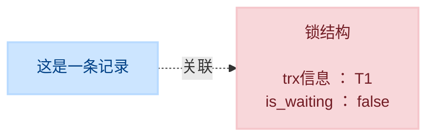

# `1`. 概述

**锁** 是计算机协调多个进程或线程 **并发访问某一资源** 的机制。在程序开发中会存在多线程同步的问题，当多个线程并发访问某个数据的时候，尤其是针对一些敏感的数据（比如订单、金额等），我们就需要保证这个数据在任何时刻 **最多只有一个线程** 在访问，保证数据的 **完整性** 和 **一致性**。在开发过程中加锁是为了保证数据的一致性，这个思想在数据库领域中同样很重要。

在数据库中，除传统的计算资源（如 `CPU`、`RAM`、`I/O` 等）的争用以外，数据也是一种供许多用户共享的资源。为保证数据的一致性，需要对 **并发操作进行控制**，因此产生了 **锁**。同时 **锁机制** 也为实现 `MySQL` 的各个隔离级别提供了保证。 **锁冲突** 也是影响数据库 **并发访问性能** 的一个重要因素。所以锁对数据库而言显得尤其重要，也更加复杂。

# `2`. `MySQL` 并发事务访问相同记录

## `2.1` 读-读情况

**读-读** 情况，即并发事务相继 **读取相同的记录** 。读取操作本身不会对记录有任何影响，并不会引起什么问题，所以允许这种情况的发生。

## `2.2` 写-写情况

**写-写** 情况，即并发事务相继对相同的记录做出改动

在这种情况下会发生 **脏写** 的问题，任何一种隔离级别都不允许这种问题的发生。所以在多个未提交事务相继对一条记录做改动时，需要让它们 **排队执行** ，这个排队的过程其实是通过 **锁** 来实现的。这个所谓的锁其实是一个 **内存中的结构**，在事务执行前本来是没有锁的，也就是说一开始是没有 **锁结构** 和记录进行关联的，如图所示：

当一个事务想对这条记录做改动时，首先会看看内存中有没有与这条记录关联的 **锁结构** ，当没有的时候就会在内存中生成一个 **锁结构** 与之关联。比如，事务 `T1` 要对这条记录做改动，就需要生成一个 **锁结构** 与之关联：

在 锁结构 里有很多信息，为了简化理解，只把两个比较重要的属性拿了出来：

-   `trx信息` ：代表这个锁结构是哪个事务生成的
-   `is_waiting` ：代表当前事务是否在等待

当事务 `T1` 改动了这条记录后，就生成了一个 **锁结构** 与该记录关联，因为之前没有别的事务为这条记录加锁，所以 `is_waiting` 属性就是 `false` ，我们把这个场景就称之为 **获取锁成功**，或者 **加锁成功**，然后就可以继续执行操作了。

## `2.3` 读-写或写-读情况

## `2.4` 并发问题的解决方案
