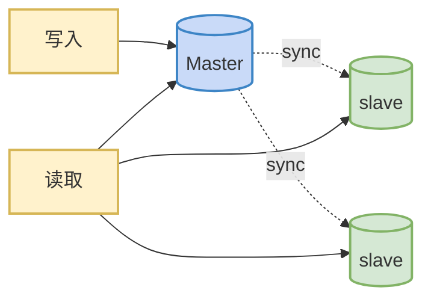

# 主从复制

数据库的主从复制，简单说就是**把一台数据库服务器（主库）的数据，自动同步到另一台或多台服务器（从库）上**。这样做通常是为了实现**读写分离、数据备份、高可用**等目标

1.  **读写分离**：主库负责写，从库负责读。因为大部分业务是 “读多写少”，这样能大幅提升数据库的并发能力。
2.  **数据备份与容灾**：从库本身就是一份实时备份。主库挂了，可以快速切换到从库。
3.  **高可用**：配合 `MHA`、`Orchestrator` 等工具，主库故障时能自动把从库提升为新主库。
4.  **数据分析**：在从库上跑耗时的统计查询，不影响主库的业务。




## `1`. 主从复制的原理

`Slave` 会从 `Master` 读取 `binlog` 来进行数据同步


### `1.1` 原理剖析

`MySQL` 的主从复制主要依赖三个线程来完成：

1.  **主库的 `Binlog Dump` 线程**：主库每执行一个写操作（增删改），都会记录到 `Binlog`（二进制日志）里。当从库连上来时，主库会为每个从库启动一个 `Dump` 线程，把 `Binlog` 里的内容发给从库。
2.  **从库的 `I/O` 线程**：从库的 `I/O` 线程连接主库，接收主库发来的 `Binlog`，然后写入到本地的 `Relay Log`（中继日志）中。
3.  **从库的 `SQL` 线程**：从库的 `SQL` 线程读取 `Relay Log`，把里面记录的操作在从库上 “重放” 一遍，最终让从库的数据和主库保持一致。

你可以把它想象成：主库在写“日记”（`Binlog`），从库派人去抄“日记”（`I/O` 线程），抄回来后翻译成自己的“工作日志”（`Relay Log`），再照着做一遍（`SQL` 线程）

>   不是所有版本的 `MysQL` 都默认开启服务器的二进制日志。在进行主从同步的时候，我们需要先检查服务器是否已经开启了二进制日志


### `1.2` 复制的问题

复制的最大问题：**延时**


### `1.3` 复制的基本原则

1.   每个 `Slave` 只有一个 `Master`
2.   每个 `Slave` 只能有一个唯一的服务器 `ID`
3.   每个 `Master` 可以有多个 `Slave`（一主多从）


## `2`. 一主一从架构搭建 `MySQL 8.0`

### `2.1` 主库配置（`Master`）

主库的核心任务是开启 `Binlog` 并创建一个专用的复制账号

1.   修改配置文件 `my.cnf`

     ```ini
     [mysqld]
     # 唯一标识，不能与其他节点重复
     server-id = 1
     
     # 开启二进制日志，并指定一个前缀名
     log-bin = mysql-bin-log
     
     # 选择 ROW 格式，保证数据一致性（可选），默认是 STATEMENT
     binlog_format = ROW
     
     # 忽略不需要复制的系统库（可选）
     binlog-ignore-db = mysql
     ```

2.   重启服务并创建复制用户

     重启 `MySQL` 服务使配置生效，然后登录主库执行

     ```sql
     # 1. 创建复制专用账号（密码请替换为强密码）
     CREATE USER 'slave1'@'%' IDENTIFIED BY '密码';
     
     # 2. 授予复制权限
     GRANT REPLICATION SLAVE ON *.* TO 'slave1'@'%';
     
     -- 3. 关键一步：强制将密码加密方式改为 mysql_native_password
     ALTER USER 'slave1'@'%' IDENTIFIED WITH mysql_native_password BY '密码
     
     -- 4. 刷新权限，使更改立即生效
     flush privileges;';
     ```

3.   获取初始同步坐标（关键步骤）

     ```sql
     # 锁定主库，防止在获取坐标时数据变更
     FLUSH TABLES WITH READ LOCK;
     
     # 在另一个会话中获取当前 Binlog 文件名和位置
     SHOW MASTER STATUS;
     ```

     记下 `File` 和 `Position` 的值（例如 `mysql-bin-log.000001` 和 `157`），这是从库的起点。**注意：获取坐标后不要关闭这个会话，保持锁生效，直到从库数据备份完成**


### `2.2` 从库配置（`Slave`）

从库需要“指名道姓”地告诉 `I/O` 线程去哪里拉数据

1.   修改配置文件 `my.cnf`

     ```ini
     [mysqld]
     # 唯一标识，必须与主库不同
     server-id = 2
     
     # 开启中继日志（记录从主库拉过来的数据）
     relay_log = mysql-relay-log
     
     # 如果从库未来可能切换为主库，建议也开启 log-bin
     # log-bin = mysql-bin-log
     ```

2.   导入存量数据

     如果主库已有数据，需要用 `mysqldump` 等工具把数据同步到从库，确保起点一致。如果主库是全新的空库，可跳过此步

3.   配置复制源

4.   启动复制线程

     ```sql
     START REPLICA;
     ```

     


## `3`. 同步数据一致性问题