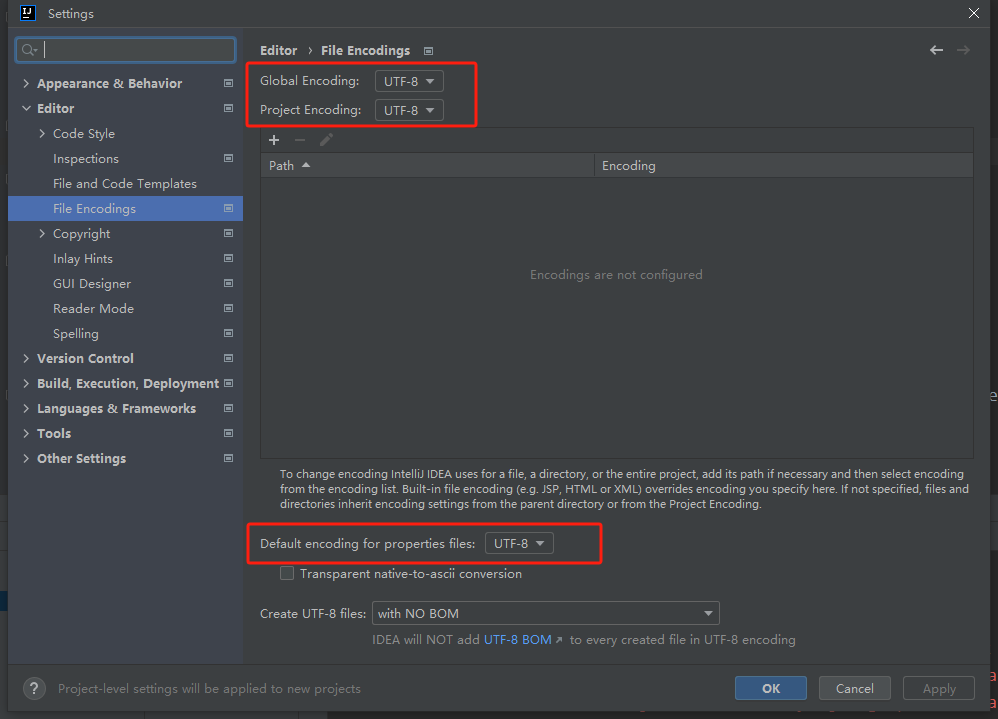
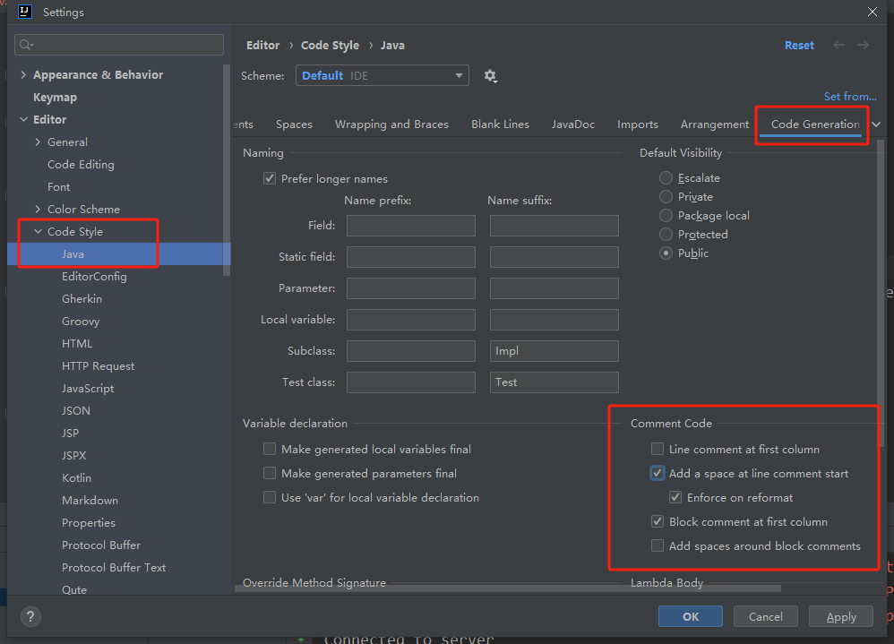
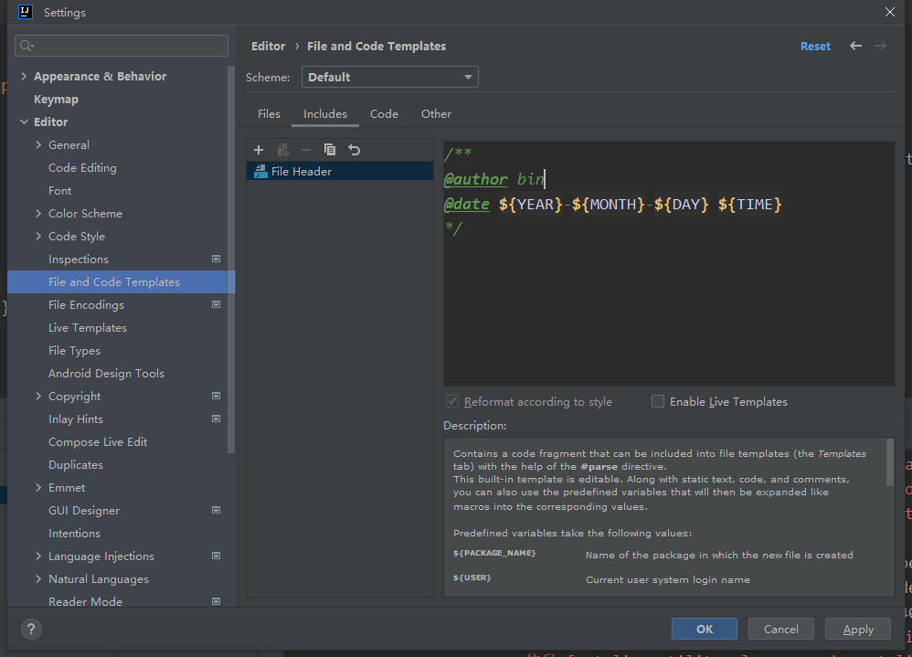
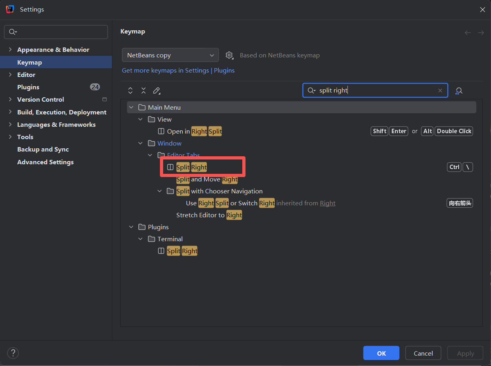

[IntelliJ IDEA](https://www.jetbrains.com/idea/ "IntelliJ IDEA官网") 下载 `.exe` 文件

[IntelliJ IDEA历史版本下载链接](https://www.jetbrains.com/idea/download/other "历史版本")


# 内存分配

安装目录下的`\bin\idea64.exe.vmoptions`

```bash
# 设置初始堆内存为 2048 MB
-Xms2048m
# 设置最大堆内存为 4096 MB
-Xmx4096m

# 代码缓存区
-XX:ReservedCodeCacheSize=1024m
```

如果项目还是跑不起来，需要增加构建内存

`File | Settings | Build, Execution, Deployment | Compiler`，把 `Shared heap size` 配成 **4096**（根据需要来就行）


# 编码

1. 编码格式设置成 `UTF-8`

   `File` -> `New Projects Setup` -> `Settings for New Projects...`，然后配置

   


# 注释

1. 默认注释

   `idea` 的注释不从第一行开始

   

2. 创建新文件的头部注释

   ```java
   /**
    * @author bin
    * @date ${YEAR}-${MONTH}-${DAY} ${TIME}
    */
   ```

   


# 快捷键配置

1. `ctrl + \` 需要在 `keymap` 单独配置

    


# `idea` 风格

1.   `Editor Tabs` 一行显示，不折叠

     `Settings` -> `Editor` -> `General` -> `Editor Tabs` -> `Show tabs in` -> `One row, and if tabs don't fit:` -> `Squeeze tabs`

     ```java
     public static void main(String[] args) {
         // System.out.println("Hello World");
     }
     ```

2.   `(git) Commit` 改为展示缓存区

     `Commit` -> `Configure Local Changes` -> `Staging Area`

     不展示模块及目录：`Commit` -> `Group By` -> `Module`、`Commit` -> `Group By` -> `Directory`


# 换行符

1.   为了避免不必要的麻烦，`IDEA` 最好配置成 `Linux` 风格的换行符(`LF`)

     `Editor` -> `Code Style` -> `Line separator`


# 断点调试

1. 在代码左侧行号旁边点击一下：会出现一个红色圆点 🔴
2. 用 `Debug` 启动
3. `IDEA` 下方会出现 `Debug` 面板
