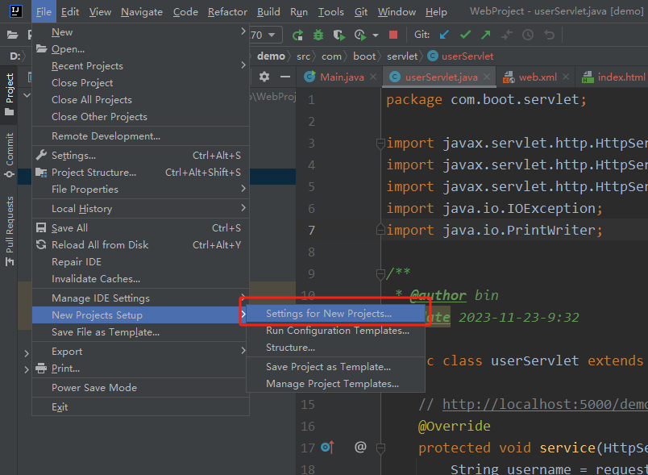
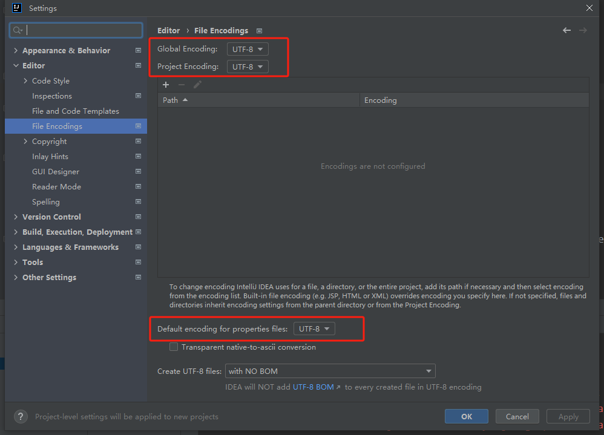
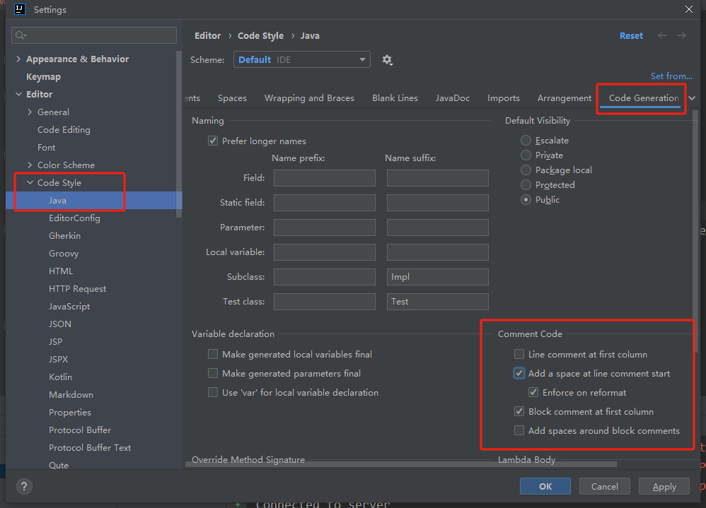
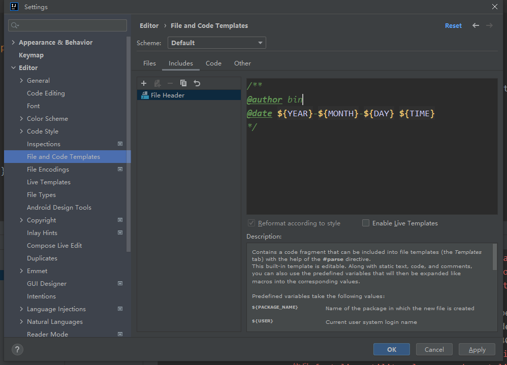

# 内存分配

安装目录下的`\bin\idea64.exe.vmoptions`

```bash
# 设置初始堆内存为 2048 MB
-Xms2048m
# 设置最大堆内存为 4096 MB
-Xmx4096m

# 代码缓存区
-XX:ReservedCodeCacheSize=1024m
```


# 编码

1. 编码格式设置成 `UTF-8`

   

   

2. 


# 注释

1. 默认注释

   idea的注释不从第一行开始

   

2. 创建新文件的头部注释

   

   ```java
   /**
    * @author bin
    * @date ${YEAR}-${MONTH}-${DAY} ${TIME}
    */
   ```

   

3. 