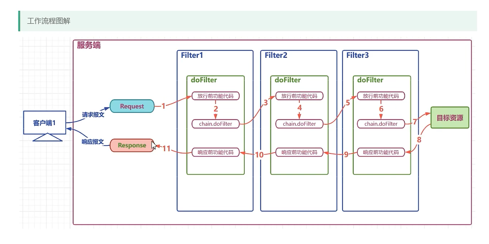

#  过滤器

Filter，即过滤器，是JAVAEE技术规范之一，作用目标资源的请求进行过滤的一套技术规范,是Java Web项目中 **最为实用的技术之一**

- Filter接口定义了过滤器的开发规范所有的过滤器都要实现该接口
- Filter的工作位置是项目中所有目标资源之前，容器在创建HttpServletRequest和HtpServletResponse对象后，会先调用Filter的doFilter方法
- Filter的doFilter方法可以控制请求是否继续，如果放行，则请求继续，如果拒绝，则请求到此为止，由过滤器本身做出响应
- Filter不仅可以对请求做出过滤，也可以在目标资源做出响应前，对响应再次进行处理
- Filter是GOF中责任链模式的典型案例
- Filter的常用应用包括但不限于：登录权限检查，解决网站乱码，过滤敏感字符，日志记录，性能分析


**过滤器Filter**

```java
package com.boot.filters;

import javax.servlet.*;
import javax.servlet.http.HttpServletRequest;
import javax.servlet.http.HttpServletResponse;
import java.io.IOException;
import java.text.SimpleDateFormat;
import java.util.Date;

/**
 * @author bin
 * @date 2023-12-08 9:13
 */

/**
 * 1.实现Filter接口
 * 2.重写过滤方法
 * 3.配置过滤器
 *      web.xml
 *      注解
 */
public class loggingFilter implements Filter {

    private SimpleDateFormat dateFormat = new SimpleDateFormat("yyy-MM-dd HH:mm:ss");

    /*
        过滤请求的和响应的方法
            1. 请求到达目标资源之前，先经过该方法
            2. 该方法有能力控制请求是否继续向后到达目标资源 可以在该方法内直接向客户端做响应处理
            3. 请求到达目标资源后，响应之前，还会经过该方法
     */
    @Override
    public void doFilter(ServletRequest servletRequest, ServletResponse servletResponse, FilterChain filterChain) throws IOException, ServletException {

        /*
            1.请求到达目标资源之前的功能代码
                判断是否登录
                校验权限是否满足
            2.放行代码
            3.响应之前是否修改响应报文
         */

        // 请求到达目标资源之前的代码
        System.out.println("过滤器 loggingFilter before filterChain.doFilter invoked");

        /*HttpServletRequest request = (HttpServletRequest) servletRequest;
        HttpServletResponse response = (HttpServletResponse) servletResponse;
        String requestURI = request.getRequestURI();
        String dataTime = dateFormat.format(new Date());
        System.out.println(requestURI + "在" + dataTime + "被访问了");
        long t1 = System.currentTimeMillis();*/


        // 放行
        filterChain.doFilter(servletRequest, servletResponse);

        // 响应之前的功能代码
        System.out.println("过滤器 loggingFilter after filterChain.doFilter invoked");
        
        // long t2 = System.currentTimeMillis();
        // System.out.println("请求耗时" + (t2-t1) + "ms");
    }

}
```

**`web.xml`**配置，也可以使用`@WebFilter`注解

```xml
<?xml version="1.0" encoding="UTF-8"?>
<web-app xmlns="http://xmlns.jcp.org/xml/ns/javaee"
         xmlns:xsi="http://www.w3.org/2001/XMLSchema-instance"
         xsi:schemaLocation="http://xmlns.jcp.org/xml/ns/javaee http://xmlns.jcp.org/xml/ns/javaee/web-app_4_0.xsd"
         version="4.0">
    
    <!-- 配置过滤器 -->
    <filter>
        <filter-name>loggingFilter</filter-name>
        <filter-class>com.boot.filters.loggingFilter</filter-class>
    </filter>
    <!-- 配置过滤器的资源规则，路径 -->
    <filter-mapping>
        <filter-name>loggingFilter</filter-name>
        <!--
            url-pattern
                根据请求的资源路径 对指定的请求进行过滤
            /*      过滤全部资源
            /a/*    过滤以a开头的资源
            /*.html 过滤以htmL 为后缀的资源
            /session    对session请求进行过滤

            servlet-name    根据请求的servLet的别名，最指定的servLet资源进行过滤

            一个filter-mapping中可以同时存在多个urL-pattern 和servlet-name
         -->
        <url-pattern>/*</url-pattern>
        <!-- <url-pattern>/session</url-pattern> -->
        <!-- <servlet-name>session</servlet-name> -->
    </filter-mapping>

</web-app>
```


# 过滤器生命周期

- 构造              构造器	     项目启动             1
- 初始化          init                   构造完毕             1
- 过滤              doFilter           每次请求             多次
- 销毁              destory           服务关闭              1


# 过滤器链

过滤器链是由自动形成的，顺序与web.xml的过滤器配置有关



# 注解方式配置过滤器 @WebFilter

```java
@WebFilter(
        filterName = "loggingFilter",
        urlPatterns = {"/*", "/session"},
        servletNames = {"session"}
)
public class loggingFilter implements Filter {
    @Override
    public void doFilter(ServletRequest servletRequest, ServletResponse servletResponse, FilterChain filterChain) throws IOException, ServletException {
        // ...
    }
}
```

