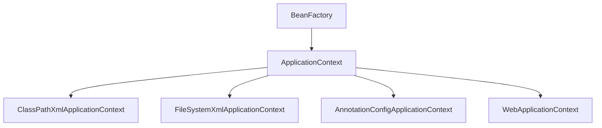

[`Spring` 官网](https://spring.io/ “spring”)

==**`Spring` 的三个核心功能**==

1. **组件管理**：`Ioc(Inversion of Control)` 控制反转 和 `DI(Dependency injection)` 依赖注入
    - 组件：可复用的 `java` 对象
    - `Ioc(Inversion of Control)` 控制反转：`loC` 主要是针对对象的创建和调用控制而言的，也就是说，当应用程序需要使用一个对象时，不再是应用程序直接创建该对象，而是由loC容器来创建和管理，即控制权由应用程序转移到loC容器中，也就是“反转”了控制权。这种方式基本上是通过依赖查找的方式来实现的，即 `loC` 容器维护着构成应用程序的对象，并负责创建这些对象。
    - `DI(Dependency injection)` 依赖注入：`DI` 是指在组件之间传递依赖关系的过程中，将依赖关系在容器内部进行处理，这样就不必在应用程序代码中硬编码对象之间的依赖关系，实现了对象之间的解耦合。在 `Spring` 中，`DI` 是通过 `XML` 配置文件或注解的方式实现的。它提供了三种形式的依赖注入:构造函数注入、Setter方法注入和接口注入。
2. **`Aop` 面向切面编程**
3. **声明式事务**

# `SpringFramework`

主要功能模块

| 功能模块         | 功能介绍                                |
| ---------------- | --------------------------------------- |
| `Core Container` | 环境下使用任何功能都必须基于 `IOC` 容器 |
| `AOP & Aspects`  | 面向切面编程                            |
| `TX`             | 声明式事务管理                          |
| `Spring MVC`     | 提供了面向 `Web`应用程序的集成功能      |

# `SpringIoC`

**`SpringIoC`(Inversion of Control)控制反转**

`Spring IoC` 容器，负责实例化、配置和组装 bean（组件）。容器通过读取配置元数据来获取有关要实例化、配置和组装组件的指令。配置元数据以 `XML`、`Java` 注解或 `Java` 代码形式表现。它允许表达组成应用程序的组件以及这些组件之间丰富的相互依赖关系

## `SpringIoC` 容器和容器实现类

**`SpringIoc` 容器接口**：

`BeanFactory` 接口提供了一种高级配置机制，能够管理任何类型的对象，它是 `SpringIoC` 容器标准化超接口！

`ApplicationContext` 是 `BeanFactory` 的子接口。它**扩展**了以下功能：

| 类型名                                   | 简介                                                         |
| ---------------------------------------- | ------------------------------------------------------------ |
| `ClassPathXmlApplicationContext`         | 通过读取类路径下的 `XML` 格式的**配置文件**创建 `IOC` 容器对象 |
| `FileSystemXmlApplicationContext`        | 通过文件系统路径读取 `XML` 格式的**配置文件**创建 `IOC` 容器对象 |
| **`AnnotationConfigApplicationContext`** | 通过读取**`Java`配置类**创建 `IOC` 容器对象                  |
| **`WebApplicationContext`**              | 专门为 `Web` 应用准备，基于 `Web` 环境创建 **`IOC` 容器对象**，并将对象引入存入 `ServletContext` 域中 |

### `Spring IoC` 容器管理配置方式

`Spring` 框架提供了多种配置方式：**`XML` 配置方式**、**注解方式**和 **`Java` 配置类**方式

1. `XML` 配置方式：是 `Spring` 框架最早的配置方式之一，通过在 `XML` 文件中定义 `Bean` 及其依赖关系、`Bean` 的作用域等信息，让 `Spring IoC` 容器来管理 `Bean` 之间的依赖关系。该方式从 `Spring` 框架的第一版开始提供支持
2. 注解方式：从 `Spring 2.5` 版本开始提供支持，可以通过在Bean类上使用注解来代替XML配置文件中的配置信息。通过在 `Bean` 类上加上相应的注解（如 `@Component`, `@Service`, `@Autowired` 等），将 `Bean` 注册到`Spring IoC` 容器中，这样 `Spring IoC` 容器就可以管理这些 `Bean` 之间的依赖关系
3. **`Java`配置类**方式：`从Spring 3.0` 版本开始提供支持，通过 `Java` 类来定义 `Bean`、`Bean` 之间的依赖关系和配置信息，从而代替 `XML` 配置文件的方式。`Java`配置类是一种使用 `Java` 编写配置信息的方式，通过`@Configuration`、`@Bean` 等注解来实现 `Bean` ]和依赖关系的配置

