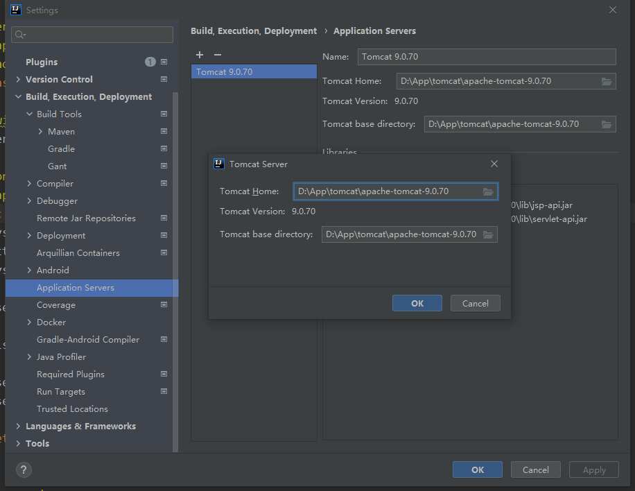

[Tomcat官网](https://tomcat.apache.org "Tomcat")

# 启动

1. 解压包 Tomcat 包
2. 配置好 `JAVA_HOME` 环境变量
3. 运行 `bin` 目录下的 `startup.bat` 即可启动 Tomcat 服务
4. 默认端口号可以在 `conf/server.xml` 里面修改
5. 控制台输出编码字符集在`/conf/logging.properties`中修改

# 部署

1. 在 `webapps` 目录下新建 `项目名/WEB_INF`
2. 把 服务资源 放到与 `WEB_INF` 同级的目录下，即可完成项目的 Tomcat 部署
3. 运行 `startup.bat` 启动服务，默认路径为 `http://localhost:8080/项目名`
4. 端口号被占用可能会导致tomcat启动失败

# idea 关联 Tomcat

在 idea 的`File | Settings | Build, Execution, Deployment | Application Servers`下面增加Tomcat即可

