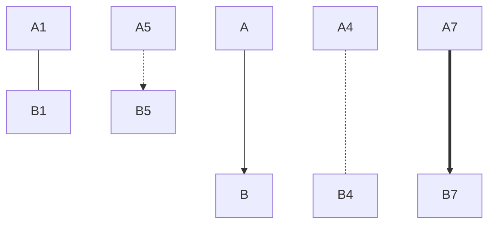
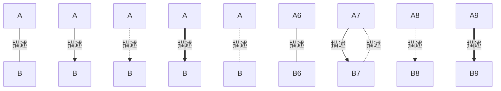

# markdown 语法

# 1. 标题

```
# 一级标题

## 二级标题

### 三级标题

#### 四级标题

##### 五级标题

###### 六级标题
```


# 2. 段落

要创建段落，请使用空白行将一行或多行文本进行分隔


# 3. 换行

在一行的末尾添加两个或多个空格，然后按回车键,即可创建一个换行(`<br>`)


# 4. 强调语法

### 粗体

要加粗文本，请在单词或短语的前后各添加两个星号（`**`）或下划线（`__`）。如需加粗一个单词或短语的中间部分用以表示强调的话，请在要加粗部分的两侧各添加两个星号  `**`

**粗体**    __粗体__

### 斜体

要同时用粗体和斜体突出显示文本，请在单词或短语的前后各添加三个星号或下划线。要加粗并用斜体显示单词或短语的中间部分，请在要突出显示的部分前后各添加三个星号，中间不要带空格

*斜体*    _斜体_

### 粗斜体

***粗斜体***    ___粗斜体___

### 删除线

~~删除线~~


# 5. 引用语法

要创建块引用，请在段落前添加一个`>`符号

> 引用
>
> > 二级引用


# 6. 列表语法

## 有序列表

1. 有序列表

2. 有序列表

## 无序列表

要创建无序列表，请在每个列表项前面添加破折号 (`-`)、星号 (`*`) 或加号 (`+`) 。缩进一个或多个列表项可创建嵌套列表

- 无序列表

- 无序列表
* 无序列表

* 无序列表
+ 无序列表

+ 无序列表
- 无序列表
- - 无序列表


# 7. 代码语法

要将单词或短语表示为代码，请将其包裹在反引号  (`` ` ``)中

`代码块`

如果你要表示为代码的单词或短语中包含一个或多个反引号，则可以通过将单词或短语包裹在双反引号(`` ` ` ``)中

`` `代码块` ``

代码段

```java
int a = 0;
```


# 8. 分隔线语法

要创建分隔线，请在单独一行上使用三个或多个星号 (`***`)、破折号 (`---`) 或下划线 (`___`) ，并且不能包含其他内容

***

---

___


# 9. 链接语法

`<https://github.com/hhuabin>`

`[github](https://github.com/hhuabin "github")`

链接文本放在中括号内，链接地址放在后面的括号中，链接title可选

<https://github.com/hhuabin>

[github](https://github.com/hhuabin "github")


# 10. 图片语法

！！！不建议使用图片，删除本地图片即不可见

``

```

```


```
链接图片
[](https://markdown.com.cn)
```

[](https://github.com/hhuabin)


# 11. 转义字符语法

要显示原本用于格式化 Markdown 文档的字符，请在字符前面添加反斜杠字符`\`


# 12. 内嵌HTML语法

<html>

    <p>
        <a href="https://github.com/hhuabin">github</a>
    <p/>
    <p>
        <h1>这是HTML内容</h1>
    </p>
</html>


# 13. 表格

要添加表，请使用三个或多个连字符（`---`）创建每列的标题，并使用管道（`|`）分隔每列。您可以选择在表的任一端添加管道

```
| Syntax      | Description |
| ----------- | ----------- |
| Header      | Title       |
| Paragraph   | Text        |
```


# 14. 任务列表语法

```
- [x] 任务一
- [ ] 任务二
```

- [x] 任务一
- [ ] 任务二


# 15. 标题编号 {#custom-id}

编号必须是非中文

[标题编号](#custom-id)


# 16. 流程图

## 绘制流程图

\```mermaid
graph 方向
内容 ……
\```

### 方向

- 从上到下：TB （有时候也写作 TD）
- 从下到上：BT
- 从左到右：LR
- 从右到左：RL

### 内容

- 基本节点图形
- 连接线
- 连接线上的注释

#### 1. 基本节点

基本节点图像由两部分组成，一个唯一的id，用于标记节点的身份；节点内的注释内容。基本图像如图所示


#### 2. 连接线

`-` `.` `=` 可适当增加延长长度

- A --> B：      A带箭头指向B
- A --- B：       A不带箭头指向B
- A -.- B：       A用虚线指向B
- A -.-> B：     A用带箭头的虚线指向B
- A ==> B：    A用加粗的箭头指向B



#### 3. 连接线上的注释

可以在中间加描述

- A--描述--- B ：A不带箭头指向B并在中间加上文字描述
- A --描述--> B： A带箭头指向B并在中间加上文字描述
- A -.描述.-> B ：A用带箭头的虚线指向B并在中间加上文字描述
- A ==描述==> B ：A用加粗的箭头指向B并在中间加上文字描述

或者在后面加用 `|` 引起来

- A[A] ---|描述| B[B]




## 标准流程图源码格式：

(right)：横向

```flow
st=>start: 开始框
op=>operation: 处理框
cond=>condition: 判断框(是或否?)
cond2=>condition: 判断框(是或否?)
sub1=>subroutine: 子流程
io=>inputoutput: 输入输出框
e=>end: 结束框

st(right)->op->cond
cond(yes)->cond2(no, bottom)->io->e
cond(no)->sub1(right)->op
```

## UML时序图源码样例：

```sequence
对象A->对象B: 对象B你好吗?（请求）
Note right of 对象B: 对象B的描述
Note left of 对象A: 对象A的描述(提示)
对象B-->对象A: 我很好(响应)
对象A->对象B: 你真的好吗？
```

