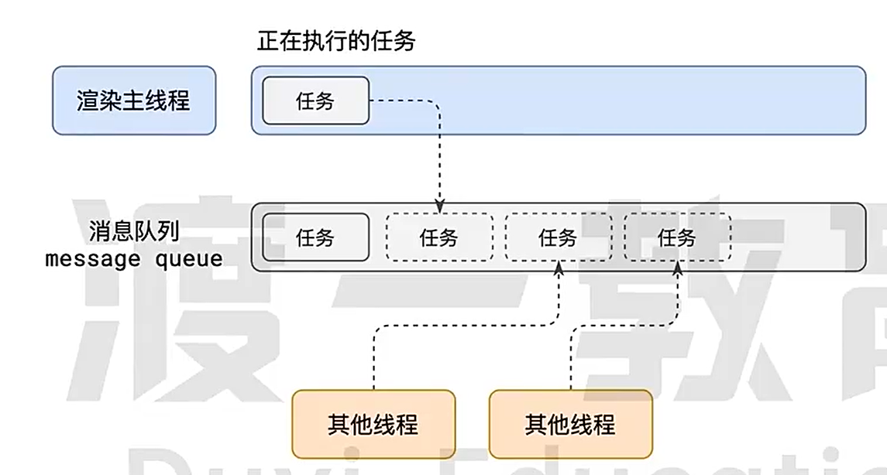

# 事件循环（消息循环）（Event Loop）

 

- 事件循环（Event Loop）是 JavaScript 运行时环境中**负责处理异步操作的机制**。它是**实现异步编程的基础**，**确保 JavaScript 单线程模型下的非阻塞执行**
  JavaScript 是一种单线程语言，它运行在**浏览器的渲染主线程**中，而渲染主线程只有一个。意味着它一次只能执行一个任务。然而，JavaScript 又有很多异步操作，比如**网络请求、定时器、事件监听**等，这些操作不能立即执行，而需要等待一定的时间或者在特定的条件下执行。事件循环就是用来**管理这些异步操作的执行顺序的机制**

事件循环由以下几个主要部分组成：

1. **调用栈（Call Stack）：** 用来存储执行上下文（Execution Context）的栈结构，用于管理代码的执行顺序。当 JavaScript 引擎执行函数时，会将该函数的执行上下文推入调用栈，当函数执行完成后，将执行上下文从调用栈中弹出。
2. **消息队列（Message Queue）：** 用来存储待执行的消息（任务）。当异步操作完成时，会生成一个消息并被添加到消息队列中。
3. **事件循环（Event Loop）：** 不断地从消息队列中取出消息，将其推入调用栈中执行。事件循环是一个持续运行的循环，它负责检查调用栈是否为空，如果为空，则从消息队列中取出消息，并将其推入调用栈中执行。这个过程不断重复，确保 JavaScript 运行时环境能够按照正确的顺序执行异步操作

简单来说，事件循环的作用就是保证 JavaScript 在**执行同步任务的同时，能够及时地处理异步操作**，使得整个程序的执行能够按照正确的顺序进行

## 事件优先级

1. **用户交互事件（Input Events）：** 这包括用户与页面的交互事件，如鼠标点击、键盘输入、滚动等。这些事件通常具有最高的优先级，因为它们直接影响到用户体验。浏览器会尽可能快地响应和处理这些事件，以确保页面的交互性能。
2. **渲染事件（Rendering Events）：** 这些事件与页面的渲染和绘制有关，例如重绘（repaint）、重排（reflow）、动画更新等。渲染事件的优先级较高，因为它们直接影响到页面的呈现效果和动画流畅性。
3. **网络事件（Network Events）：** 这包括网络请求、响应和资源加载事件，如 XMLHttpRequest、Fetch API、图片加载等。浏览器会优先处理网络事件，以确保及时加载页面所需的资源，提高页面加载速度和性能。
4. **定时器事件（Timer Events）：** 定时器事件包括 `setTimeout`、`setInterval` 等定时器的触发事件。这些事件的优先级相对较低，因为它们通常不会影响到页面的实时交互和渲染，但浏览器仍会尽量按时执行它们。
5. **其他事件（Other Events）：** 包括一些特殊的事件，如错误事件、页面加载事件、页面卸载事件等。这些事件的优先级取决于其具体的场景和影响范围，通常处于中等优先级。