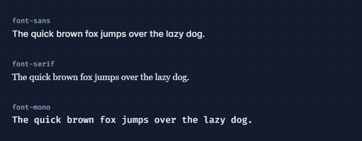

# Tailwind CSS 的语法规则


## 动态类名

1. 变量类

   ```jsx
   export default function Button {
       const sizeClasses = "px-4 py-2 rounded-md text-base"
   
       return (
           <button type="button" className={`font-bold ${sizeClasses}`}>
               {children}
           </button>
       )
   }
   ```

2. 三目表达式

   ```jsx
   <div class="{{ error ? 'text-red-600' : 'text-green-600' }}"></div>
   ```


## `!important`

Tailwind 允许你在任何工具类后添加 `!` 前缀来应用 `!important`：

```html
<div class="!text-red-500 !bg-blue-200">
    <!-- 这个div的文本颜色和背景色将使用!important -->
</div>
```


##  display

| Class        | Properties             |
| ------------ | ---------------------- |
| block        | display: block;        |
| inline-block | display: inline-block; |
| inline       | display: inline;       |
| flex         | display: flex;         |
| table        | display: table;        |
| grid         | display: grid;         |
| list-item    | display: list-item;    |
| hidden       | display: none;         |


## width|height

### width

| Class        | Properties                         |
| ------------ | ---------------------------------- |
| **w-[16px]** | width: 16px;                       |
| w-0          | width: 0px;                        |
| w-px         | width: 1px;                        |
| w-4          | width: 1rem;            /* 16px */ |
| w-auto       | width: auto;                       |
| w-1/2        | width: 50%;                        |
| w-1/4        | width: 25%;                        |
| w-3/4        | width: 75%;                        |
| w-full       | width: 100%;                       |
| w-screen     | width: 100vw;                      |

### min-width

| Class             | Properties        |
| ----------------- | ----------------- |
| **min-w-[220px]** | min-width: 220px; |
| min-w-0           | min-width: 0px;   |
| min-w-full        | min-width: 100%;  |

### max-width

| Class             | Properties        |
| ----------------- | ----------------- |
| **max-w-[220px]** | max-width: 220px; |
| max-w-0           | max-width: 0px;   |
| max-w-full        | max-width: 100%;  |
| max-w-screen-md   | max-width: 768px; |


### height

`height`与`width`基本相同

| Class        | Properties     |
| ------------ | -------------- |
| **h-[16px]** | height: 16px;  |
| h-0          | height: 0px;   |
| h-px         | height: 1px;   |
| h-full       | height: 100%;  |
| h-screen     | height: 100vh; |

### min-height

| Class             | Properties         |
| ----------------- | ------------------ |
| **min-h-[220px]** | min-height: 220px; |
| min-h-0           | min-height: 0px;   |
| min-h-full        | min-height: 100%;  |
| min-h-screen      | min-height: 100vh; |

### max-height

| Class             | Properties         |
| ----------------- | ------------------ |
| **max-h-[220px]** | max-height: 220px; |
| max-h-0           | max-height: 0px;   |
| max-h-full        | max-height: 100%;  |
| max-h-screen      | max-height: 100vh; |


### size

| Class           | Properties                                                   |
| :-------------- | :----------------------------------------------------------- |
| **size-[16px]** | width: 16px;<br/>height: 16px;                               |
| size-0          | width: 0px;<br/>height: 0px;                                 |
| size-px         | width: 1px;<br />height: 1px;                                |
| size-4          | width: 1rem;      /* 16px \*/<br />height: 1rem;     /* 16px */ |
| size-1/2        | width: 50%;<br />height: 50%;                                |
| size-full       | width: 100%;<br />height: 100%;                              |


## padding | border | margin

### padding

| Class       | Properties                                                   |
| ----------- | ------------------------------------------------------------ |
| **p-[5px]** | padding: 5px;                                                |
| p-0         | padding: 0px;                                                |
| px-0        | padding-left: 0px;<br />padding-right: 0px;                  |
| py-0        | padding-top: 0px;<br />padding-bottom: 0px;                  |
| pt-0        | padding-top: 0px;                                            |
| pr-0        | padding-right: 0px;                                          |
| pb-0        | padding-bottom: 0px;                                         |
| pl-0        | padding-left: 0px;                                           |
| p-px        | padding: 1px;                                                |
| px-px       | padding-left: 1px;<br />padding-right: 1px;                  |
| p-4         | padding: 1rem;       /* 16px */                              |
| px-4        | padding-left: 1rem;         /* 16px */<br />padding-right: 1rem;      /\* 16px */ |


### margin

`margin`与`padding`基本相同

| Class       | Properties                                                   |
| ----------- | ------------------------------------------------------------ |
| **m-[5px]** | margin: 5px;                                                 |
| m-0         | margin: 0px;                                                 |
| mx-0        | margin-left: 0px;<br />margin-right: 0px;                    |
| m-4         | margin: 1rem;                  /* 16px */                    |
| mx-4        | margin-left: 1rem;           /* 16px */<br />margin-right: 1rem;         /\* 16px */ |


### Space Between

子元素中间的间隔

- x：x轴方向上的间隔
- y：y轴方向上的间隔

| Class             | Properties                               |
| ----------------- | ---------------------------------------- |
| **space-y-[5px]** | margin-top: 5px;                         |
| space-x-0 >       | margin-left: 0px;                        |
| space-y-0 >       | margin-top: 0px;                         |
| space-x-4 >       | margin-left: 1rem;            /* 16px */ |
| space-y-4 >       | margin-top: 1rem;            /* 16px */  |


## border

### border-radius

| Class              | Properties                                                   |
| ------------------ | ------------------------------------------------------------ |
| **rounded-[12px]** | border-radius: 12px;                                         |
| rounded-none       | border-radius: 0px;                                          |
| rounded-sm         | border-radius: 0.125rem; /* 2px */                           |
| rounded            | border-radius: 0.25rem;            /* 4px */                 |
| rounded-lg         | border-radius: 0.5rem;              /* 8px */                |
| rounded-full       | border-radius: 9999px;                                       |
| rounded-t          | border-top-left-radius: 0.25rem;                 /* 4px */<br />border-top-right-radius: 0.25rem;               /\* 4px */ |
| rounded-t-md       | border-top-left-radius: 0.375rem;               /* 6px */<br />border-top-right-radius: 0.375rem;            /\* 6px */ |
| rounded-r          | border-top-right-radius: 0.25rem;               /* 4px */<br />border-bottom-right-radius: 0.25rem;        /\* 4px */ |
| rounded-b          | border-bottom-right-radius: 0.25rem;        /* 4px */<br />border-bottom-left-radius: 0.25rem;           /\* 4px */ |
| rounded-l          | border-top-left-radius: 0.25rem;                  /* 4px */<br />border-bottom-left-radius: 0.25rem;           /\* 4px */ |
| rounded-tl         | border-top-left-radius: 0.25rem; /* 4px */                   |
| rounded-tr         | border-top-right-radius: 0.25rem;               /* 4px */    |
| rounded-br         | border-bottom-right-radius: 0.25rem;        /* 4px */        |
| rounded-bl         | border-bottom-left-radius: 0.25rem;           /* 4px */      |


### border-width

border-{side}-{width}

| Class            | Properties                                            |
| ---------------- | ----------------------------------------------------- |
| **border-[3px]** | border-width: 3px;                                    |
| border-0         | border-width: 0px;                                    |
| **border**       | border-width: 1px;                                    |
| border-x-0       | border-left-width: 0px;<br />border-right-width: 0px; |
| border-x         | border-left-width: 1px;<br />border-right-width: 1px; |
| border-y         | border-top-width: 1px;<br />border-bottom-width: 1px; |
| border-t         | border-top-width: 1px;                                |
| border-r         | border-right-width: 1px;                              |
| border-b         | border-bottom-width: 1px;                             |
| border-l         | border-left-width: 1px;                               |


### border-color

| Class            | Properties                                                   |
| ---------------- | ------------------------------------------------------------ |
| border-[#243c5a] | border-color: #243c5a;                                       |
| border-black     | border-color: rgb(0 0 0);                                    |
| border-x-black   | border-left-color: rgb(0 0 0);<br />border-right-color: rgb(0 0 0); |
| border-y-black   | border-top-color: rgb(0 0 0);<br />border-bottom-color: rgb(0 0 0); |
| border-t-black   | border-top-color: rgb(0 0 0);                                |
| border-r-black   | border-right-color: rgb(0 0 0);                              |
| border-b-black   | border-bottom-color: rgb(0 0 0);                             |
| border-l-black   | border-left-color: rgb(0 0 0);                               |


### border-style

以0.05为单位逐一递增

| Class         | Properties                             |
| ------------- | -------------------------------------- |
| border-solid  | border-style: solid;                   |
| border-double | border-style: double;                  |
| border-dashed | border-style: dashed;         // 虚线  |
| border-dotted | border-style: dotted;          // 点线 |
| border-hidden | border-style: hidden;                  |
| border-none   | border-style: none;                    |


## outline

`outline` 在整个元素周围画了一条线。用法与`border`几乎一样，但不能像 `border` 那样，指定在元素的一个面上设置轮廓，也就是不能单独设置顶部轮廓、右侧轮廓、底部轮廓或左侧轮廓


### outline-width

| Class         | Properties          |
| ------------- | ------------------- |
| outline-[5px] | outline-width: 5px; |
| outline-0     | outline-width: 0px; |


### outline-color

| Class             | Properties              |
| ----------------- | ----------------------- |
| outline-[#243c5a] | outline-color: #243c5a; |
| outline-black     | outline-color: #000;    |


### outline-style

| Class          | Properties             |
| -------------- | ---------------------- |
| outline        | outline-style: solid;  |
| outline-dashed | outline-style: dashed; |


### outline-offset

outline-offset属性在元素的轮廓与边框之间添加空间。元素及其轮廓之间的空间是透明的

| Class                    | Properties                                 |
| ------------------------ | ------------------------------------------ |
| **outline-offset-[3px]** | outline-offset: 3px;                       |
| outline-offset-0         | outline-offset: 0px;    // [0, 1, 2, 4, 8] |
| outline-offset-2         | outline-offset: 2px;                       |
| outline-offset-8         | outline-offset: 8px;                       |


## background

```css
background: 
  #ff0000            /* 背景颜色 */,
  url('image.jpg')   /* 背景图像 */,
  no-repeat          /* 不重复 */,
  center center      /* 起始位置在中心 */,
  / /* 使用斜杠分隔背景大小属性 */,
  cover,             /* 图像按比例缩放以覆盖整个元素 */,
  content-box        /* 背景绘制在内容框 */,
  fixed;             /* 背景图像固定不动 */
```

- **`background-color`：** 设置元素的背景颜色

- **`background-image`：** 设置元素的背景图像

- **`background-repeat`：** 控制背景图像的平铺方式

- **`background-position`：** 设置背景图像的起始位置

- **`background-size`：** 控制背景图像的大小

- **`background-origin`：** 设置背景图像的起始位置是内容框、内边距框还是边框框

- **`background-clip`：** 设置背景的绘制区域

- **`background-attachment`：** 控制背景图像的滚动方式

  - **`scroll`：** 默认值。背景图像会随着元素的内容滚动而滚动

  - **`fixed`：** 背景图像固定在视口中，不随元素的内容滚动而滚动

    ```css
    background-attachment: fixed;
    ```

  - **`local`：** 背景图像会随元素的内容滚动而滚动，但不会随视口的滚动而滚动。这个值主要用于处理在较大的容器内使用固定背景


### background-color

| Class        | Properties                          |
| ------------ | ----------------------------------- |
| bg-[#50d71e] | background-color: #50d71e;          |
| bg-black     | background-color: rgb(0 0 0);       |
| bg-white     | background-color: rgb(255 255 255); |

```html
<div class="bg-sky-500/[.06]"></div>

<div class="bg-[#000]/[.1]"></div>
```


### background-image

| Class                                | Properties                                                   |
| ------------------------------------ | ------------------------------------------------------------ |
| bg-[url('@/image/hero-pattern.svg')] | background-image: url('@/image/hero-pattern.svg');           |
| bg-none                              | background-image: none;                                      |
| bg-gradient-to-t                     | background-image: linear-gradient(to top, var(--tw-gradient-stops));    /* 0deg */ |
| bg-gradient-to-tr                    | background-image: linear-gradient(to top right, var(--tw-gradient-stops)); |
| bg-gradient-to-r                     | background-image: linear-gradient(to right, var(--tw-gradient-stops));    /* 90deg */ |
| bg-gradient-to-br                    | background-image: linear-gradient(to bottom right, var(--tw-gradient-stops)); |
| bg-gradient-to-b                     | background-image: linear-gradient(to bottom, var(--tw-gradient-stops));    /* 180deg */ |
| bg-gradient-to-bl                    | background-image: linear-gradient(to bottom left, var(--tw-gradient-stops)); |
| bg-gradient-to-l                     | background-image: linear-gradient(to left, var(--tw-gradient-stops));           /* 270deg */ |
| bg-gradient-to-tl                    | background-image: linear-gradient(to top left, var(--tw-gradient-stops)); |

1. 起始末尾颜色

   ```html
   <div class="h-14 bg-gradient-to-r from-cyan-500 to-blue-500"></div> 
   ```

2. 中间颜色

   ```html
   <div class="bg-gradient-to-r from-indigo-500 via-purple-500 to-pink-500"></div>
   ```

3. 百分比

   ```html
   <div class="bg-gradient-to-r from-indigo-500 from-10% via-sky-500 via-30% to-emerald-500 to-90%"></div>
   ```

4. 貌似不支持其他角度的渐变

5. 不能使用`to-transparent`

   ```html
   <div class="bg-gradient-to-r from-blue-500 to-transparent">
   	<!-- ... -->
   </div>
   ```

   


### background-size

| Class      | Properties                |
| ---------- | ------------------------- |
| bg-auto    | background-size: auto;    |
| bg-cover   | background-size: cover;   |
| bg-contain | background-size: contain; |


### background-repeat

| Class           | Properties                    |
| --------------- | ----------------------------- |
| bg-repeat       | background-repeat: repeat;    |
| bg-no-repeat    | background-repeat: no-repeat; |
| bg-repeat-x     | background-repeat: repeat-x;  |
| bg-repeat-y     | background-repeat: repeat-y;  |
| bg-repeat-round | background-repeat: round;     |
| bg-repeat-space | background-repeat: space;     |


### background-position

| Class          | Properties                        |
| -------------- | --------------------------------- |
| bg-center      | background-position: center;      |
| bg-left        | background-position: left;        |
| bg-top         | background-position: top;         |
| bg-left-top    | background-position: left top;    |
| bg-left-bottom | background-position: left bottom; |


## box-sizing

| Class       | Properties               |
| ----------- | ------------------------ |
| box-border  | box-sizing: border-box;  |
| box-content | box-sizing: content-box; |


## box-shadow

box-shadow 用来设置元素的阴影效果，阴影不会影响页面布局

```css
box-shadow: h-offset v-offset blur spread color;
```

- `h-offset`: 水平偏移，正值表示右移，负值表示左移
- `v-offset`: 垂直偏移，正值表示下移，负值表示上移
- `blur`: 模糊半径，可以是零
- `spread`: 扩散半径，正值表示扩大，负值表示收缩
- `color`: 阴影的颜色

| Class                                          | Properties                                                   |
| ---------------------------------------------- | ------------------------------------------------------------ |
| **shadow-[0_35px_60px_-15px_rgba(0,0,0,0.3)]** | box-shadow: 0 35px 60px -15px rgb(0 0 0 / 0.03);             |
| shadow-sm                                      | box-shadow: 0 1px 2px 0 rgb(0 0 0 / 0.05);                   |
| shadow                                         | box-shadow: 0 1px 3px 0 rgb(0 0 0 / 0.1), 0 1px 2px -1px rgb(0 0 0 / 0.1); |
| shadow-md                                      | box-shadow: 0 4px 6px -1px rgb(0 0 0 / 0.1), 0 2px 4px -2px rgb(0 0 0 / 0.1); |
| shadow-none                                    | box-shadow: 0 0 #0000;                                       |


## position

| Class    | Properties          |
| -------- | ------------------- |
| static   | position: static;   |
| fixed    | position: fixed;    |
| absolute | position: absolute; |
| relative | position: relative; |
| sticky   | position: sticky;   |


## Top / Right / Bottom / Left

```css
inset: 0px;

// 即等于
top: 0px;
right: 0px;
bottom: 0px;
left: 0px;
```

| Class         | Properties                                                   |
| ------------- | ------------------------------------------------------------ |
| **top-[3px]** | top: 3px;                                                    |
| inset-0       | inset: 0px;                                                  |
| top-0         | top: 0px;                                                    |
| right-0       | right: 0px;                                                  |
| bottom-0      | bottom: 0px;                                                 |
| left-0        | left: 0px;                                                   |
| inset-x-0     | left: 0px;<br />right: 0px;                                  |
| inset-y-0     | top: 0px;<br />bottom: 0px;                                  |
| top-4         | top: 1rem;           /* 16px */                              |
| inset-x-4     | left: 1rem;           /* 16px */<br />right: 1rem;         /\* 16px */ |
| inset-y-4     | top: 1rem;            /* 16px */<br />bottom: 1rem;     /\* 16px */ |
| inset-x-auto  | left: auto; right: auto;                                     |
| top-1/2       | top: 50%;                                                    |
| inset-x-1/2   | left: 50%;<br />right: 50%;                                  |
| inset-y-1/2   | top: 50%;<br />bottom: 50%;                                  |
| inset-x-full  | left: 100%;<br />right: 100%;                                |
| inset-y-full  | top: 100%;<br />bottom: 100%;                                |


## opacity

| Class         | Properties     |
| ------------- | -------------- |
| opacity-[.67] | opacity: 0.67; |
| opacity-0     | opacity: 0;    |
| opacity-5     | opacity: 0.05; |
| opacity-50    | opacity: 0.5;  |
| opacity-100   | opacity: 1;    |


## z-index

| Class   | Properties     |
| ------- | -------------- |
| z-[100] | z-index: 100;  |
| z-0     | z-index: 0;    |
| z-50    | z-index: 50;   |
| z-auto  | z-index: auto; |


## overflow

| Class             | Properties          |
| ----------------- | :------------------ |
| overflow-auto     | overflow: auto;     |
| overflow-hidden   | overflow: hidden;   |
| overflow-scroll   | overflow: scroll;   |
| overflow-x-hidden | overflow-x: hidden; |
| overflow-y-hidden | overflow-y: hidden; |
| overflow-x-scroll | overflow-x: scroll; |
| overflow-y-scroll | overflow-y: scroll; |


## content

| Class                   | Properties              |
| ----------------------- | ----------------------- |
| content-['Hello_World'] | content: 'Hello_World'; |
| content-none            | content: none;          |


## font

### font-family

| Class                  | Properties                                                   |
| ---------------------- | ------------------------------------------------------------ |
| **font-['Open_Sans']** | font-family: Open_Sans;                                      |
| font-sans              | font-family: ui-sans-serif, system-ui, sans-serif, "Apple Color Emoji", "Segoe UI Emoji", "Segoe UI Symbol", "Noto Color Emoji"; |
| font-serif             | font-family: ui-serif, Georgia, Cambria, "Times New Roman", Times, serif; |
| font-mono              | font-family: ui-monospace, SFMono-Regular, Menlo, Monaco, Consolas, "Liberation Mono", "Courier New", monospace; |




### font-size

| Class       | Properties                                                   |
| ----------- | ------------------------------------------------------------ |
| text-[14px] | font-size: 14px;                                             |
| text-xs     | font-size: 0.75rem;         /* 12px */<br />line-height: 1rem;           /\* 16px */ |
| text-sm     | font-size: 0.875rem;       /* 14px */<br />line-height: 1.25rem;      /\* 20px */ |
| text-base   | font-size: 1rem;               /* 16px */<br />line-height: 1.5rem;        /\* 24px */ |
| text-lg     | font-size: 1.125rem;       /* 18px */<br />line-height: 1.75rem;      /\* 28px */ |
| text-xl     | font-size: 1.25rem;          /* 20px */<br />line-height: 1.75rem;       /\* 28px */ |
| text-2xl    | font-size: 1.5rem;             /* 24px */<br />line-height: 2rem;             /\* 32px */ |
| text-3xl    | font-size: 1.875rem;         /* 30px */<br />line-height: 2.25rem;        /\* 36px */ |
| text-4xl    | font-size: 2.25rem;            /* 36px */<br />line-height: 2.5rem;           /\* 40px */ |
| text-5xl    | font-size: 3rem;                  /* 48px */<br />line-height: 1; |


### line-height

| Class          | Properties                               |
| -------------- | ---------------------------------------- |
| leading-[24px] | line-height: 24px;                       |
| leading-3      | line-height: .75rem;       /* 12px */    |
| leading-4      | line-height: 1rem;           /* 16px */  |
| leading-5      | line-height: 1.25rem;      /* 20px */    |
| leading-6      | line-height: 1.5rem;         /* 24px */  |
| leading-7      | line-height: 1.75rem;       /* 28px */   |
| leading-8      | line-height: 2rem;            /* 32px */ |
| leading-9      | line-height: 2.25rem;        /* 36px */  |
| leading-10     | line-height: 2.5rem;          /* 40px */ |


### font-weight

| Class           | Properties        |
| --------------- | ----------------- |
| font-thin       | font-weight: 100; |
| font-extralight | font-weight: 200; |
| font-light      | font-weight: 300; |
| font-normal     | font-weight: 400; |
| font-medium     | font-weight: 500; |
| font-semibold   | font-weight: 600; |
| font-bold       | font-weight: 700; |
| font-extrabold  | font-weight: 800; |
| font-black      | font-weight: 900; |

### color

| Class              | Properties                 |
| ------------------ | -------------------------- |
| **text-[#50d71e]** | color: #50d71e;            |
| text-black         | color: rgb(0, 0, 0);       |
| text-white         | color: rgb(255, 255, 255); |

### text-align

| Class        | Properties           |
| ------------ | -------------------- |
| text-left    | text-align: left;    |
| text-center  | text-align: center;  |
| text-right   | text-align: right;   |
| text-justify | text-align: justify; |
| text-start   | text-align: start;   |
| text-end     | text-align: end;     |

### vertical-align

| Class             | Properties                   |
| ----------------- | ---------------------------- |
| align-baseline    | vertical-align: baseline;    |
| align-top         | vertical-align: top;         |
| align-middle      | vertical-align: middle;      |
| align-bottom      | vertical-align: bottom;      |
| align-text-top    | vertical-align: text-top;    |
| align-text-bottom | vertical-align: text-bottom; |
| align-sub         | vertical-align: sub;         |
| align-super       | vertical-align: super;       |

### text-wrap

| Class        | Properties          |
| ------------ | ------------------- |
| text-wrap    | text-wrap: wrap;    |
| text-nowrap  | text-wrap: nowrap;  |
| text-balance | text-wrap: balance; |
| text-pretty  | text-wrap: pretty;  |

### word-break

| Class        | Properties                                 |
| ------------ | ------------------------------------------ |
| break-normal | overflow-wrap: normal; word-break: normal; |
| break-words  | overflow-wrap: break-word;                 |
| break-all    | word-break: break-all;                     |
| break-keep   | word-break: keep-all;                      |

### text-indent

| Class        | Properties                       |
| ------------ | -------------------------------- |
| indent-[2em] | text-indent: 2em;                |
| indent-0     | text-indent: 0px;                |
| indent-px    | text-indent: 1px;                |
| indent-0.5   | text-indent: 0.125rem; /* 2px */ |
| indent-1     | text-indent: 0.25rem; /* 4px */  |

### white-space

| Class                   | Properties                 |
| ----------------------- | -------------------------- |
| whitespace-normal       | white-space: normal;       |
| whitespace-nowrap       | white-space: nowrap;       |
| whitespace-pre          | white-space: pre;          |
| whitespace-pre-line     | white-space: pre-line;     |
| whitespace-pre-wrap     | white-space: pre-wrap;     |
| whitespace-break-spaces | white-space: break-spaces; |

### text-overflow

| Class         | Properties                                                   |
| ------------- | ------------------------------------------------------------ |
| truncate      | overflow: hidden; text-overflow: ellipsis; white-space: nowrap; |
| text-ellipsis | text-overflow: ellipsis;                                     |
| text-clip     | text-overflow: clip;                                         |


### line-clamp

| Class           | Properties                                                   |
| --------------- | ------------------------------------------------------------ |
| line-clamp-[7]  | overflow: hidden;<br />display: -webkit-box;<br />-webkit-box-orient: vertical;<br />-webkit-line-clamp: 7; |
| line-clamp-1    | overflow: hidden;<br />display: -webkit-box;<br />-webkit-box-orient: vertical;<br />-webkit-line-clamp: 1; |
| line-clamp-2    | overflow: hidden;<br />display: -webkit-box;<br />-webkit-box-orient: vertical;<br />-webkit-line-clamp: 2; |
| line-clamp-3    | overflow: hidden;<br />display: -webkit-box;<br />-webkit-box-orient: vertical;<br />-webkit-line-clamp: 3; |
| line-clamp-4    | overflow: hidden;<br />display: -webkit-box;<br />-webkit-box-orient: vertical;<br />-webkit-line-clamp: 4; |
| line-clamp-5    | overflow: hidden;<br />display: -webkit-box;<br />-webkit-box-orient: vertical;<br />-webkit-line-clamp: 5; |
| line-clamp-6    | overflow: hidden;<br />display: -webkit-box;<br />-webkit-box-orient: vertical;<br />-webkit-line-clamp: 6; |
| line-clamp-none | overflow: visible;<br />display: block;<br />-webkit-box-orient: horizontal;<br />-webkit-line-clamp: none; |


## cursor

| Class           | Properties        |                                                              |
| --------------- | ----------------- | ------------------------------------------------------------ |
| cursor-auto     | cursor: auto;     |  |
| cursor-default  | cursor: default;  |  |
| cursor-pointer  | cursor: pointer;  |  |
| cursor-grab     | cursor: grab;     |  |
| cursor-grabbing | cursor: grabbing; |  |
| cursor-zoom-in  | cursor: zoom-in;  |  |
| cursor-zoom-out | cursor: zoom-out; |  |
