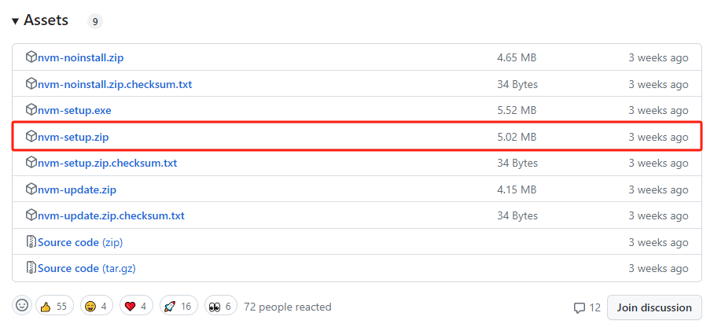

[nvm下载](https://github.com/coreybutler/nvm-windows/releases)



配置nvm安装路径及node包安装路径即可，系统会自动配置nvm的环境变量


# 常用命令

```bash
nvm version                      # 查看 nvm 的版本
nvm ls  						 # 查看目前已经安装的版本
nvm install 10.5.0 		 		 # 安装指定的版本的nodejs
nvm use 10.5.0 			 		 # 使用指定版本的nodejs
nvm list available 				 # 显示可下载版本的部分列表
nvm uninstall 10.5.0			 # 删除已安装的指定版本，语法与install类似
nvm alias 						 # 给不同的版本号添加别名
nvm unalias					 	 # 删除已定义的别名
nvm reinstall-packages <version> # 在当前版本node环境下，重新全局安装指定版本号的npm包
nvm current 				     # 显示当前的node版本
```

```bash
nvm install 9.11.2 32            # 下载 32 位的旧 node 版本
nvm use 9.11.2 32                # 使用该版本
```

