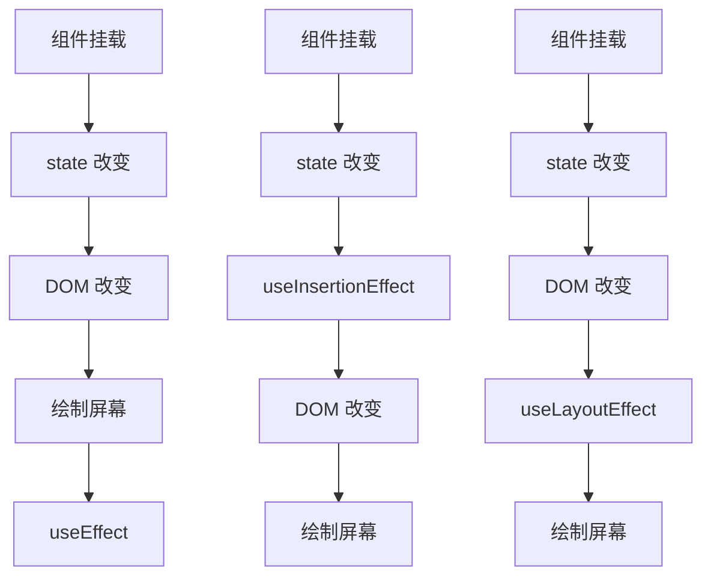

# hooks

- Hook：React16.8.0版本增加的新特性
- 可以**在函数式组件中使用 state** 以及其他的 React 新特性

## 为什么要使用 `Hooks`

`Hooks` 解决的是：`Class` 组件中 逻辑复用困难、逻辑分散、心智模型复杂 的问题

❌ Hooks 不是为了解决性能问题

1. 没有 `this`，代码更直观；解决`this` 指向复杂、心智负担高问题
2. 解决生命周期导致逻辑分散问题
3. 更符合 React 当前和未来的发展方向


`React Hooks` 建议引入顺序

```typescript
import {
    // 状态
    useState,

    // 生命周期
    useEffect,

    // 引用
    useRef,

    // 性能优化
    useCallback,
    useMemo,
    useContext,
} from 'react'
```


## 1. `useState`状态更新

`const [state, setState] = useState(initialState);`

**initialState**：**第一次初始化**指定的值在内部作缓存

**返回值**：包含2个元素的数组

- `state`为`initialState`值**本身**（object时，也是其本身，故而修改状态时，需要注意有没有改变初始化对象）

  ```typescript
  const initTitle = [{
      status: ""
  }]
  
  const ApplyExamined: React.FC = () => {
      // 不应该如此初始化对象
      const [title, setTitle] = useState(initTitle)
      // 应该使用下面的写法（不包括redux）
      // const [title, setTitle] = useState(DeepCopy.deepCopy(initTitle))
  
      useEffect(() => {
          const errorTitle = [...title]
          // 此时，初始化对象initTitle也会被改变，**再次**进入该组件时，initTitle[0].status === 'error'
          // 故而初始化对象时。应该使用初始化对象的深复制值
          errorTitle[0].status = 'error'
          setTitle(errorTitle)
      }, [])
  }
  ```

- `setState`为更新状态值的函数

### 避免重复创建初始状态

1. 错误例子

   ```typescript
   const [todos, setTodos] = useState(createInitialTodos())   // 不可使用该写法
   ```

   尽管 `createInitialTodos()` 的结果仅用于初始渲染，但仍然会在每次渲染时调用此函数

2. **正确使用**

   ```typescript
   const [todos, setTodos] = useState(createInitialTodos)     // React 在并且仅在初始化期间会调用该函数
   ```

   传递的是 `createInitialTodos` **函数本身**，而不是 `createInitialTodos()` 调用该函数的结果。如果将函数传递给 `useState`，**React 仅在初始化期间调用它**。如：

   ```typescript
   // 以深拷贝函数的返回值作为初始值
   const [title, setTitle] = useState(() => DeepCopy.deepCopy(renewalTitle))
   ```


**useState用法**

setXxx(setName)的两种写法

- **setXxx(newState)**：参数为非函数值**（单次调用）**

- **setXxx(precState => newState)**：参数为函数，接收原本的状态值，`newState` 和 `precState` 不能为同一值，否则不会触发页面更新。**尤其注意对象**，地址容易一样==**（连续调用）**==

```jsx
import { useState } from 'react'
export default function Demo() {
    const [name, setName] = useState(['bin'])
    const [age, setAge] = useState(18)
    const [age1, setAge1] = useState(0)
    
    const changeAge = () => {
        setAge1(18)
        setAge(age + age1)    // 18
    }
    
    const changeName = () => {
		//setName("huabin") //第一种写法
		setName(prevState  => {
            const newValue = [...prevState]
            newValue[0] = "hhuabin"
            return newValue
        })
	}
    
    return(
        <div>
			<div>名字：{name}</div>
            <div onClick={changeName}>改名字</div>
		</div>
    )
}
```

示例：

1. **连续调用**：**根据先前的 state 更新 state**

   假设 `age` 为 `42`，这个处理函数三次调用 `setAge(age + 1)`：

   ```jsx
   function handleClick() {
       setAge(age + 1); // setAge(42 + 1)
       setAge(age + 1); // setAge(42 + 1)
       setAge(age + 1); // setAge(42 + 1)
   }
   ```

   然而，点击一次后，age 将只会变为 43 而不是 45！这是因为调用 set 函数 不会更新 已经运行代码中的 age 状态变量。因此，每个 setAge(age + 1) 调用变成了 setAge(43)。

   为了解决这个问题，你可以向 setAge **传递一个 更新函数**，而不是下一个状态：

   ```jsx
   function handleClick() {
       setAge(a => a + 1); // setAge(42 => 43)
       setAge(a => a + 1); // setAge(43 => 44)
       setAge(a => a + 1); // setAge(44 => 45)
   }
   ```

   这里，`a => a + 1` 是更新函数。它获取 **待定状态** 并从中计算 **下一个状态**。

   React 将更新函数放入 **队列** 中。然后，在下一次渲染期间，它将按照相同的顺序调用它们：

   1. `a => a + 1` 将接收 `42` 作为待定状态，并返回 `43` 作为下一个状态。
   2. `a => a + 1` 将接收 `43` 作为待定状态，并返回 `44` 作为下一个状态。
   3. `a => a + 1` 将接收 `44` 作为待定状态，并返回 `45` 作为下一个状态。

   现在没有其他排队的更新，因此 React 最终将存储 `45` 作为当前状态。

   按照惯例，通常将待定状态参数命名为状态变量名称的第一个字母，如 `age` 为 `a`。然而，你也可以把它命名为 `prevAge` 或者其他你觉得更清楚的名称。

2. 更新状态中的**对象和数组**

   你可以将对象和数组放入状态中。在 React 中，状态被认为是只读的，因此 **你应该替换它而不是改变现有对象**。例如，如果你在状态中保存了一个 `form` 对象，请不要改变它：

   ```jsx
   // 🚩 不要像下面这样改变一个对象：
   form.firstName = 'Taylor';
   ```

   相反，可以通过**创建一个新对象来替换整个对象**：

   ```jsx
   // ✅ 使用新对象替换 state
   setForm({
       ...form,
       firstName: 'Taylor'
   });
   ```


## bug：父组件给子组件单向数据流，状态改变函数`setXXX`

==`React`非常容易造成闭包获取旧的`state`特别是传给子组件的`state`，这是`React`的缺点之一==

父组件给子组件传递改变状态函数`setXXX`时候应该尽量传递以下格式，应该尽量调用==函数式更新==，避免子组件同时更新父组件函数，造成闭包取旧值的情况。使用函数式更新可以有效避免同时更新出现更新不成功的情况。

1. 传递子组件更新函数，该函数必须使用函数式更新，此时约定子组件只传 `diff`，而不是完整 `state`。适用于 `info` 是 `object` 对象修改值或者只新增数据。

   ```tsx
   const [info, setInfo] = useState<Info>({})
   
   const childrenChangeInfo = (state: Partial<Info>) => {
       setInfo(prev => {
           return {
               ...prev,
               ...state,
           }
       })
   }
   
   <ImageUpload
       setInfo={(state) => childrenChangeInfo(state)}
   ></ImageUpload>
   ```

2. 直接传递更新函数

   ```tsx
   const [info, setInfo] = useState<Info>({})
   
   <ImageUpload
       setInfo={setInfo}
   ></ImageUpload>
   ```

3. 传递接受函数式更新的函数，子组件可以自己选择改变状态的方式

   ```tsx
   const [info, setInfo] = useState<Info>({})
   
   const childrenChangeInfo = (state: Info | ((prevState: Info) => Info)) => {
       setInfo(state)
   }
   
   <ImageUpload
       setInfo={(state) => childrenChangeInfo(state)}
   ></ImageUpload>
   ```

   


## `flushSync `

- **同步执行**：`flushSync` 会**绕过 React 的批处理（batching）机制**，立即触发 DOM 更新。**但它不会改变闭包里的旧 state**

```typescript
import { flushSync } from 'react-dom';

flushSync(() => {
    // 在这里的状态更新会立即触发同步渲染
    setState(newValue);
});
```

React 默认采用**异步批处理更新**机制，多个 `setState` 可能被合并成一次渲染，以提高性能。但某些场景下，我们需要**立即获取更新后的 DOM**，例如：

- **测量 DOM 元素**（如计算元素尺寸、位置）。
- **第三方库依赖同步渲染**（如某些动画库、富文本编辑器）。
- **在事件回调中确保 UI 立即更新**（如滚动位置调整）。


不允许在`useEffect`中同步执行`flushSync`

```typescript
useEffect(() => {
    flushSync(() => {
        setCount(c => c + 1) // ❌ React 还在渲染，不能强制 flush
    })
}, [])
```

可以改成异步执行：

```typescript
useEffect(() => {
    Promise.resolve().then(() => {
        flushSync(() => {
            setCount(c => c + 1)
        })
    })
}, [])
```


## 2. `useEffect`生命周期

可以让在函数组件中执行副作用操作(用于模拟类组件中的生命周期钩子)

- dependencies：依赖数组，当依赖数组的 value 发生变化时更新，可以实现类似 watch 的功能

```javascript
import { useEffect } from 'react';

useEffect(() => {
    // 在此可以执行任何带副作用操作
    return () => {
        // 清理函数
        // componentWillUnmount() 在此做一些收尾工作, 比如清除定时器/取消订阅等
    }
}, dependencies: [])
// dependencies 如果是 undefine, 相当于 componentDidMount()， componentDidUpdate()，componentWillUnmount()，所以，一般不为空，而是[]。
// dependencies 如果指定的是[], 回调函数只会在第一次render()后执行，相当于 componentDidMount()
// dependencies 里面如果有 state，则state 更新时，也会执行，相当于 componentDidMount() 和 componentDidUpdate()一起
```

- **清理函数执行时机**：
  1. 组件挂载时执行一次
  2. 组件卸载时执行一次
  3. 当依赖项 `dependencies` 不为空（如`[state1, state2]`）。**每次依赖项变化时，在下次 Effect ==执行前==执行**


可以把 useEffect Hook 看做如下三个函数的组合

- `componentDidMount()`、`componentDidUpdate()`、`componentWillUnmount() `

如果只要 `componentDidUpdate` 即 `nextTick()` 的功能，需要加多一个 `useEffect` ，在挂载完成时候让 `isMounted=true`

```tsx
const [isMounted, setIsMounted] = useState(false)    // 是否挂载完成

useEffect(() => { 
    setIsMounted(true)
    return () => {
        setIsMounted(false)
    }
}, [])

useEffect(() => { 
    if(!isMounted) return
}, [arr])
```

==Attention==

在某些场景下，==父组件的`useEffect`可能会先于子组件执行==。如`App.tsx`中，因为路由组件是后续**动态匹配渲染**

| **场景**                             | **`App` 的 `useEffect` 先执行的原因**    |
| :----------------------------------- | :--------------------------------------- |
| **动态路由（React Router）**         | 子路由尚未匹配，未挂载                   |
| **`<Suspense>` + `React.lazy`**      | 子组件异步加载中                         |
| **子组件依赖异步数据（API）**        | 子组件 `useEffect` 等待数据返回          |
| **子组件条件渲染**                   | 初始不渲染，后续才挂载                   |
| **`useLayoutEffect` vs `useEffect`** | `useLayoutEffect` 同步执行，可能影响顺序 |


## 3.`useRef`

`useRef` 是一个 React Hook，它能帮助引用**一个不需要渲染的值**

`useRef(initialValue)`

参数：

- `initialValue`：ref 对象的 `current` 属性的初始值。可以是任意类型的值。这个参数在首次渲染后被忽略。

返回值：

- `useRef` 返回一个只有一个属性的对象:
  - `current`：初始值为传递的 `initialValue`。之后可以将其设置为其他值。如果将 ref 对象作为一个 JSX 节点的 `ref` 属性传递给 React，React 将为它设置 `current` 属性。

attention：

可以修改 `ref.current` 属性，改变 `ref.current` 属性时，React 不会重新渲染组件，因为 ref 是一个普通的 JavaScript 对象。

1. 属性存储

   ```tsx
   const intervalRef = useRef(0)
   
   intervalRef.current = 100
   ```

2. 挂载 DOM

   ```tsx
   const inputRef = useRef<HTMLDivElement | null>(null)
   
   const setRef = useCallback((node) => {
       if (node) {
           inputRef.current = node
       }
   }, [])
   
   return (
   	<input ref={inputRef} type="text" placeholder="点击按钮提示数据"/>
       <input ref={node => inputRef.current = node} type="text" placeholder="点击按钮提示数据"/>
       <input ref={setRef} type="text" placeholder="点击按钮提示数据"/>
   )
   ```

   

:exclamation: :exclamation: :exclamation:：在`React`中，==禁止使用函数防抖==，React每次更新都会重刷一遍`submitOrder()`导致`isLoading`一直被重置成`false`

```typescript
// 禁止使用
const submitOrder = (
    let isLoading = false   // 此处 isLoading 需要使用useRef
    return () => {
        if (isLoading) return
        console.log('提交订单', isLoading)
        isLoading = true
    }
)()
```


## 4. useReducer

作用：`useReducer` 是 `useState` 的**替代方案**

`useReducer(reducer, initialArg, init?)`

```jsx
const [state, dispatch] = useReducer(reducer, { age: 42 });
```

- **reducer**: `function reducer(state, action) {}`，**一般定义在函数组件外**以避免更新时重新创建
  - **state**: prevstate 旧的 state
  - **action**: dispatch(action) 由 dispatch 函数传入的参数
- **initialArg**: state 的初始值，作用与 useState() 中的值一样

```jsx
import { useReducer } from 'react';

// 避免更新时重新创建
function reducer(state, action) {
  if (action.type === 'incremented_age') {
    return {
      age: state.age + 1
    };
  }
  throw Error('Unknown action.');
}

export default function Counter() {
  const [state, dispatch] = useReducer(reducer, { age: 42 });

  return (
    <>
      <button onClick={() => {
        dispatch({ type: 'incremented_age' })
      }}>
        Increment age
      </button>
      <p>Hello! You are {state.age}.</p>
    </>
  );
}
```


## 5.useMemo

`const cachedValue = useMemo(calculateValue, dependencies)`

**用途**：缓存==**计算结果（函数返回值）**==，避免每次渲染时重复执行**复杂**计算。**适用场景**：当某个值的==**计算成本较高**==，且依赖项未变化时。当计算过程并不复杂时，慎用，请勿乱用

`useMemo` 是一个 React Hook，所以你只能 **在组件的顶层** 或者自定义 Hook 中调用它。你不能在循环语句或条件语句中调用它。如有需要，将其提取为一个新组件并使用 state。

- `calculateValue`：要缓存计算值的函数。它应该是**一个没有任何参数的纯函数**，并且可以返回任意类型。React 将会在首次渲染时调用该函数；在之后的渲染中，如果 `dependencies` 没有发生变化，React 将直接返回相同值。否则，将会再次调用 `calculateValue` 并返回最新结果，然后缓存该结果以便下次重复使用。
- `dependencies`：所有在 `calculateValue` 函数中使用的响应式变量组成的数组。响应式变量包括 props、state 和所有你直接在组件中定义的变量和函数

**用法**

1. **跳过代价昂贵的重新计算**

   在组件顶层调用 `useMemo` 以在重新渲染之间缓存计算结果：

   ```tsx
   import { useMemo } from 'react';
   
   function TodoList({ todos, tab, theme }) {
       // ✅ 只有当 todos 或 tab 改变时才会发生改变
     	const visibleTodos = useMemo(() => filterTodos(todos, tab), [todos, tab]);
       
       return (
           // 一般在 html 中使用
           <div>{visibleTodos}</div>
       )
   }
   ```


## `React.memo`

```typescript
memo(Component, arePropsEqual?)
```

- `arePropsEqual`：比较函数，接收参数`(prevProps, nextProps)`都是`Readonly<Props>`

  返回 `true` 表示 `props` 相等，不重新渲染；返回 `false` 表示 `props` 不相等，重新渲染

`React.memo`和`useMemo`不是一个东西

- **用途**：作为高阶组件，用于包裹函数组件，使其仅在 `props` 发生变化时重新渲染（默认对 `props` 进行浅比较）。
- **作用对象**：**组件**。
- **适用场景**：当父组件频繁渲染，但子组件的 `props` 未变化时，避免子组件不必要的渲染。

```tsx
import { memo } from 'react'

type Props = {
    data: string;
    setIdentityInfo: (identityInfo: Partial<IdentityInfo>) => void;
}

// ✅推荐使用。使用默认推导类型 React.NamedExoticComponent<Props>
const MemoizedComponent = memo((props: Props) => {
    return <div>{data}</div>;
}, (prevProps, nextProps) => {
    // 返回 true 表示 props 相等，不重新渲染
    // 返回 false 表示 props 不相等，重新渲染
    // (prevProps as Readonly<Props>, nextProps)
    const { id: prevId } = prevProps
    const { id: nextId } = prevProps
    return prevId === nextId
})
// 或者使用这种，但是不推荐
const MemoizedComponent: React.NamedExoticComponent<Props> = memo((props) => {
    return <div>{data}</div>;
})

export default MemoizedComponent
```

强制推推导类型

```tsx
const Component: React.FC<Props> = (props) => {
    return <div>{data}</div>;
}

const MemoizedComponent = memo(Component)

export default MemoizedComponent
```


## 6.`useCallback`

`useCallback(fn, dependencies)`

**用途**：==**缓存函数（函数内存地址）**==，优化子组件渲染，**作为依赖函数**时候的优化

- `fn`：在多次渲染中需要缓存的函数。此函数可以接受任何参数并且返回任何值。React 将会在初次渲染而非调用时返回该函数
- `dependencies`：有关是否更新 `fn` 的所有响应式值的一个列表。响应式值包括 props、state，和所有在你组件内部直接声明的变量和函数

`useCallback` 是一个允许你在**多次渲染中缓存函数的 React Hook**，用于优化函数的性能。它的作用是**在组件渲染过程中，缓存回调函数，以避免不必要的函数重新创建**

**useCallback用法**：特别注意==**当依赖项是函数时，一般需要使用 `useCallback` 记住函数**==，因为每次状态更新都会触发函数的重新创建

`useCallback` 带来的开销：

1. **内存**开销（**闭包** + 函数缓存）
2. 依赖项**比较成本**和**维护成本**
3. 如果回调函数很轻量，**useCallback ≈ 负优化**

`useCallback` 的使用场景：

1. **跳过组件的重新渲染**

   ```jsx
   import React, { useCallback } from 'react';
   
   function ParentComponent() {
       const [count, setCount] = useState(0);
       const [userInfo, setUserInfo] = useState({
           username: "bin",
           age: 18,
       })
   
       // 仅当 `count` 变化时生成新的回调函数
       const handleClick = useCallback(() => {
           console.log('点击次数:', count);
       }, [count]); // 依赖项是 `count`
       
       const changeUserInfo = useCallback((username) => {
           // 禁止使用以下方式，如需使用，依赖项中需要添加 userInfo，不然获取的userInfo永远是旧值
           /* setUserInfo({
               ...userInfo,
               username,
           }) */
           // 正确写法，避免依赖 userInfo
           setUserInfo(prev => {
               return {
                   ...prev,
                   username,
               }
           })
       }, [])
   
       return <ChildComponent onClick={handleClick} />;
   }
   
   // 子组件使用 React.memo 优化
   const ChildComponent = React.memo(({ onClick }) => {
       return <button onClick={onClick}>点击</button>;
   });
   ```

   **将 `handleSubmit` 传递给 `useCallback` 就可以确保它在多次重新渲染之间是相同的函数**，直到依赖发生改变。注意，除**非出于某种特定原因，否则不必将一个函数包裹在 `useCallback` 中**。在本例中，你将它传递到了包裹在 `memo` 中的组件，这允许它跳过重新渲染。

2. **防止频繁触发 Effect**

3. 从记忆化回调中更新 state

4. 优化自定义 Hook

   如果你正在编写一个 **自定义 Hook**，建议将它返回的任何函数包裹在 `useCallback` 中

   ```jsx
   function useRouter() {
       const { dispatch } = useContext(RouterStateContext);
   
       const navigate = useCallback((url) => {
       	dispatch({ type: 'navigate', url });
       }, [dispatch]);
   
       const goBack = useCallback(() => {
       	dispatch({ type: 'back' });
       }, [dispatch]);
   
       return {
           navigate,
           goBack,
       };
   }
   ```

- `useCallback` 是一个 Hook，所以应该在 **组件的顶层** 或自定义 Hook 中调用。你不应在循环或者条件语句中调用它。如果你需要这样做，请新建一个组件，并将 state 移入其中。


## 7.`forwardRef`, `useImperativeHandle`

```typescript
useImperativeHandle(ref, createHandle, dependencies?)
```

在 react 中无法直接通过 `ref ` 获取**子组件实例**（在 vue 中可以）。**当父组件需要调用子组件的方法时**，可以使用 `forwardRef` +  `useImperativeHandle`

`forwardRef` 是 React 提供的一个函数，用于向函数组件转发 `ref`。它允许你在函数组件中接收 `ref` 并将其转发给内部的子组件。

`useImperativeHandle` 接受三个参数：

1. ref 对象，即父组件的`useRef<ChildComponentRef>(null)`

2. **工厂函数**：返回你想要暴露的 `ref` 的句柄，即给父组件的 `ref` 变量赋值

3. 依赖项数组。

通过在函数组件中调用 `useImperativeHandle`，你可以自定义子组件向外暴露的实例或方法。

 :bulb: 此时使用`React.memo`的话，`memo`需要包裹`forwardRef`

```tsx
import { forwardRef, useImperativeHandle } from 'react'
import type {
    ForwardedRef,
    ForwardRefExoticComponent,
    PropsWithoutRef,
    RefAttributes,
} from 'react'

export type ChildComponentRef = {
    increment: () => void
}

// 子组件， 用 forwardRef 包裹
// ChildComponent类型不需要具体写明，会自动推导的
// 具体类型是 ForwardRefExoticComponent<PropsWithoutRef<Props> & RefAttributes<AddressFromRef>>
export default forwardRef(function ChildComponent(props, ref: ForwardedRef<ChildComponentRef>): JSX.Element {
	// 子组件的内部状态
	const [count, setCount] = useState(0);

	// 父组件通过子组件的引用调用的方法
	const increment = () => {
		setCount(prevCount => prevCount + 1);
	};

	// 使用 useImperativeHandle 定义向外暴露的方法
	useImperativeHandle(ref, () => {
        // 暴露 increment 函数即可
		return {
            increment
        }
	});

	return (
		<div>
			<p>Count: {count}</p>
		</div>
	);
});

// 父组件
function ParentComponent() {
	// 创建一个 ref
	const childRef = useRef<ChildComponentRef>(null);

	// 在父组件中调用子组件暴露的方法
	const handleButtonClick = () => {
		childRef.current?.increment();
	};

	return (
		<div>
			<ChildComponent ref={childRef} />
			<button onClick={handleButtonClick}>Increment Child Count</button>
		</div>
	);
}

export default ParentComponent
```

在上面的示例中，通过使用 `useImperativeHandle`，子组件 `ChildComponent` 可以将 `increment` 方法暴露给父组件，然后父组件可以通过子组件的引用来调用这个方法。

原理：`useImperativeHandle` 的作用就是自定义这个 `ref.current` 应该暴露什么值给父组件。就是给传入的`ref`也就是`ParentComponent`的 `childRef` 赋值

```typescript
useImperativeHandle(ref, () => {
    // 暴露 increment 函数即可
    return {
        increment
    }
}
```

总之，`useImperativeHandle` 允许你在函数组件中自定义向外暴露的实例或方法，以供父组件通过子组件的引用进行调用。


## 8. ~~useInsertionEffect~~、useLayoutEffect、useEffect

三个Effect：`useInsertionEffect`、`useLayoutEffect`、`useEffect`

- ~~useInsertionEffect~~：可以用于给页面**增加** state、样式 等，（不推荐使用本钩子）

  `useInsertionEffect` 是为 CSS-in-JS 库的作者特意打造的。除非你正在使用 CSS-in-JS 库并且需要注入样式，否则你应该使用 `useEffect` 或者 `useLayoutEffect`

- **useLayoutEffect**：可以用于给页面修改 state、样式 等

  `useLayoutEffect` 是 `useEffect` 的一个版本，在浏览器重新绘制屏幕之前触发

  ```jsx
  useLayoutEffect(setup, dependencies?)
  ```

  React 保证了 `useLayoutEffect` 中的代码以及其中任何计划的状态更新都会在**浏览器重新绘制屏幕之前**得到处理。然后在用户没有注意到第一个额外渲染的情况下**再次重新渲染**。换句话说，`useLayoutEffect` 阻塞了浏览器的绘制



`useLayoutEffect`和`useEffect`对比

| 对比点       | useLayoutEffect                             | useEffect           |
| ------------ | ------------------------------------------- | ------------------- |
| 执行时机     | DOM 更新后、**绘制之前**（可以获取到真DOM） | 浏览器 **绘制之后** |
| 是否阻塞渲染 | ✅ 会阻塞                                    | ❌ 不阻塞            |
| 是否同步     | ✅ 同步                                      | ❌ 异步              |
| 是否可能闪动 | ❌ 不会                                      | ✅ 可能              |
| 推荐用途     | DOM 测量、同步布局                          | 请求、订阅、日志    |

- `useLayoutEffect` = **DOM 已就绪**，但还没画
- `useEffect` = 用户已经**看到页面**了


### `useLayoutEffect`：

- 此时 **DOM 已经真实挂载**
- 样式已计算
- 但 **浏览器还没画到屏幕上**

为什么不用 `useEffect` 量 DOM？问题：可能出现「闪动」

```tsx
// 改布局，应该使用 useLayoutEffect
useEffect(() => {
    const width = ref.current!.offsetWidth
    setState(width)
})
```

选用建议：

```text
❓要不要读 DOM / 改布局？
    ├─ 否 → useEffect
    └─ 是
        ├─ 会影响首屏视觉 → useLayoutEffect
        └─ 不影响 → useEffect
```


## 9. useDebugValue

React 提供的一个钩子函数，用于在开发阶段提供额外的调试信息。

```jsx
import { useDebugValue } from 'react';

export default function Hook() {
    useDebugValue("Hook")
}
```


## 10. useDeferredValue

**用于延迟更新状态的值，以优化性能。**它返回一个被延迟更新的值，并确保在渲染期间不会导致额外的重渲染。

`useDeferredValue(state)`：一般接收一个 state 作为参数

useDeferredValue 会触发两次页面渲染

额，目前来说，看不懂这个 hook 有什么卵用

```jsx
import { Suspense, useState, useDeferredValue } from 'react';
import SearchResults from './SearchResults.js';

export default function App() {
	const [query, setQuery] = useState('');
	const deferredQuery = useDeferredValue(query);
	return (
		<>
			<label>
				Search albums:
				<input value={query} onChange={e => setQuery(e.target.value)} />
			</label>
			<Suspense fallback={<h2>Loading...</h2>}>
				<SearchResults query={deferredQuery} />
			</Suspense>
		</>
	);
} 
```

以上代码，input 正常显示 SearchResults 等待组件加载完成时显示。


## 11. useTransition

用于在渲染过渡期间优化用户体验。它允许我们在异步更新状态时指定一个过渡期，以平滑地处理状态的变化，并在过渡期间显示一些加载指示或过渡效果。**可以实现单个变量的类似 vue 中 nextick 的功能**，或者是**单个变量的 this.setState(a, () => {})的第二个参数**，不过不建议这样子想。`useTransition` 的**目的是实现平滑过渡**，即 `isPending`，若要实现 `nextick ` 建议使用 `useEffect`

`const [isPending, startTransition] = useTransition()`

`useTransition` 返回一个数组，其中包含两个元素： `isPending` 和 `startTransition`。

- `startTransition` 是一个**函数**，用于触发过渡期的开始。我们可以在该函数中**执行异步操作或更新状态**。在过渡期间，React 会延迟更新组件，以提供更平滑的过渡效果。
- `isPending` 是一个**布尔值**，指示是否处于过渡期。当调用 `startTransition` 函数开始过渡期时，`isPending` 会变为 `true`，在过渡期结束后会变为 `false`。我们可以根据 `isPending` 的值来在界面上显示加载指示或过渡效果。

```jsx
import { useState, useTransition } from 'react';

function MyComponent() {
	const [a, setA] = useState(0)
	const [b, setB] = useState(0)
    
	const [isPending, startTransition] = useTransition()

	const fetchData = () => {
        // 在过渡期间更新状态
        setA(a => a+1)
        setB(b => b+1)
        // startTransition 的回调函数设置setState会在其他的setState生效后才执行
		startTransition(() => {
            // 这里 a = 0, b = 0;
			setA(a => {
                // 这里a = 1, b = 0，setA只对 a 生效
                return a+1
            })
		})
	};

	return (
		<div>
			<button onClick={fetchData} disabled={isPending}>
				{isPending ? 'Loading...' : 'Fetch Data'}
			</button>
			<div>{data}</div>
		</div>
	);
}
```


## 12. useId

可以生成传递给无障碍属性的唯一 ID

```jsx
const id = useId()
```

**不要使用 `useId` 来生成列表中的 key**。key 应该由你的数据生成


React 的 Hook 规则要求在每次渲染中使用 Hook 的数量必须是固定的，并且必须按照相同的顺序使用。如果在使用 Hook 之前提前返回组件，则会导致在返回之前未使用或渲染的 Hook。

以下是一个示例，展示了一个可能导致 "Rendered fewer hooks than expected" 错误的情况：

```jsx
function MyComponent() {
	if (condition) {
		return null; // 提前返回语句导致错误
	}

	const [state, setState] = useState(initialState);
	// 使用其他的 Hook...

	return (
	  // 组件的 JSX 渲染
	);
}
```

在上面的示例中，如果条件 `condition` 成立，组件会提前返回 `null`，导致后面定义的 Hook 没有机会使用。要解决这个问题，可以将提前返回移动到组件 JSX 渲染的部分，以确保 Hook 在组件的顶层使用。


## 13. none nextTick

- Vue的`nextTick`，是在DOM更新后执行的，**React中并没有针对DOM更新之后执行的代码**

- React实现不了`nextTick`，但是React可以通过`useEffect`监听state的状态变化，当state状态变化后可以执行`useEffect`中的函数
- 但是要明白一点，state状态变化并不等于是DOM更新，**如果一定要在DOM更新后执行函数，请使用Vue**


## 14.`createPortal`

允许组件挂载在父组件以外的其他元素。==可用于Modal框，或者弹出层等等==

```tsx
<div>
    <SomeComponent />
    {createPortal(children, domNode, key?)}
</div>
```

- 挂载在body上

  ```tsx
  import { createPortal } from 'react-dom';
  
  <div>
      <p>This child is placed in the parent div.</p>
      {createPortal(
          <p>This child is placed in the document body.</p>,
          document.body,
          // document.getElementById('root') // 这是指定的 DOM 节点
      )}
  </div>
  
  or
  
  return createPortal(
      <div></div>,
      document.body
  )
  ```


# 15.Context

`context`：一种组件间通信方式, 常用于【祖组件】与【后代组件】间通信

1. `createContext`：创建 `Context` 容器对象并且暴露出去

   ```ts
   import { createContext } from 'react'
   
   export interface ConfigConsumerProps {
       theme: 'light' | 'dark'
   }
   
   export const defaultConfig: ConfigConsumerProps = {
       theme: 'light',
   }
   
   // 1.这里把 Context 暴露出去即可
   export const ConfigContext = createContext<ConfigConsumerProps>(defaultConfig)
   ```

2. `Provider`：父组件使用（传值），包裹 `Provider`，通过 `value` 属性给后代组件传递数据：

   ```jsx
   import { useContext } from 'react'
   import { ConfigContext } from './context'
   // 1.获取 Provider
   const { Provider, Consumer } = ConfigContext
   
   const ConfigProvider: React.FC = () => {
   
       // 2.获取context默认值
       const context = useContext(ConfigContext)
       // 3.使用自定义值，覆盖默认值
       const data = {
           ...context,
           theme: 'dark',
       }
   
       return (
           // 4.将自定义值传给子组件
           <Provider value={data}>
               <children />
           </Provider>
       )
   }
   
   export default ConfigProvider
   
   ```

3. `Consumer`：`children`组件读取数据

   函数组件：useContext 钩子函数，只能函数式组件中使用

   ```jsx
   import { useContext } from 'react'
   import { ConfigContext } from './context'
   
   const ConfigProvider = () => {
       // 获取方式1
       const context = useContext(ConfigContext)
       console.log(context.theme)
   
       return (
        	// 获取方式2
           <ConfigContext.Consumer>
               {
                   value => ( // value 就是 context 中的 value 数据
                       return (<div>{value.name}</div>)
                   )
               }
           </ConfigContext.Consumer>
       )
   }
   
   export default ConfigProvider
   ```

   类组件（不用看）：
   
   ```jsx
   // html 外使用
   static contextType = xxxContext  // 声明接收context(MyContext)
   this.context // 读取context中的value数据
   
   // html 中使用
   return (
       <MyContext.Consumer>
           {
               value => ( // value就是context中的value数据
                   return (<div>{value.name}</div>)
               )
           }
       </MyContext.Consumer>
   )
   ```


在应用开发中一般不用 `context`, 一般都它的封装 `React` 插件；在**全局状态管理**、**跨层级组件通信**、**减少重复代码**中使用较多。

大多数情况下建议直接使用 `props` 传值最为简单快捷：

- **`Context` 会在值发生变化时重新渲染所有使用它的组件**。如果你需要频繁更新的状态，且只需要传递给少数组件，直接使用 props 传值可以减少不必要的重渲染
- 通过精确传递 `props`，可以更好地控制哪些组件需要更新，从而**提高性能**。


# setState(React16+)

React 状态的更新是**异步**的

1. 一般的 `setState`，对象式

   ```jsx
   this.setState({
       count:count+1
   })
   ```

2. `setState` 函数接收两个参数，第二个参数是一个状态更新后的执行函数

   ```jsx
   state = {
       count: 0,
   }
   this.setState({count: count + 1},() => {
       console.log(this.state.count);   // 1
   })
   ```

3. 函数式的 `setState`

   ```jsx
   this.setState( state => ({
       count:state.count+1
   }))
   // 或者
   this.setState( state => {
       return count:state.count+1
   })
   ```


# lazy、Suspense 

组件懒加载：组件懒加载可以使用 lszy 函数，同时必须使用 Suspense 组件，并且指定fallback，此时 fallback 组件不能使用懒加载，必须使用普通同步引入

```jsx
import { Component, lazy, Suspense} from 'react'

import Loading from './Loading'
const Home = lazy(()=> import('./Home') )

render() {
    return (
        <Suspense fallback={<Loading/>}>
            {/* 注册路由 */}
            <Route path="/about" component={About}/>
            <Route path="/home" component={Home}/>
        </Suspense>
    )
}
```

在路由组件中，Suspense 只能加在 Routes 或 Outlet 外；\<Routes>，\<Route> 的直接子组件只能是 \<Route>

```jsx
<Suspense fallback={<Loading/>}>
    <Outlet></Outlet>
</Suspense>

<Suspense fallback={<Loading/>}>
    <Routes>
        <Route path="/" element={<Home/>}>
            <Route path="/home" element={<HomeComponent/>}/>
        </Route>
    </Routes>
</Suspense>
```

路由子路由组件的Suspense问题

- react比较推崇在本页面解决问题，组件自定义loading会比较好，不用封装在路由那里

```tsx
<>
	<div>mainContent</div>

    {/* <Navigate to="/home/id"/> */}
    {/* <Outlet></Outlet> */}
    {/* 组件自定义loading会比较好 */}
    <Suspense fallback={<div><Loading/></div>}>
        <Outlet></Outlet>
    </Suspense>
</>
```

在 React 中，**异步组件第一次加载执行两次**的情况通常是由于 React 的工作机制所导致的。

当使用异步组件（例如 React.lazy 和 Suspense）时，React 首先会触发组件的加载过程。在加载过程中，React 会渲染出一个占位符（placeholder），以便在异步组件加载完成前展示该占位符。这是第一次渲染。

一旦异步组件加载完成，React 将会触发第二次渲染，此时会替换占位符并渲染出实际的组件内容。

因此，第一次加载异步组件会经历两次渲染。这是 React 的正常行为，并且在大多数情况下不会引起问题。React 之所以采用这种方式，是为了确保组件的加载状态和渲染结果能够正确地反映出异步加载的过程。


# React.memo(Component, areEqual)

用于缓存组件，当子组件的 props 发生变化的时候再重新渲染，父组件的 state 变化的时候不会触发重新渲染。类似于 `PureComponent` 和 `shouldComponentUpdate` 方法的集合体。

用法：**直接包裹组件**即可 React.memo(Component, areEqual)

- `Component`：要进行记忆化的组件。`memo` 不会修改该组件，而是返回一个新的、记忆化的组件。它接受任何有效的 React 组件，包括函数组件和 [`forwardRef`](https://react.docschina.org/reference/react/forwardRef) 组件。
- **可选参数** `arePropsEqual`：一个函数，接受两个参数：组件的**前一个 props** 和**新的 props**。如果旧的和新的 props 相等，即组件使用新的 props 渲染的输出和表现与旧的 props 完全相同，则它应该返回 `true`。否则返回 `false`。通常情况下，你不需要指定此函数。默认情况下，React 将使用 `Object.is` 比较每个 prop。
- **返回值**：`memo` 返回一个新的 React 组件。它的行为与提供给 `memo` 的组件相同，只是当它的父组件重新渲染时 React 不会总是重新渲染它，除非它的 props 发生了变化。

```jsx
import { memo } from 'react';

const SomeComponent = memo((props) => {
	return (<div></div>)
}, (oldProps, newProps) => {
    return true
});
```

使用 `memo` 将组件包装起来，以获得该组件的一个 **记忆化** 版本。通常情况下，只要该组件的 props 没有改变，这个记忆化版本就不会在其父组件重新渲染时重新渲染。但 React 仍可能会重新渲染它：记忆化是一种性能优化，而非保证。

- ==`React.memo` 只会对 props 进行浅比较==。如果 props 是对象或数组，确保传递给组件的引用在每次渲染时都是新的，否则它可能不会正常工作。
- 只有在确定组件因为渲染开销很大或者 props 变化时会进行渲染时，才应该使用 `React.memo`。对于简单的组件，它可能会增加代码的复杂性而不带来明显的性能提升。


# Fragment

Fragment：可以不用必须有一个真实的DOM根标签了

```html
<Fragment></Fragment>
<></>
```

区别：Fragment 可以指定 key 值，并且只能指定 key。不能写其他属性


# 组件优化

## render函数触发条件

1. 自身`state` 变化
2. 自身`Props` 变化
3. **父组件**重新渲染（可优化）
   
   - 原因：即便当前组件的 `props` 和 `state` 没有变化，只要它的父组件重渲染了(如父组件因自身的 `state` 或`props` 变化而重新渲染)，那么这个子组件也会重新染。这个情况经常会导致一些不必要的重复渲染，为此，我们可以使用一些优化手段，如`React.memo`、`PureComponent` 或`shouldComponentUpdate`
   
   - 解决：只有当组件的 `state`或 `props` 数据发生改变时才重新 `render()`


## 全局组件

React **没有**真正的**全局组件**注册，如果非要做，以下给几个方法

1. 在 `components` 做一个集中导出
2. 。使用 `Context` 。正常人是不会这么做的


## Component 有2个问题

1. 只要执行setState()，即使不改变状态数据，组件也会重新render()
2. 只要当前组件重新render()，就会自动重新render子组件 ==> 效率低

**原因：Component中的shouldComponentUpdate()总是返回true**


## 解决办法 PureComponent（Class组件）

1. 重写shouldComponentUpdate()方法

   比较新旧state或props数据, 如果有变化才返回true，如果没有返回false

   ```jsx
   shouldComponentUpdate(nextProps,nextState){
       console.log(this.props,this.state); //目前的props和state
       console.log(nextProps,nextState); //接下要变化的目标props，目标state
       return !this.state.carName === nextState.carName
   }
   ```

2. 使用 **PureComponent**

   PureComponent重写了shouldComponentUpdate()，只有state或props数据有变化才返回true

   注意: 

   ​      只是进行state和props数据的浅比较，如果只是数据对象内部数据变了，返回false  

   ​      不要直接修改state数据，而是要产生新数据

   ```jsx
   import {PureComponent} from 'react'
   export default class Demo extends PureComponent {
       
   }
   ```

项目中一般使用PureComponent来优化


# Render Props

用处：可**封装高阶通用型组件**，如日志记录等。

Vue中：使用**slot 插槽技术**, 也就是通过组件标签体传入结构  \<AA>\<BB/>\</AA>

React中：组件A接收一个返回 `JSX.Element` 的函数

1. 父组件

   ```jsx
   import React from 'react';
   import A from './A.tsx';
   
   function App() {
       return (
           <div className="parent">
               <h3>我是Parent组件</h3>
               <A render={ (name) => <B name={name}/> }>
                   {(name, age) => (
                       <h3>{name}</h3>
                       <h3>{age}</h3>
                   )}
               </A>
           </div>
       );
   }
   
   export default App;
   ```

2. 子组件A

   ```jsx
   import React, { useState } from 'react';
   
   function A({ children }) {
       const [name, setName] = useState("tom")
       const [age, setAge] = useState(18)
   
       return (
           <div>
           	{ children(name, age) }
           </div>
       );
   }
   
   export default MouseTracker;
   ```


**类式组件中使用**

- ```typescript
  import { Component } from 'react'
  
  export default class Parent extends Component {
  	render() {
  		return (
  			<div className="parent">
  				<h3>我是Parent组件</h3>
  				<A render={ (name) => <B name={name}/> }/>
  			</div>
  		)
  	}
  }
  
  class A extends Component {
  	state = {name:'tom'}
  	render() {
  		console.log(this.props);
  		const {name} = this.state
  		return (
  			<div className="a">
  				<h3>我是A组件</h3>
  				{this.props.render(name)}
  			</div>
  		)
  	}
  }
  
  class B extends Component {
  	render() {
  		console.log('B--render');
  		return (
  			<div className="b">
  				<h3>我是B组件,{this.props.name}</h3>
  			</div>
  		)
  	}
  }
  // 优化：使用 children 代替 render
  ```


# 错误边界(React16+)

- 错误边界：用来捕获后代组件错误，渲染出备用页面

- 只能捕获后代**组件生命周期**产生的错误，不能捕获自己组件产生的错误和其他组件在合成事件、定时器中产生的错误

```jsx
state = {
    hasError:'' //用于标识子组件是否产生错误
}

// 生命周期函数，一旦后台组件报错，就会触发
static getDerivedStateFromError(error) {
    console.log(error);
    // 在render之前触发
    // 返回新的state
    return {
        hasError: true,
    };
}

componentDidCatch(error, info) {
    // 统计页面的错误。发送请求发送到后台去
    console.log(error, info);
}

render() {
    return (
        <div></div>
        {this.state.hasError ? <h2>当前网络不稳定，稍后再试</h2> : <Child/>}
    )
}
```


# **组件**通信方式总结

1. `props` 组件传参
2. `redux` 集中状态管理
3. `Context` 数据共享
4. `route` 路由传参（页面？）


1. `props`：**函数式组件本身只接收一个参数**，即 `props` 对象

   - `children props`
   - `render props`

   ```tsx
   type Props = {
       name: string;
       age?: number;
       isActive: boolean;
   }
   
   const MyComponent: React.FC<Props> = (props) {
     // 组件逻辑
   }
   ```
   
   ```typescript
   import PropTypes from 'prop-types';
   
   function MyComponent(props) {
     // 组件逻辑
   }
   
   MyComponent.propTypes = {
     // 定义传入参数的类型
    name: PropTypes.string.isRequired, // 字符串类型，且为必传
     age: PropTypes.number, // 数字类型，可选
    isActive: PropTypes.bool.isRequired // 布尔类型，且为必传
   };
   
   MyComponent.defaultProps = {
       name:'bin',
       age:18,
   }
   
   export default MyComponent;
   ```
   
   

2. 消息订阅-发布：

   pubs-sub

3. 集中式管理：

   redux

4. conText

   生产者-消费者模式
   
   ```tsx
   import React, { createContext, useContext } from 'react';
   
   ```
   
   


# 副作用

react 并不会自动帮助你去发现副作用，但是它会想办法让它显现出来，从而让你发现它。React 的严格模式，在开发模式下，会主动额重复调用一些函数，以使副作用显现。所以**在处于开发模式并且开启了React的严格模式时，这些函数会被调用两次**：

- 函数的函数体
- 状态更新器函数（setstate的第一个参数）
- 传递给 usestate、useMemo 或 useReducer 的函数
- 类组件的 constructor，render，shouldComponentUpdate 方法
- 类组件的静态方法 getDerivedStateFromProps
