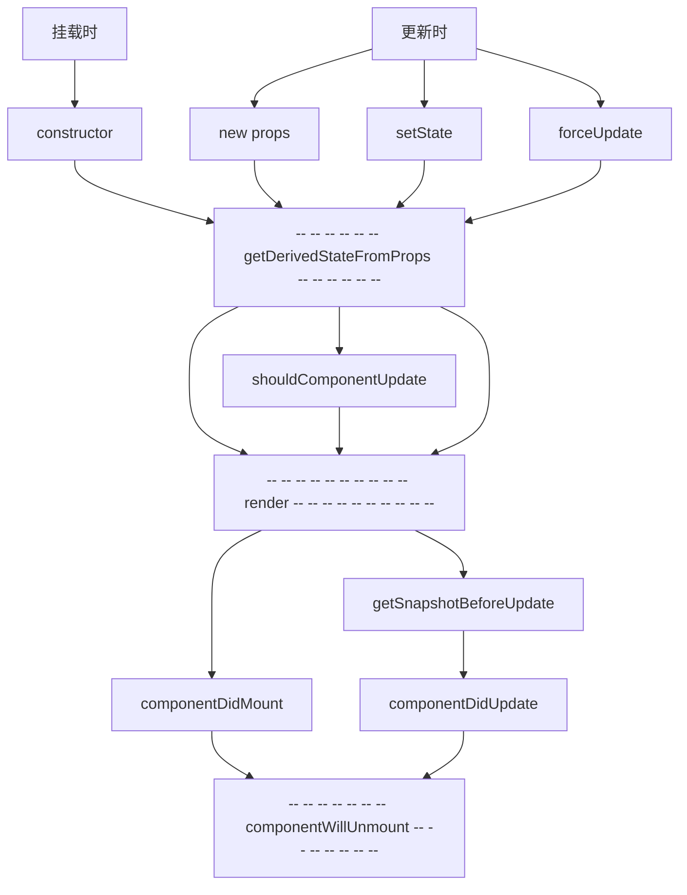
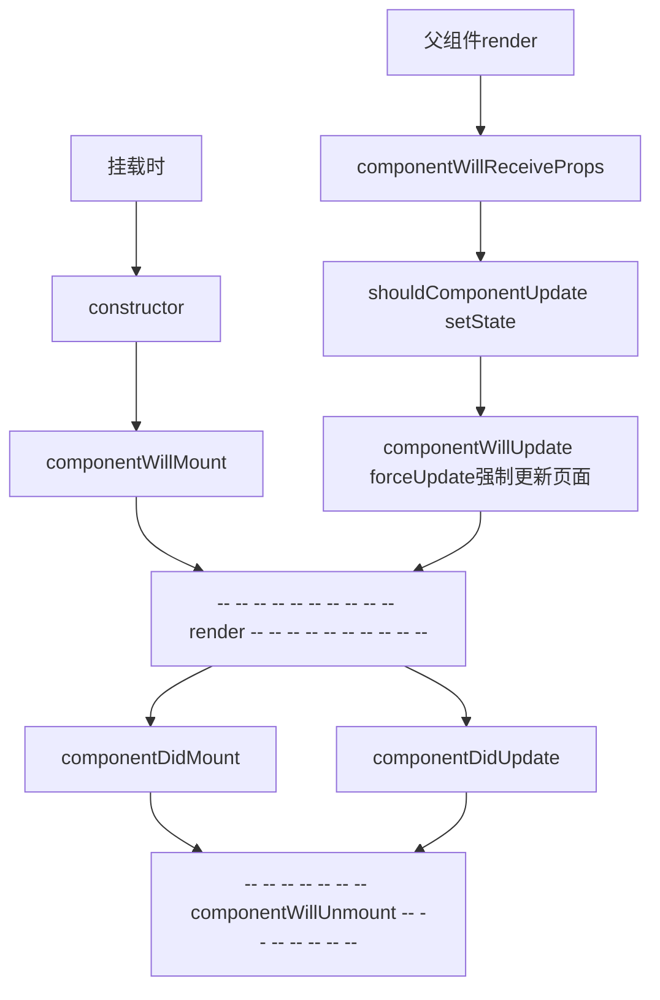

# 生命周期

# React 18

`cleanup`：组件清理上一次的effect

|            场景             | 执行顺序                                                     |
| :-------------------------: | :----------------------------------------------------------- |
|        **首次加载**         | Parent render → Child render → Child effect → Parent effect  |
|     **父组件状态更新**      | Parent render → Child render → Parent cleanup → Child cleanup → Child effect → Parent effect |
|     **子组件状态更新**      | Child render → Child cleanup → Child effect                  |
| **父组件更新 + React.memo** | Parent render → Parent cleanup → Parent effect               |

 :bulb: ：使用 `DataRoute` 的 `App.tsx` 生命周期例外


## `DataRoute` 生命周期顺序

`App`包裹了 `<RouterProvider>`，完全独立于路由组件树

```typescript
App render -> App effect -> createPublicLoader -> Home render -> Child render -> Child effect -> Home effect
```

| 顺序               | 原因                                      |
| ------------------ | ----------------------------------------- |
| App render         | 根组件 render                             |
| App effect         | 根组件 effect（非路由元素，先执行）       |
| createPublicLoader | Data Router loader 异步执行               |
| Home render        | Home 路由元素 render（loader 数据准备好） |
| Child render       | Home 内子组件 render                      |
| Child effect       | Fiber post-order → 子 effect 先执行       |
| Home effect        | Fiber post-order → 父 effect 后执行       |

# React17.x

**新版生命周期 React17.x**



新钩子解释：

- **getDerivedStateFromProps**：获得派生的 state from props

  - 若state的值在任何时候都取决于props，那么可以使用getDerivedStateFromProps，几乎不用

  - 返回值为 **状态对象(state)** 或 **null**，若返回状态对象则会覆盖实例的 state

  ```javascript
  // 静态方法，接收 props,state，返回 state 
  static getDerivedStateFromProps(props,state){
      console.log('getDerivedStateFromProps',props,state);
      // return state;
      return null
  }
  ```

- **getSnapshotBeforeUpdate**：在更新之前获取快照（使用场景并不常见，一般配合 componentDidUpdate 使用）

  - 接收值： prevProps, prrevState，更新前的 props 和 state

  - 返回值：无论返回什么都给 componentDidUpdate

  ```javascript
  getSnapshotBeforeUpdate(prevProps, prrevState){
      console.log('getSnapshotBeforeUpdate', prevProps, prrevState);
      return 'snapshot'
  }
  ```

- componentDidUpdate： 组件更新完毕的钩子

  - 接收值： preProps,preState,snapshot

  ```javascript
  componentDidUpdate(preProps,preState,snapshot){
      console.log('componentDidUpdate',preProps,preState,snapshot);
  }
  ```


# React16.x

旧版 React16.x（reference 不需记）



- componentWillReceiveProps 首次接收 props 不触发，当 props 被父组件修改时才触发。
