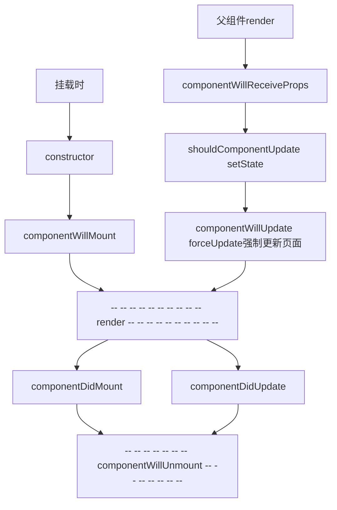
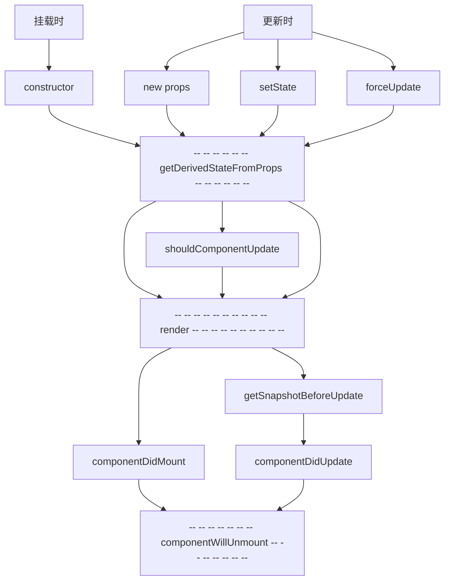

[react 官网](https://react.dev/learn)

# 全局对象 React, ReactDOM

与 jQuery 的全局对象 jQuery ， $类似。

引入 react.development.js，全局多了 **React** 对象

引入 react-dom.development.js，全局多了 **ReactDOM** 对象

引入 prop-types.js，全局多了 **PropTypes** 对象（适用于props相关）


# 关于虚拟DOM：

1. 本质是Object类型的对象（一般对象）
2. 虚拟DOM比较“轻”，真实DOM比较“重”，因为虚拟DOM是React内部在用，无需真实DOM上那么多的属性。
3. 虚拟DOM最终会被React转化为真实DOM，呈现在页面上。

- 使用 jsx 创建虚拟 dom

```javascript
//1.创建虚拟DOM
const VDOM = (  /* 此处一定不要写引号，因为不是字符串 */
    <h1 id="title">
    	<span>Hello,React</span>
    </h1>
)
//2.渲染虚拟DOM到页面
ReactDOM.render(VDOM,document.getElementById('test'))
```

- 使用 js 创建虚拟 dom

```javascript
//1.创建虚拟DOM
const VDOM = React.createElement('h1',{id:'title'},React.createElement('span',{},'Hello,React'))
//2.渲染虚拟DOM到页面
ReactDOM.render(VDOM,document.getElementById('test'))
```

**jsx 是 js 的语法糖**


**jsx语法规则**：

1. 定义虚拟DOM时，不要写引号。
2. 标签中混入**JS表达式**时要用{}。
3. 样式的类名指定不要用class，要用className。
4. 内联样式，要用style={{key:value}}的形式去写。
5. 只有一个根标签
6. 标签必须闭合
7. 标签首字母
   1. 若小写字母开头，则将该标签转为html中同名元素，若html中无该标签对应的同名元素，则报错。
   2. 若大写字母开头，react就去渲染对应的组件，若组件没有定义，则报错。


# 组件定义

- 函数式组件

  ```javascript
  //1.创建函数式组件
  function MyComponent(){
      console.log(this); //此处的this是undefined，因为babel编译后开启了严格模式
      return <h2>我是用函数定义的组件(适用于【简单组件】的定义)</h2>
  }
  //2.渲染组件到页面
  ReactDOM.render(<MyComponent/>,document.getElementById('test'))
  ```

- 类式组件

  ```javascript
  //1.创建类式组件
  class MyComponent extends React.Component {
      render(){
          //render是放在哪里的？—— MyComponent的原型对象上，供实例使用。
          //render中的this是谁？—— MyComponent的实例对象 <=> MyComponent组件实例对象。
          console.log('render中的this:',this);
          return <h2>我是用类定义的组件(适用于【复杂组件】的定义)</h2>
      }
  }
  //2.渲染组件到页面
  ReactDOM.render(<MyComponent/>,document.getElementById('test'))
  ```


# React 中 this 指向问题

- **全局下的方法**：react 中默认开启了严格模式 **'use strict';** 全局下的函数 this 为 undefine ,不是 window

- **类**：类中的 this 指向类的**实例对象**

- **类中的方法**，类中的方法默认开启了局部严格模式，所以类中的方法 this 为 undefine ，不是类实例对象

- **render 方法中的this**：render 方法是被实例对象调用的，故而，this 指向 **实例对象**

  - 解决办法：

    1. 强制绑定 this : 通过函数对象的 bind()

       ```javascript
       constructor(props){
           super(props)
           //初始化状态
           //解决changeWeather中this指向问题
           this.changeWeather = this.changeWeather.bind(this)
       }
       ```

    2. 方法使用箭头函数(箭头函数没有自己的 this)

       ```javascript
       changeWeather = () => {}
       ```

       


# state

直接修改state不会触发页面更新。要使用 **setState** 更新state中的值


# props

引入 prop-types.js，全局多了 PropTypes 对象，可用于 props 限制类型等

```javascript
// 对标签属性进行类型、必要性的限制
Person.propTypes = {
    name:PropTypes.string.isRequired,  // 限制name必传，且为字符串
    sex:PropTypes.string,              // 限制sex为字符串
    age:PropTypes.number,              // 限制age为数值
    speak:PropTypes.func,              // 限制speak为函数
}
// 指定默认标签属性值
Person.defaultProps = {
    sex:'男',        //sex默认值为男
    age:18           //age默认值为18
}
```

将 propTypes 放进类里面，使用 static 关键字。只要保证类里面有 propTypes 属性即可

```javascript
// 对标签属性进行类型、必要性的限制
static propTypes = {
    name:PropTypes.string.isRequired,     // 限制name必传，且为字符串
    sex:PropTypes.string,                 // 限制sex为字符串
    age:PropTypes.number,                 // 限制age为数值
}

// 指定默认标签属性值
static defaultProps = {
    sex:'男',      // sex默认值为男
    age:18         // age默认值为18
}
```

构造器中的 props

```javascript
constructor(props){
    //构造器是否接收props，是否传递给super，取决于：是否希望在构造器中通过this访问props
    super(props)
    console.log('constructor',this.props);
}
```


# ref

**切勿过度使用 refs** ，尽量使用 event 参数。

1. **字符串形式的 ref**（不建议使用，以后可能会被废弃）

   ```javascript
   <input ref="input1" type="text" placeholder="点击按钮提示数据"/>
   ```

   使用

   ```javascript
   showData = () => {
       const {input1} = this.refs
       alert(input1.value)
   }
   ```

   

2. **回调函数形式的 ref**（推荐使用，性能代码缺点）

   ```javascript
   <input ref={c => this.input1 = c } type="text" placeholder="点击按钮提示数据"/>
   ```

   使用

   ```javascript
   showData = () => {
       const {input1} = this
       alert(input1.value)
   }
   ```

   回调函数形式的 ref 会有效率上的问题，修改为以下：（使用方式不变）

   ```javascript
   <input ref={this.saveInput} type="text"/>
   ```

   ```javascript
   saveInput = (c) => {
       this.input1 = c;
   }
   ```

   

3. **createRef 形式**（推荐使用）

   React.createRef 调用后可以返回一个容器，该容器可以存储被 ref 所标识的节点,该容器是“专人专用”的

   `createRef` 不接受任何参数。
   
   `createRef` 返回一个对象，该对象只有一个属性：current

   - `current`：初始值为 null，你可以稍后设置为其他内容。如果你把 ref 对象作为 JSX 节点的 ref 属性传递给 React，React 将设置其 current 属性。
   
   ```javascript
   myRef = React.createRef()
   ```

   ```javascript
   <input ref={this.myRef} type="text" placeholder="点击按钮提示数据"/>
   ```
   
   使用
   
   ```javascript
   showData = ()=>{
       console.log(this.myRef);
       alert(this.myRef.current.value);
   }
   ```
   

`createRef `主要用于 class 组件。而函数组件通常使用 useRef。


# 事件处理

通过onXxx（如 onClick）属性指定事件处理函数(注意大小写)

- React使用的是自定义(合成)事件, 而不是使用的原生DOM事件 ——— 为了更好的兼容性
- React中的事件是通过事件委托方式处理的(**委托给组件最外层的元素**) ———为了的高效

## 高阶函数与函数柯里化

```javascript
高阶函数：如果一个函数符合下面2个规范中的任何一个，那该函数就是高阶函数。
    1.若A函数，接收的参数是一个函数，那么A就可以称之为高阶函数。
    2.若A函数，调用的返回值依然是一个函数，那么A就可以称之为高阶函数。
    常见的高阶函数有：Promise、setTimeout、arr.map()等等

函数的柯里化：通过函数调用继续返回函数的方式，实现多次接收参数最后统一处理的函数编码形式。 
function sum(a){
    return(b)=>{
        return (c)=>{
        	return a+b+c
        }
    }
}
```

使用函数柯里化实现事件处理传参

```javascript
<input onChange={this.saveFormData('username')} type="text" name="username"/>
```

```javascript
saveFormData = (dataType)=>{
    return (event)=>{
        this.setState({[dataType]:event.target.value})
    }
}
```

不使用函数柯里化实现事件处理传参（推荐使用这种事件处理方式）

```javascript
<input onChange={event => this.saveFormData('username',event) } type="text" name="username"/>
```

```javascript
saveFormData = (dataType,event)=>{
    this.setState({[dataType]:event.target.value})
}
```

**PS：在React中， input 元素的 onChange 事件是 html 中的 oninput**，在处理输入变化的时候，React中通常使用 onChange


# 生命周期

旧版 React16.x（reference 不需记）



- componentWillReceiveProps 首次接收 props 不触发，当 props 被父组件修改时才触发。


**新版生命周期 React17.x**



新钩子解释：

- **getDerivedStateFromProps**：获得派生的 state from props

  - 若state的值在任何时候都取决于props，那么可以使用getDerivedStateFromProps，几乎不用

  - 返回值为 **状态对象(state)** 或 **null**，若返回状态对象则会覆盖实例的 state

  ```javascript
  // 静态方法，接收 props,state，返回 state 
  static getDerivedStateFromProps(props,state){
      console.log('getDerivedStateFromProps',props,state);
      // return state;
      return null
  }
  ```

- **getSnapshotBeforeUpdate**：在更新之前获取快照（使用场景并不常见，一般配合 componentDidUpdate 使用）

  - 接收值： prevProps, prrevState，更新前的 props 和 state

  - 返回值：无论返回什么都给 componentDidUpdate

  ```javascript
  getSnapshotBeforeUpdate(prevProps, prrevState){
      console.log('getSnapshotBeforeUpdate', prevProps, prrevState);
      return 'snapshot'
  }
  ```

- componentDidUpdate： 组件更新完毕的钩子

  - 接收值： preProps,preState,snapshot

  ```javascript
  componentDidUpdate(preProps,preState,snapshot){
      console.log('componentDidUpdate',preProps,preState,snapshot);
  }
  ```


