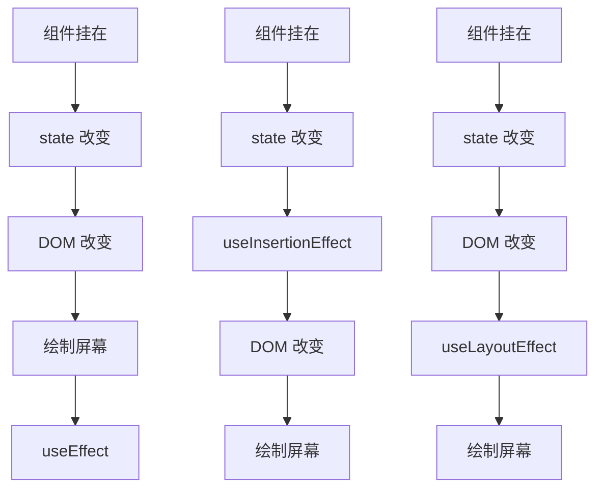

# setState

React 状态的更新是**异步**的

1. 一般的 setState，对象式

   ```jsx
   this.setState({
       count:count+1
   })
   ```

2. setState 函数接收两个参数，第二个参数是一个状态更新后的执行函数

   ```jsx
   this.setState({count:count+1},()=>{
       console.log(this.state.count);
   })
   ```

3. 函数式的 setState

   ```jsx
   this.setState( state => ({
       count:state.count+1
   }))
   // 或者
   this.setState( state => {
       return count:state.count+1
   })
   ```


# lazy、Suspense 

组件懒加载：组件懒加载可以使用 lszy 函数，同时必须使用 Suspense 组件，并且指定fallback，此时 fallback 组件不能使用懒加载，必须使用普通同步引入

```jsx
import { Component, lazy, Suspense} from 'react'

import Loading from './Loading'
const Home = lazy(()=> import('./Home') )

render() {
    return (
        <Suspense fallback={<Loading/>}>
            {/* 注册路由 */}
            <Route path="/about" component={About}/>
            <Route path="/home" component={Home}/>
        </Suspense>
    )
}
```

在路由组件中，Suspense 只能加在 Routes 或 Outlet 外；\<Routes>，\<Route> 的直接子组件只能是 \<Route>

```jsx
<Suspense fallback={<Loading/>}>
    <Outlet></Outlet>
</Suspense>

<Suspense fallback={<Loading/>}>
    <Routes>
        <Route path="/" element={<Home/>}>
            <Route path="/home" element={<HomeComponent/>}/>
        </Route>
    </Routes>
</Suspense>
```

在 React 中，**异步组件第一次加载执行两次**的情况通常是由于 React 的工作机制所导致的。

当使用异步组件（例如 React.lazy 和 Suspense）时，React 首先会触发组件的加载过程。在加载过程中，React 会渲染出一个占位符（placeholder），以便在异步组件加载完成前展示该占位符。这是第一次渲染。

一旦异步组件加载完成，React 将会触发第二次渲染，此时会替换占位符并渲染出实际的组件内容。

因此，第一次加载异步组件会经历两次渲染。这是 React 的正常行为，并且在大多数情况下不会引起问题。React 之所以采用这种方式，是为了确保组件的加载状态和渲染结果能够正确地反映出异步加载的过程。


# hooks

- Hook：React16.8.0版本增加的新特性
- 可以**在函数式组件中使用 state** 以及其他的 React 新特性

## 1. State Hook

`const [state, setState] = useState(initialState);`

- `useState()`

  参数：**第一次初始化**指定的值在内部作缓存

  返回值：包含2个元素的数组,，第1个为内部当前状态值，第2个为更新状态值的函数

  - setXxx(setName)：有两种写法

    setXxx(newState)：参数为非函数值

    setXxx(precState => newState)：参数为函数，接收原本的状态值

```jsx
import React from 'react'
export default function Demo() {
    const [name, setName] = React.useState('bin')
    
    const changeName = () => {
		//setName("huabin") //第一种写法
		setName(precState  => {
            return "hua" + precState 
        })
	}
    
    return(
        <div>
			<div>名字：{name}</div>
            <div onClick={changeName}>改名字</div>
		</div>
    )
}
```

## 2. Effect Hook，生命周期

可以让在函数组件中执行副作用操作(用于模拟类组件中的生命周期钩子)

```javascript
useEffect(() => { 
    // 在此可以执行任何带副作用操作
    return () => { // 在组件卸载前执行
        // componentWillUnmount() 在此做一些收尾工作, 比如清除定时器/取消订阅等
    }
}, stateValue: [])
// stateValue 如果是 undefine, 相当于 componentDidMount()， componentDidUpdate()，componentWillUnmount()，所以，一般不为空。
// stateValue 如果指定的是[], 回调函数只会在第一次render()后执行，相当于 componentDidMount()
// stateValue 里面如果有 state，则state 更新时，也会执行，相当于 componentDidMount() 和 componentDidUpdate()一起
```

可以把 useEffect Hook 看做如下三个函数的组合

- `componentDidMount()`
- `componentDidUpdate()`
- `componentWillUnmount() `


## 3. Ref Hook

Ref Hook可以在函数组件中存储/查找组件内的标签或任意其它数据

```javascript
const inputRef = useRef(null);
```

作用：保存标签对象,功能与React.createRef()一样

```jsx
<input ref={inputRef} type="text" placeholder="点击按钮提示数据"/>
```

```jsx
showData = ()=>{
    console.log(inputRef);
}
```


## 4. useReducer

作用：useReducer 是 useState 的替代方案

`useReducer(reducer, initialArg, init?)`

```jsx
const [state, dispatch] = useReducer(reducer, { age: 42 });
```

- **reducer**: `function reducer(state, action) {}`，**一般定义在函数组件外**以避免更新时重新创建
  - **state**: prevstate 旧的 state
  - **action**: dispatch(action) 由 dispatch 函数传入的参数
- **initialArg**: state 的初始值，作用与 useState() 中的值一样

```jsx
import { useReducer } from 'react';

// 避免更新时重新创建
function reducer(state, action) {
  if (action.type === 'incremented_age') {
    return {
      age: state.age + 1
    };
  }
  throw Error('Unknown action.');
}

export default function Counter() {
  const [state, dispatch] = useReducer(reducer, { age: 42 });

  return (
    <>
      <button onClick={() => {
        dispatch({ type: 'incremented_age' })w
      }}>
        Increment age
      </button>
      <p>Hello! You are {state.age}.</p>
    </>
  );
}
```


## 5. useMemo

用于优化组件的性能。它的作用是在组件渲染过程中，**缓存函数的执行结果**，以避免重复计算。也可以用于**缓存子组件**，代替 React.memo

- 在函数式组件中，每次重新渲染，定义的函数都会重新执行

`useMemo()` 主要用于以下两个场景：

1. **计算昂贵的操作**：如果某个计算操作需要较长的时间或者消耗较多的资源，可以使用 `useMemo()` 将计算结果缓存起来，避免重复计算，提高性能。
2. **避免不必要的渲染**：当某个组件的渲染依赖于某个变量，而该变量的值没有发生变化时，可以使用 `useMemo()` 缓存组件的渲染结果，避免不必要的渲染。

`const cachedValue = useMemo(calculateValue, dependencies)`

- calculateValue：函数计算结果，`() => {return a + b}`
- dependencies： 依赖数组，与 useEffect 的依赖数组用法一样

```jsx
import React, { useMemo } from 'react';

export default function MyComponent({ data }) {
    const [a, setA] = React.useState(1)
    const [b, setB] = React.useState(1)
    
	const expensiveResult = useMemo(() => {
        // 执行昂贵的计算操作
        // 返回计算结果
    	return a+b
        // 缓存子组件
        return <ChildrenComponent a={a} b={b}/>
	}, [a, b]); // 当 data 变化时重新计算结果

    return (
        <div>
        {/* 使用 expensiveResult */}
        </div>
    );
}
```


## 6. useCallback

用于**优化函数的性能**。它的作用是在组件渲染过程中，**缓存回调函数**，以避免不必要的函数重新创建。可以配合 React.memo() 使用

```
const cachedFn = useCallback(fn, dependencies)
```

- fn: 回调函数
- dependencies: 依赖数组，如果依赖项数组不变，则 `useCallback()` 会返回缓存的回调函数。与 useEffect 的依赖数组用法一样

```jsx
import { useCallback } from 'react';

export default function ProductPage({ productId, referrer, theme }) {
    
    const [name, setName] = React.useState('bin')
    
    const cachedFn = useCallback(() => {
        setName("")
    }, [name]);
}
```


## 7. useImperativeHandle

在 react 中无法直接通过 `ref ` 获取子组件实例（在 vue 中可以）。**当父组件需要调用子组件的方法时**，可以使用 `forwardRef` +  `useImperativeHandle`

`forwardRef` 是 React 提供的一个函数，用于向函数组件转发 `ref`。它允许你在函数组件中接收 `ref` 并将其转发给内部的子组件。

`useImperativeHandle` 接受三个参数：

1. ref 对象

2. 创建的实例或**方法的获取函数**

3. 依赖项数组。

通过在函数组件中调用 `useImperativeHandle`，你可以自定义子组件向外暴露的实例或方法。

```jsx
import React, { useImperativeHandle, forwardRef } from 'react';

// 子组件， 用 forwardRef 包裹
const ChildComponent = forwardRef((props, ref) => {
	// 子组件的内部状态
	const [count, setCount] = useState(0);

	// 父组件通过子组件的引用调用的方法
	const increment = () => {
		setCount(prevCount => prevCount + 1);
	};

	// 使用 useImperativeHandle 定义向外暴露的方法
	useImperativeHandle(ref, () => {
        // 暴露 increment 函数即可
		return increment
	});

	return (
		<div>
			<p>Count: {count}</p>
		</div>
	);
});

// 父组件
function ParentComponent() {
	// 创建一个 ref
	const childRef = useRef();

	// 在父组件中调用子组件暴露的方法
	const handleButtonClick = () => {
		childRef.current.increment();
	};

	return (
		<div>
			<ChildComponent ref={childRef} />
			<button onClick={handleButtonClick}>Increment Child Count</button>
		</div>
	);
}

export default ParentComponent;
```

在上面的示例中，通过使用 `useImperativeHandle`，子组件 `ChildComponent` 可以将 `increment` 方法暴露给父组件，然后父组件可以通过子组件的引用来调用这个方法。

总之，`useImperativeHandle` 允许你在函数组件中自定义向外暴露的实例或方法，以供父组件通过子组件的引用进行调用。


## 8. useInsertionEffect、useLayoutEffect

三个Effect：`useInsertionEffect`、`useLayoutEffect`、`useEffect`

- useInsertionEffect：可以用于给页面**增加** state、样式 等
- useLayoutEffect：可以用于给页面**修改** state、样式 等




## 9. useDebugValue

React 提供的一个钩子函数，用于在开发阶段提供额外的调试信息。

```jsx
import { useDebugValue } from 'react';

export default function Hook() {
    useDebugValue("Hook")
}
```


## 10. useDeferredValue

用于延迟更新状态的值，以优化性能。它返回一个被延迟更新的值，并确保在渲染期间不会导致额外的重渲染。

`useDeferredValue(state)`：一般接收一个 state 作为参数

useDeferredValue 会触发两次页面渲染

额，目前来说，看不懂这个 hook 有什么卵用

```jsx
import { Suspense, useState, useDeferredValue } from 'react';
import SearchResults from './SearchResults.js';

export default function App() {
	const [query, setQuery] = useState('');
	const deferredQuery = useDeferredValue(query);
	return (
		<>
			<label>
				Search albums:
				<input value={query} onChange={e => setQuery(e.target.value)} />
			</label>
			<Suspense fallback={<h2>Loading...</h2>}>
				<SearchResults query={deferredQuery} />
			</Suspense>
		</>
	);
} 
```

以上代码，input 正常显示 SearchResults 等待组件加载完成时显示。


## 11. useTransition

用于在渲染过渡期间优化用户体验。它允许我们在异步更新状态时指定一个过渡期，以平滑地处理状态的变化，并在过渡期间显示一些加载指示或过渡效果。

`const [isPending, startTransition] = useTransition()`

`useTransition` 返回一个数组，其中包含两个元素：`startTransition` 和 `isPending`。

- `startTransition` 是一个**函数**，用于触发过渡期的开始。我们可以在该函数中**执行异步操作或更新状态**。在过渡期间，React 会延迟更新组件，以提供更平滑的过渡效果。
- `isPending` 是一个**布尔值**，指示是否处于过渡期。当调用 `startTransition` 函数开始过渡期时，`isPending` 会变为 `true`，在过渡期结束后会变为 `false`。我们可以根据 `isPending` 的值来在界面上显示加载指示或过渡效果。

```jsx
import { useState, useTransition } from 'react';

function MyComponent() {
	const [a, setA] = useState(0)
	const [b, setB] = useState(0)
    
	const [startTransition, isPending] = useTransition();

	const fetchData = () => {
        // 在过渡期间更新状态
        setA(a => a+1)
        // startTransition 的回调函数设置setState会在其他的setState生效后才执行
		startTransition(() => {
            // 倒是可以实现 vue 中 nextick 的功能
			setB(b => b+1)
		})
	};

	return (
		<div>
			<button onClick={fetchData} disabled={isPending}>
				{isPending ? 'Loading...' : 'Fetch Data'}
			</button>
			<div>{data}</div>
		</div>
	);
}
```


## 12. useId

可以生成传递给无障碍属性的唯一 ID

```jsx
const id = useId()
```

**不要使用 `useId` 来生成列表中的 key**。key 应该由你的数据生成


React 的 Hook 规则要求在每次渲染中使用 Hook 的数量必须是固定的，并且必须按照相同的顺序使用。如果在使用 Hook 之前提前返回组件，则会导致在返回之前未使用或渲染的 Hook。

以下是一个示例，展示了一个可能导致 "Rendered fewer hooks than expected" 错误的情况：

```jsx
function MyComponent() {
	if (condition) {
		return null; // 提前返回语句导致错误
	}

	const [state, setState] = useState(initialState);
	// 使用其他的 Hook...

	return (
	  // 组件的 JSX 渲染
	);
}
```

在上面的示例中，如果条件 `condition` 成立，组件会提前返回 `null`，导致后面定义的 Hook 没有机会使用。要解决这个问题，可以将提前返回移动到组件 JSX 渲染的部分，以确保 Hook 在组件的顶层使用。


# React.memo()

用于缓存组件，当子组件的 props 发生变化的时候再重新渲染，父组件的 state 变化的时候不会触发重新渲染。类似于 PureComponent 和 shouldComponentUpdate 方法的集合体。

用法：直接包裹组件即可

```jsx
// 定义组件
const Component = () => {
    
}
export default React.memo(Component)
```


# Fragment

Fragment：可以不用必须有一个真实的DOM根标签了

```html
<Fragment></Fragment>
<></>
```

区别：Fragment 可以指定 key 值，并且只能指定 key。不能写其他属性


# Context

context：一种组件间通信方式, 常用于【祖组件】与【后代组件】间通信

1. 建Context容器对象并且暴露出去：

   ```jsx
   import React from 'react'
   // {} 默认对象数据
   export default const MyContext = React.createContext({
       name: "",
       age: 0,
   })
   ```

2. 主组件使用（传值），渲染子组时，外面包裹Provider，通过value属性给后代组件传递数据：

   ```jsx
   // 引入 Context
   import MyContext from "url"
   const {Provider} = MyContext
   
   // 主组件使用
   export default function Component() {
       // 数据 覆盖默认的 createContext对象
       const data = {
           name: "bin",
          	age: 18,
       }
       return (
           
           <Provider value={data}>
               <子组件/>
           </Provider>
       )
   }
   ```

3. 后代组件读取数据（收值）

   类组件：

   ```jsx
   // html 外使用
   static contextType = xxxContext  // 声明接收context(MyContext)
   this.context // 读取context中的value数据
   
   // html 中使用
   return (
       <MyContext.Consumer>
           {
               value => ( // value就是context中的value数据
                   return (<div>{value.name}</div>)
               )
           }
       </MyContext.Consumer>
   )
   ```
   
   函数组件：useContext 钩子函数，只能函数式组件中使用
   
   ```jsx
   import React, {useContext} from 'react'
   // 引入 Context
   import MyContext from "url"
   
   export default function Component() {
       const ctx = useContext(MyContext)
       console.log(ctx.name)
       return (
           <MyContext.Consumer>
               {
                   value => ( // value就是context中的value数据
                       return (<div>{value.name}</div>)
                   )
               }
           </MyContext.Consumer>
       )
   }
   ```

在应用开发中一般不用context, 一般都它的封装react插件


# 组件优化

## Component 有2个问题

1. 只要执行setState(),即使不改变状态数据，组件也会重新render()
2. 只当前组件重新render()，就会自动重新render子组件 ==> 效率低

**原因：Component中的shouldComponentUpdate()总是返回true**

## 效率高的做法

只有当组件的state或props数据发生改变时才重新render()

## 解决办法 PureComponent

1. 重写shouldComponentUpdate()方法

   比较新旧state或props数据, 如果有变化才返回true，如果没有返回false

   ```jsx
   shouldComponentUpdate(nextProps,nextState){
       console.log(this.props,this.state); //目前的props和state
       console.log(nextProps,nextState); //接下要变化的目标props，目标state
       return !this.state.carName === nextState.carName
   }
   ```

2. 使用 **PureComponent**

   PureComponent重写了shouldComponentUpdate()，只有state或props数据有变化才返回true

   注意: 

   ​      只是进行state和props数据的浅比较，如果只是数据对象内部数据变了，返回false  

   ​      不要直接修改state数据，而是要产生新数据

   ```jsx
   import {PureComponent} from 'react'
   export default class Demo extends PureComponent {
       
   }
   ```

项目中一般使用PureComponent来优化


# render props

Vue中:  使用**slot 插槽技术**, 也就是通过组件标签体传入结构  \<AA>\<BB/>\</AA>

React中:

​    使用children props: 通过组件标签体传入结构

​    使用render props: 通过组件标签属性传入结构, 一般用render函数属性

重点代码在 class A 中

```jsx
import { Component } from 'react'

export default class Parent extends Component {
	render() {
		return (
			<div className="parent">
				<h3>我是Parent组件</h3>
				<A render={(name)=><C name={name}/>}/>
			</div>
		)
	}
}

class A extends Component {
	state = {name:'tom'}
	render() {
		console.log(this.props);
		const {name} = this.state
		return (
			<div className="a">
				<h3>我是A组件</h3>
				{this.props.render(name)}
			</div>
		)
	}
}

class B extends Component {
	render() {
		console.log('B--render');
		return (
			<div className="b">
				<h3>我是B组件,{this.props.name}</h3>
			</div>
		)
	}
}

```


# 错误边界

- 错误边界：用来捕获后代组件错误，渲染出备用页面

- 只能捕获后代**组件生命周期**产生的错误，不能捕获自己组件产生的错误和其他组件在合成事件、定时器中产生的错误

```jsx
state = {
    hasError:'' //用于标识子组件是否产生错误
}

// 生命周期函数，一旦后台组件报错，就会触发
static getDerivedStateFromError(error) {
    console.log(error);
    // 在render之前触发
    // 返回新的state
    return {
        hasError: true,
    };
}

componentDidCatch(error, info) {
    // 统计页面的错误。发送请求发送到后台去
    console.log(error, info);
}

render() {
    return (
        <div></div>
        {this.state.hasError ? <h2>当前网络不稳定，稍后再试</h2> : <Child/>}
    )
}
```


# 组件通信方式总结

1. props

   - children props
   - render props

2. 消息订阅-发布：

   pubs-sub

3. 集中式管理：

   redux

4. conText

   生产者-消费者模式
